# AdministratorAnna

**Руководство администратора**

**\(SL-admgd\)**

## Технология администрирования

**Технология администрирования**

### 1 Концепция

Приложение Администратор предназначено для конфигурирования и управления настройками клиентского приложения Universal Accounting. Администратор позволяет настраивать существующие и создавать новые на базе существующих документы, отчеты, конфигурировать журналы, формы, изменять общие системные настройки Universal Accounting, настройки бухгалтерских операций, управлять группами пользователей и их правами.

Технология администрирования.

Настройки объединены в записи настроек. Для каждой записи определяются свои объекты с их свойствами.

В основе технологии администрирования лежат понятия объекта и его свойств. Под объектом здесь будем понимать документ, отчет, пользователя и т д., некий объект, имеющий собственные настройки.

Различают объекты четырех основных типов:

* Документы
* Отчеты
* Настройки
* Права

Для текущей записи список объектов выбранного типа имеет древовидную структуру. Узлы дерева представляют собой либо узел, служащий для логической группировки объектов \(логический узел\), либо собственно объект.

Объекты поддерживают определенные свойства. Изменение настроек для объектов, их конфигурирование осуществляется посредством изменения значений свойств объектов. Не поддерживаемые объектом свойства игнорируются. Создание новых объектов \(документов, отчетов\) осуществляется в основном путем копирования существующих и изменения их свойств.

Свойства объектов подразделяются на открытые, предназначенные для настройки объекта, и служебные \(в т. ч. системные\) для обработки информации о дереве объектов.

Свойства в свою очередь имеют атрибуты: Название \(идентификатор свойства\), Значение, Примечание \(описание свойства\) и др.

Фиксирование изменений настроек в базе данных осуществляется нажатием кнопки \[Post\]. В клиентском приложении изменения вступают в силу после нажатия кнопки \[Refresh Parametre\]. Отмена изменений настроек осуществляется нажатием кнопки Cancel.

### 2 Интерфейс

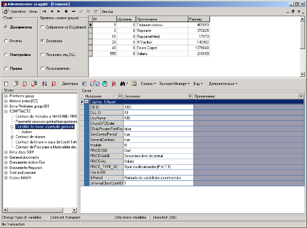

Главное окно приложения содержит два вложенных окна.

Верхнее окно приложения служит для работы с записями настроек, выбора типа объектов и уровня конфигураций.

Нижнее окно содержит окно \[Узлы\] для работы с деревом объектов указанного типа и выбранной записи и окно \[Св-ва\] для работы со свойствами текущего узла дерева. Для этих окон определены свои строки меню

Главная строка меню \(находится вверху\) содержит общие команды работы с приложением, операции с окнами, операции с записями.

**Операции работы с записями:**

Кнопка **First** – Переход к первой записи

Кнопка **Prior** – Переход к предыдущей записи

Кнопка **Next** – Переход к следующей записи

Кнопка **Insert** – Добавление новой записи. То же действие осуществляется нажатием клавиши Insert

Кнопка **Delete** – Удаление текущей записи. То же действие осуществляется нажатием клавиш Ctrl+Delete. Открывается окно подтверждения удаления записи.

Кнопка **Post** – Сохранение последних изменений в настройках Администратора в базе данных.

Кнопка **Cancel** – Отмена последних изменений в настройках Администратора в базе данных.

Кнопка **Refresh** – Обновление окна приложения

Кнопка **Выход** – Выход из приложения Администратор.

Меню **Окно** главной строки меню содержит стандартные операции управления окнами и включает пункты

Горизонтально

Вертикально

Каскад

Показать все

Таблица в правой части верхнего окна содержит записи для указанного уровня конфигураций. Уровень конфигураций устанавливается переключателем **Уровень конфигураций**. Как правило, используется опция \[Основной\], отображающая записи настроек, для которых поле \[Уровень\] равно 0, или опция \[Пользователи\], отображающая записи настроек, для которых поле \[Уровень\] отлично от 0.

Переключатель **Поле** служит для переключения между типами объектов в окне \[Узлы\] \(отображения дерева объектов соответствующих типов\).

Опция **Документы** – Отображает дерево объектов типа Документы текущей записи настроек

Опция **Отчеты** – Отображает дерево объектов типа Отчеты текущей записи настроек

Опция **Настройки** – Отображает объекты типа Настройки \(настройки форм, журналов, системные настройки\)

Опция **Права** – Отображает дерево пользователей в окне Узлы

**Дерево объектов**

Объекты выбранной записи и выбранного типа представлены в виде дерева в окне **Узлы**.

Узел имеет имя и подпись. Имя узла представляет собой внутреннее имя и служит идентификатором узла. Подпись узла - это внешнее имя, видимое для пользователя в дереве объектов.

Операции с деревом объектов \(операции с узлами дерева\) реализуют элементы строки меню окна Узлы.

**Панель меню окна Узлы**

Кнопка **New Item** \(первая\) Добавляет новый узел на текущий уровень дерева из предлагаемого списка. Открывает диалоговое окно **Выбор узла из шаблона.**

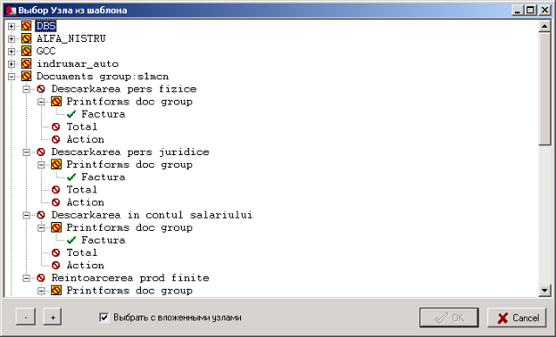

Окно Выбор узла из шаблона:

Кнопка \[–\] сворачивает дерево выводящихся в окне объектов, показывая только узлы самого верхнего уровня.

Кнопка \[+\] раскрывает дерево выводящихся в окне объектов, показывая все вложенные узлы.

При включенном флажке **Выбрать с вложенными узлами** выбранный узел добавляется в дерево объектов со своими субузлами.

Кнопка **New Sub Item** \(вторая\) Добавляет новый субузел для текущего уровня дерева из предлагаемого списка. Открывает диалоговое окно **Выбор узла из шаблона.**

Кнопка **New Item** \(третья\) Добавляет новый узел с пустой подписью на текущий уровень дерева.

Кнопка **New Sub Item** \(четвертая\) Добавляет новый субузел с пустой подписью для текущего уровня.

Кнопка **Sort** сортирует узлы каждого уровня дерева в порядке возрастания их подписей.

Кнопка **Delete Item** удаляет текущий узел вместе с вложенными узлами. Вызывается окно подтверждения удаления текущего узла.

**Меню Действия** строки меню окна \[Узлы\]

Пункт **New Node** добавляет новый узел на текущий уровень дерева объектов. Узлу присваивается имя и подпись по умолчанию.

Пункт **New SubNode** добавляет новый субузел для текущего уровня дерева объектов. Узлу присваивается имя и подпись, первые символы которого есть значение поля \[Номер текущей записи\]

Пункт **Delete Node** удаляет текущий узел вместе с вложенными узлами. Вызывается окно подтверждения удаления текущего узла.

Пункт **Rename Node** переименовывает текущий узел. Вызывается диалоговое окно с запросом о новом имени узла.

Пункт **Rename with childs** переименовывает текущий узел вместе со всеми вложенными узлами путем добавления общего окончания к их именам. Вызывается диалоговое окно с запросом об окончании имени для узла и субузлов.

Пункт **Change Caption** изменяет подпись текущего узла. То же действие осуществляется нажатием клавиши F2 или щелчком мыши на выделенный узел.

Меню **Images** содержит операции отслеживания состояния узлов \(пункты Undefined, Image, State, Selected\). Операции используется разработчиками.

Пункт **Expand Tree** раскрывает текущее дерево, показывая все вложенные узлы.

Пункт **Collapse Tree** сворачивает текущее дерево, показывая только узлы самого верхнего уровня.

**Свойства**

Свойства выбранного в окне Узлы объекта \(или логического узла\) представлены в окне **Св-ва** в виде списка, содержащего название, значение и примечание свойства. Стрелка справа от заголовка столбца списка \(Название Значение Примечание\) открывает список для фильтрации свойств.

\(All\) отображает все свойства объекта

\(Custom…\) открывает диалоговое окно пользовательского фильтра

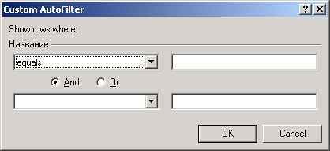

Выбор строки списка с определенным названием, значением или примечанием отображает список свойств с таким названием, значением или примечанием.

Свойства объекта объединяются в именованные группы по назначению этих свойств.

Кнопка \[+\] слева от строки ‘Группа’ отображает все свойства этой группы.

Кнопка \[–\] слева от ‘Группа’ скрывает свойства группы.

Редактирование значения выбранного свойства осуществляется нажатием клавиши F2.

Операции со свойствами объектов реализуют элементы строки меню окна \[Св-ва\].

**Меню Сервис** строки меню окна \[Св-ва\] содержит основные команды работы со свойствами объектов и группами свойств.

Пункт **Новое свойство** добавляет новое свойство для выбранного объекта \(узла дерева\) в группу Общая.

Открывается диалоговое окно **Свойство** для ввода данных.

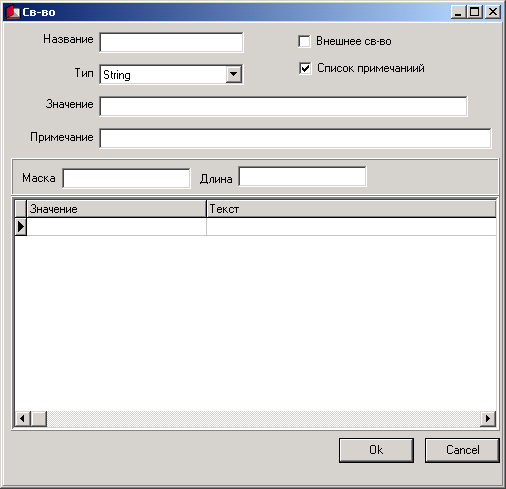

**Окно Св-во** - диалоговое окно ввода атрибутов свойства.

В поле **Название** вводится название свойства

В поле со списком **Тип** выбирается тип свойства

Допустимые типы свойства

* **String** – строковый тип. Значение - произвольная строка
* **Integer** – целый тип. Значение - произвольное целое значение
* **Boolean** – булевский \(логический тип\). Значения - True \(истина\) и False \(ложь\)
* **MEMO** – тип MEMO. Значение - произвольный текст
* **Dir** – директория. Значение свойства – список каталогов на локальных или сетевых дисках компьютера

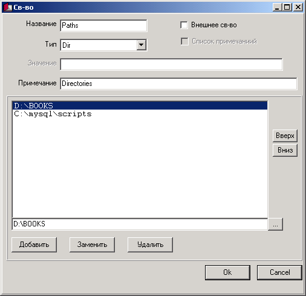

Список содержит выбранные папки.

Поле ниже списка содержит папку для добавления ее в список.

Кнопка \[…\] справа от поля каталога открывает диалоговое окно **Обзор папок** для выбора папки.

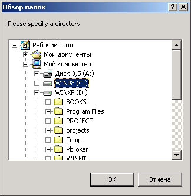

Кнопка **Добавить** окна \[Св-во\] добавляет папку из поля в список.

Кнопка **Заменить** заменяет выбранную в списке папку на папку из поля.

Кнопка **Удалить** удаляет выбранную папку.

Кнопки **Вверх,** **Вниз** справа от списка перемещают выбранный элемент соответственно вверх и вниз относительно соседних элементов списка.

* **File** – файл. Значение свойства – файл на локальном или сетевом диске компьютера

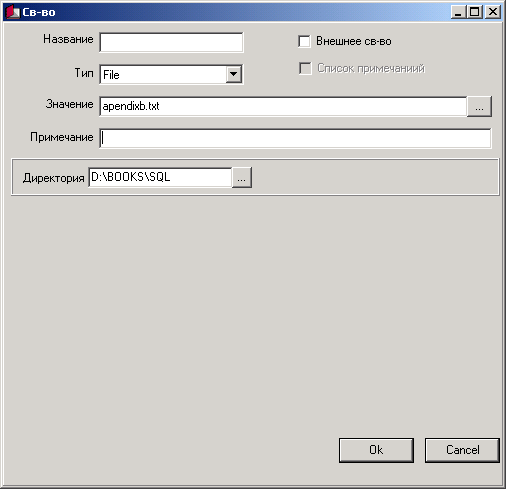

Кнопка справа от поля **Значение** открывает диалоговое окно выбора файла. В поле **Директория** указывается путь к файлу.

Кнопка справа от поля \[Директория\] открывает диалоговое окно **Обзор папок** для выбора пути к файлу.

* **ExtDesignCST**

Свойства этого типа сохраняют настройки дизайна некоторых видов документов.

* **ExtSQL** Свойства этого типа связаны с выполнением SQL команд.

В поле **Значение** окна \[Св-во\] вводится значение свойства для свойств определенных типов \(String, Integer, Boolean, File, ExtDesignCST, ExtSQL\).

В поле **Примечание** вводятся заметки, примечания относительно свойства.

Значения свойств типа String, Integer, Boolean могут выбираться из списка.

Список возможных значений вводится в таблицу в поле **Значение**. Примечания относительно значений свойства вводятся в поле **Текст** для свойств типа String и Integer.

Отображение / скрытие поля Текст устанавливается переключателем **Список примечаний**.

Значения свойства типа MEMO вводится в поле в нижней части окна.

Кнопки над этим полем вызывают диалоговое окно **Open MEMO** открытия файла и загрузки его содержимого в поле редактирования значения и окно **Save MEMO** сохранения значения типа MEMO в файл.

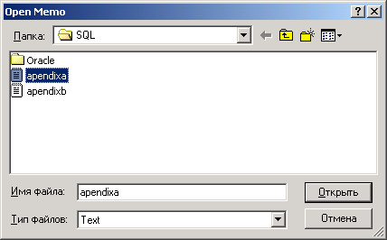

Дополнительные поля для определенных типов свойств:

Поля для свойств типа String:

Поле **Маска** определяет маску ввода значения свойства.

Поле **Длина** определяет длину строки значения свойства.

Поле **Размерность** для поля типа Integer определяет размерность значения числового свойства.

Пункт **Редактировать в окне** редактирует атрибуты свойства.

Вызывается диалоговое окно \[Свойство\] для редактирования выбранного свойства.

Пункт **Редактировать таблицу** переводит поле \[Значение свойства\] в режим редактирования \(То же действие осуществляется нажатием клавиши F4\)

Пункт **Копировать св-во** копирует указанное свойство \(со всеми его атрибутами\) в буфер.

Пункт **Вставить св-во** вставляет свойство из буфера \(со всеми его атрибутами\) в группу Общая для выбранного объекта.

Пункт **Удалить св-во** удаляет выбранное свойство. Открывается окно подтверждения удаления свойства.

Пункт **Копировать все св-ва** копирует все свойства выбранного объекта и свойства вложенных узлов в буфер.

При нажатой кнопке **Блокнот** открывается окно Блокнота с содержимым буфера копирования.

Пункт **Вставить новые св-ва** вставляет новые для объекта свойства из содержимого буфера.

Пункт **Просмотреть МЕМО** редактирует значение свойства типа MEMO.

Открывает диалоговое окно **Просмотр текстового свойства**.

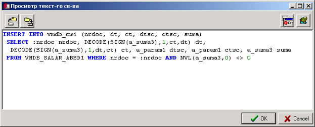

Кнопки над областью редактирования открывают окно **Open MEMO** открытия файла и загрузки его содержимого в поле редактирования значения и окно **Save MEMO** cохранения значения типа MEMO в файл.

Пункт **Вставить между MEMO** добавляет новое свойство типа MEMO \(с именем Приставка + Номер\) для выделенного свойства.

Пункт **Группы** открывает диалоговое окно **Настройка групп свойств**.

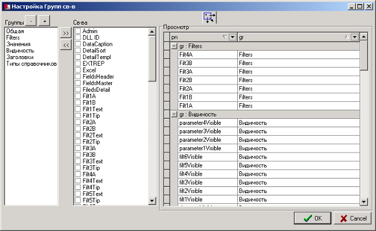

Первый список **Группы** отображает все группы свойств объекта.

Кнопка \[–\] служит для удаления выбранной группы свойств. При удалении группы свойства этой группы переводятся в группу \[Общая\]. Группу \[Общая\] удалить нельзя

Кнопка \[+\] служит для добавления новой группы.

Второй список **Свойства** отображает список всех свойств объекта. Флажки включены для выбранной группы.

Кнопка \[&gt;&gt;\] перемещает выбранное свойство в группу Общая.

Кнопка \[&lt;&lt;\] перемещает выбранное свойство в выбранную группу.

Третий список **Просмотр** отображает группы и принадлежащие им свойства. Кнопка над этим списком отображает группы со всеми их свойствами.

Стрелки справа от подписей \[pn\], \[gr\] открывают список для фильтрации свойств и групп свойств.

**\(All\)** отображает все свойства объекта или все группы

**\(Custom…\)** открывает диалоговое окно пользовательского фильтра.

Выбор строки списка с определенным названием свойства или группы отображает список свойств или групп с таким названием.

Пункт **Редактировать ини-данные** открывает окно редактирования **Изменить ини-файл**

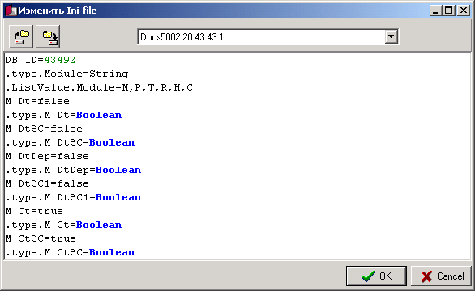

Содержит информацию о свойствах: атрибуты свойств.

Кнопки над областью редактирования вызывают диалог открытия файла и загрузки его содержимого в окно редактирования и диалог сохранения содержимого окна редактирования в файл

Поле со списком содержит имя текущего узла и имена свойств типа MEMO и служит для перехода к редактированию всех свойств объекта или к редактированию выбранного свойства типа MEMO.

Пункт **Заменить значения св-в без доб новых** используя содержимое буфера, заменяет значения свойств выбранного объекта, не добавляя при этом новые свойства из буфера.

Пункт **Заменить значения св-в с доб новых** используя содержимое буфера, заменяет значения свойств выбранного объекта и добавляет новые свойства из буфера \(вставляет содержимое буфера с добавлением свойств, которых не было ранее\).

Контекстное меню окна свойств объектов дублирует команды меню Сервис.

Кнопка **New Prop** строки меню окна \[Св-ва\] добавляет новое свойство для выбранного объекта \(узла дерева\) в группу Общая. \(Дублирует действия пункта Новое свойство.\)

Кнопка **Rename Prop** редактирует атрибуты свойства. \(Дублирует действия пункта \[Редактировать в окне\]\)

Кнопка **Блокнот** – при нажатой кнопке операции копирования в буфер и операции экспорта отображаются в блокноте.

Кнопка **Delete Prop** удаляет выбранное свойство. \(Дублирует действия пункта \[Удалить св-во\]\)

Кнопка **Найти** – Стрелка справа открывает меню

Найти далее

Найти

Найти по свойству

Найти везде

Пункт **Найти** реализует поиск в дереве объектов. Открывается диалоговое окно поиска.

Пункт **Найти далее** продолжает поиск.

Пункт **Найти по свойству** реализует поиск в списке свойств объектов.

Пункт **Найти везде** реализует поиск в дереве объектов и в списке свойств.

Меню **Экспорт/Импорт** содержит операции экспорта / импорта объектов \(и/или логических узлов дерева\) и их свойств.

Пункт **Экспорт** реализует операции экспорта. Включает в себя три пункта

Пункт **Текущий без вложенных** экспортирует выбранный узел без вложенных узлов

Пункт **Текущий** **\(все\)** экспортирует выбранный узел со всеми вложенными узлами.

Пункт **Все узлы** экспортирует все узлы текущего дерева.

Все три пункта имеют субменю:

**INI \(стд\)** экспортирует выбранный узел \(узел с субузлами, все узлы\) со свойствами в буфер в формате INI \(стд\). Обычно используется этот формат экспорта. Если нажата кнопка \[Блокнот\], содержимое экспорта отображается в окне Блокнота, которое можно сохранить как txt-файл с целью использования содержимого этого файла для импорта.

**INI \(pasc\)** экспортирует выбранный узел \(узел с субузлами, все узлы\) со свойствами в буфер в формате INI \(pasc\). Формат экспорта может использоваться разработчиками. Если нажата кнопка Блокнот, содержимое экспорта отображается в окне Блокнота.

**XML** экспортирует выбранный узел \(узел с субузлами, все узлы\) со свойствами в файл XML. Вариант экспорта используется для определенных типов документов и отчетов с возможностями настройки дизайна либо в случае необходимости сохранения содержимого экспорта.

Открывает диалоговое окно **Экспорт.**

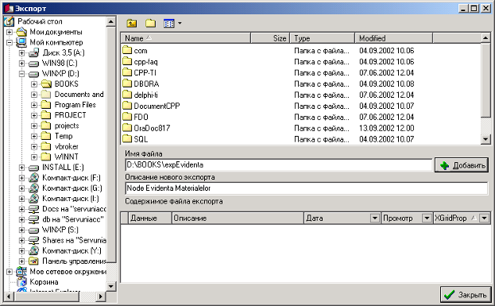

В левой части окна отображается иерархическая структура папок локальных и сетевых дисков на компьютере.

Список справа отображает содержимое выбранной папки.

Поле **Имя файла** содержит путь \(для выбранной папки\) и имя файла экспорта.

Кнопка **Добавить** создает файл экспорта в выбранной или указанной папке.

Поле **Описание нового экспорта** содержит заметки о содержании экспорта.

Список **Содержимое файла экспорта** отображает информацию о выделенном файле экспорта.

Если нажата кнопка Блокнот, содержимое экспорта отображается в окне Блокнота.

Пункт **Вставить** меню Экспорт / Импорт реализует операции импорта.

Содержит подпункты

Пункт **Как новый узел** импортирует содержимое буфера \(после операции экспорта, либо после операции копирования содержимого текстового файла экспорта\), вставляя его в дерево объектов на текущий уровень. Открывает окно \[Выбор узла из шаблона\].

Пункт **Как новый субузел** импортирует содержимое буфера \(после операции экспорта, либо после операции копирования содержимого текстового файла экспорта\), вставляя его как субузел для текущего уровня. Открывает окно \[Выбор узла из шаблона\].

Пункт **Как новый узел из XML** импортирует содержимое файла экспорта в формате XML, вставляя содержимое экспорта на текущий уровень дерева объектов. Открывает окно **Вставить узлы**.

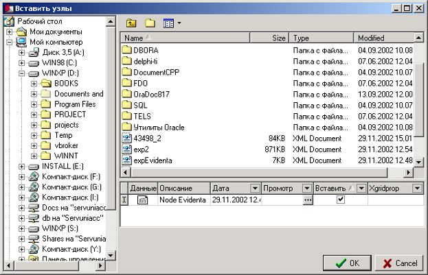

В левой части окна отображается иерархическая структура папок локальных и сетевых дисках компьютера.

Список справа вверху отображает содержимое выбранной папки.

Список справа снизу дает информацию о содержимом экспорта выбранного файла XML.

Стрелки справа от подписей \[Дата\], \[Просмотр\], \[Вставка\], \[XGridProp\] открывают списки фильтров.

Кнопка \[…\] для поля \[Просмотр\] когда на него переведен фокус открывает окно **TreeForm** дерева объектов выбранного экспорта. Окно содержит окно \[Узлы\] и окно \[Св-ва\] с их строками меню.

Флажок **Вставить** указывает, какие экспортные данные будут импортированы при нажатии кнопки \[OK\].

Кнопка … для поля XGridProp при переводе фокуса на это поле открывает окно **Просмотр.**

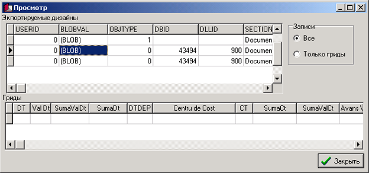

Верхняя таблица **Экспортируемые дизайны** содержит записи с информацией о дизайнах экспорта.

Переключатель **Записи** служит для фильтрации записей этой таблицы.

Опция **Все** переключателя Записи отображает все записи таблицы.

Опция **Только гриды** переключателя Записи отображает записи с информацией о гридах \(таблицах в формах\).

Нижняя таблица **Гриды** представляет собой собственно дизайн выбранного выше грида.

Пункт **Как новый субузел XML** импортирует содержимое файла экспорта в формате XML, вставляя содержимое экспорта как субузел для текущего уровня дерева объектов. Открывает окно \[Вставить узлы\] для выбора импортируемых данных.

Меню **Вид -&gt;Данные** служит для фильтрации свойств по их назначению и включает пункты:

Пункт **Открытые** отображает открытые свойства выделенного объекта.

Пункт **Системные** отображает системные свойства выделенного объекта.

Пункт **Все \(кроме сист.св-в\)** отображает открытые и системные свойства выделенного объекта.

Пункт **Все** отображает все свойства выделенного объекта.

### 3 Хранение в базе данных

1. **Хранение в базе данных**

Настройки приложения Администратор хранятся в базе данных в таблице UN4.UN4SYS\_DATA.

Каждая запись настроек Администратора соответствует записи таблицы. Четыре поля таблицы \(DOCS \(Документы\), REPORTS \(Отчеты\), SETUPS \(настройки\), RIGHTS \(Права\)\) в специальном текстовом формате хранят информацию об узлах дерева \(в т ч объектах соответствующих типов\) данной записи: свойства узлов \(открытые и служебные\) и их значения. Эта информация представляет собой т.н. ини-данные, видимые в Администраторе при выполнении операций экспорта / импорта, редактировании ини-данных. Кроме того, поля содержат информацию о структуре дерева объектов соответствующих типов.

Основные поля таблицы UN4.UN4SYS\_DATA

| **Имя поля** | **Тип поля** | **Описание** |
| :--- | :---: | :--- |
| DOCS | Clob | Содержит информацию о структуре дерева объектов типа Документы и значения свойств объектов и логических узлов |
| REPORTS | Clob | Содержит информацию о структуре дерева объектов типа Отчеты и значения свойств объектов и логических узлов |
| RIGHTS | Clob | Содержит информацию о структуре дерева объектов типа Права и значения свойств объектов и логических узлов |
| SETUPS | Clob | Содержит информацию о структуре дерева объектов, объединенных в тип Настройки, и значения свойств объектов и логических узлов |
| ID | Number\(10\) | Идентификационный номер записи настроек |
| IDLEVEL | Number\(10\) | Номер уровня конфигураций |
| TEXTLEVEL | Varchar2\(50\) | Примечание \(заметки о записи настроек\) |
| UPDDATE | Date | Дата последнего изменения настроек текущей записи |

Таблица UN4.UN4SYS\_DATA\_ARHIV предназначена для ведения архива изменений настроек Администратора.

## Документы

**Документы**

Объекты Документы содержат настройки типов документов, с которыми работает приложение Universal Accounting.

Иерархия дерева документов текущей записи настроек – это логическая организация списка документов по их назначению. Число уровней вложенности узлов, служащих для логической группировки объектов, не ограничено.

Обычно верхний уровень дерева служит для группировки документов по модулям.

Пример дерева документов:

* Evidenta vanzarilor \(de la 43300\) \(Учет продаж – Документы модуля N\)
* Evidenta materialelor \(de la 43500\) \(Учет материалов – Документы модуля M\)
* Registrele de solduri \(43100\) \(Регистр остатков – Документы модуля \#\)
* Decontari \(de la 43400\) \(Расчетные операции Документы модуля H\)

– CASA \(Касса\)

**+** CASA: Elibirarea banilor titularilor de avans\(43454\) \(Выдача денег в счет аванса\)

* CASA: Eliberarea salariului\(43455\) \(Выдача зарплаты\)
* CASA: Intoarcerea banilor de catre titulari de avans\(43456\) \(Возврат авансовых выплат\)
* CASA: Intoarcerea salariului \(Возврат зарплаты\)
* CASA: Primirea banilor din Banca \(prin cont intermediar 2451\)\(43458\) \(Приход денег из банка\)
* CASA: Indreptarea banilor din Casa spre Banca \(prin cont intermediar 2451\)\(43459\) \(Денежные перемещения из кассы в банк\)
* CASA: Primirea banilor in casa de la debitori\(43451\) \(Поступление денег в кассу от дебиторов\)
* CASA: Achitarea datoriei prin CASA fata de creditori\(43450\) \(Погашение кредиторской задолженности через кассу\)
* CASA: Alte iesiri\(43452\) \(Прочие расходные операции\)
* CASA: Alte incasari\(43453\) \(Прочие приходные операции\)
* Bank \(Банк\)
* Decontari Alte tranzactii \(Прочие расчетные операции\)
* Active fixe \(de la 43300\) \(Основные фонды – Документы модуля F\)
* Productia finite \(43500\) \(Готовая продукция – Документы модуля P\)
* Evidenta salariului \(43700\) \(Учет зарплаты – Документы модуля R\)
* Consumuri si cheltuieli \(43800\) \(Затраты\)

**Свойства уровня документа**

Группа Standart

| **Имя свойства** | **Назначение свойства** |
| :--- | :---: |
| DB ID | Идентификационный номер типа документа. Соответствует значению поля \[SysfID\] в таблице документов |
| DLL ID | Идентификационный номер DLL |
| DocName | Идентификатор документа в DLL |
| EAutoGFCOrder |  |
| EAutoGFCRun | Если значение True, запускается автоматическая генерация проводок при сохранении документа |
| EOnlyPrivatePrintForms | Если значение True, документ использует только свои печатные формы |
| Module | Модуль, которому принадлежит документ. Соответствует значению поля \[m\] в таблице документов |
| Use in DB | Если значение True, тип документа доступен в клиентском приложении |

Базовый тип документа идентифицируется значениями свойств DLL ID и DocName.

Документы типа DLL ID = 20, DocName = 201 имеют свойства для настройки элементов управления формы, отображения / скрытия элементов управления, установки их подписей, установки значений по умолчанию для элементов управления.

Свойства, представляющие собой имена элементов управления, служат для отображения / скрытия этих элементов управления.

Свойства вида \[имя элемента управления\] + \[Capt\] служат для установки подписей элементов управления.

Свойства вида \[fDefVal\] + \[имя элемента управления\] служат для установки значения по умолчанию элемента управления.

Свойства вида \[Filt\] + \[имя элемента управления\] служат для установки ограничения значений элемента управления

Пример:

| **Свойство** | **Значение** | **Действие** |
| :--- | :---: | :--- |
| M Ct | False | Скрытие элемента управления M Ct |
| M CtDep | True | Отображение элемента управления M CtDep |
| M CtDep Capt | Expeditar | Подпись Expeditar для элемента управления M CtDep |
| fDefValCT | 2161 | Значение по умолчанию 2161 для элемента правления fDefValCT |
| FiltCT | 2161;2162 | Фильтр для значений элемента управления FiltCT |

Документы типа DLL ID = 900, DocName = CST1 или DLL ID = 900, DocName = CST2 имеют свойство Design позволяющее настраивать внешний вид документа в окне конструктора формы.

Дочерние объекты объектов типа Документы – объекты типа Action, объекты типа Totals и объекты типа PrintForms. Узлы для этих объектов не могут иметь субузлов.

* **Объекты типа Action**

Объекты типа Action служат для выполнения определенных действий по обработке данных, как правило, для генерации проводок или изменения данных в определенных таблицах.

Список доступных действий отображается в окне Document Action в документах соответствующего типа в клиентском приложении Universal Accounting.

Основные свойства объекта типа Action

| **Имя свойства** | **Назначение** |
| :--- | :---: |
| ID | Порядковый номер действия в окне Document Action |
| DeleteFCFromCM | Если значение True, удаляет записи из таблицы проводок для документа |
| SQL1 SQL2 SQL3 и т д | Содержат SQL команды обработки данных |
| TextForUser | Подпись действия, видимая для пользователя в окне Document Action |
| Visible | Если значение True, действие доступно в окне Document Action |

* **Объекты типа Totals**

Объекты типа Totals служат для выполнения запросов, связанных с подсчетом итогов по таблице проводок и таблицам спецрегистра в документах соответствующего типа. Набор записей итогов отображается в окне итогов \[Document Action\].

Основные свойства объекта типа Totals

| **Имя свойства** | **Назначение** |
| :--- | :---: |
| CM\_SQL | Содержит SQL команды подсчета итогов по таблице проводок.  Результат отображается на вкладке \[Pe CM\] окна итогов \[Document Action\] |
| SPEC\_SQL | Содержит SQL команды подсчета итогов по таблицам спецрегистра. Результат отображается на вкладке \[Special\] окна итогов \[Document Action\] |

* **Объекты PrintForms**

Объекты PrintForms служат для настройки печатных форм из документов.

Список печатных форм отображается в окне \[Document Action\] при нажатии кнопки печати в документах соответствующего типа в клиентском приложении Universal Accounting.

Обычно в поддереве документа они объединены в группу и являются субузлами логического узла \[PrintForms\]

Основные свойства объекта типа PrintForms

| **Имя свойства** | **Назначение** |
| :--- | :---: |
| DLL ID | Идентификационный номер DLL |
| Index Fields |  |
| Master Fields |  |
| Report ID | Идентификатор печатной формы в DLL |
| Report Type | Один из трех типов отчетов: FormulaOne, ExcelGL2, FastReport |
| SQLDetail SQL | Запрос, возвращающий данные в область Detail \(область данных подчиненной таблицы\) печатной формы |
| SQLHeader SQL | Запрос, возвращающий данные в область Header \(область заголовка\) печатной формы |
| SQLMaster | Запрос, возвращающий данные в область Master \(область данных главной таблицы\) печатной формы |
| Template | Шаблон, используемый для генерации печатной формы |
| WindowCaption | Подпись окна сгенерированной печатной формы |

Объекты типа PrintForms поддерживают все TXT-свойства отчетов \(свойства отчетов в текстовом формате\)

## Отчеты

**Отчеты**

Объекты типа Отчеты содержат настройки соответствующих отчетов. Дерево отчетов отображается в окне \[Raport manager\] приложения Universal Accounting. Иерархия дерева отчетов текущей записи настроек – это логическая организация списка отчетов по их назначению. Число уровней вложенности узлов, служащих для логической группировки объектов, не ограничено

Пример дерева отчетов

* Rapoarte materiale/materia prima \(Материальные отчеты\)
* Rapoarte universale \(Универсальные отчеты\)
* Rapoarte vinzari \(Отчеты Продажи\)
* Rapoarte active fixe \(Отчеты Основные фонды\)
* Achizitii \(Поступления\)
* Rapoarte livrari \(Отчеты Отгрузка\)
* Rapoarte financiare \(Финансовые отчеты\)
* Decontari cu clientela \(GCC\) \(Расчеты с клиентами\)
* Rapoarte CASA \(Отчеты Касса\)
* Anexa CASA Total pe conturi \(Приложение Касса Итого по счетам\)
* Descifrarea din credetul 2411 \(Расшифровка кредита счета 2411\)
* Descifrarea din debetul 2411 \(Расшифровка дебета счета 2411\)
* Darea de seama a casierului \(Отчет кассира\)
* Foaie suplimentara la Registrul de Casa \(Дополнение к отчету кассира\)
* Jurnal-Order Nr1 \(Журнал-ордер N 1\)
* Contracte \(Контракты\)
* Materiale \(Материалы\)

Большинство отчетов поддерживают следующие свойства \(свойства группы Общая\)

| **Имя свойства** | **Назначение** |
| :--- | :---: |
| DLL ID | Идентификационный номер DLL |
| Index Fields |  |
| Master Fields |  |
| Report ID | Идентификатор печатной формы в DLL |
| Report Type | Один из трех типов отчетов: FormulaOne, ExcelGL2, FastReport |
| SQLDetail SQL | Запрос, возвращающий данные в область Detail \(область данных подчиненной таблицы\) печатной формы |
| SQLHeader SQL | Запрос, возвращающий данные в область Header \(область заголовка\) печатной формы |
| SQLMaster | Запрос, возвращающий данные в область Master \(область данных главной таблицы\) печатной формы |
| Template | Шаблон, используемый для генерации печатной формы |
| WindowCaption | Подпись окна сгенерированной печатной формы |

Некоторые отчеты поддерживают специфические свойства

Новые отчеты создаются и настраиваются преимущественно на базе т н Универсального отчета \(DLL ID = 2, Report ID = 1\), Нового Универсального отчета \(DLL ID = 4201, Report ID = 12\) и Отчета с произвольными параметрами \(DLL ID = 9002, ReportID = univ\)

* **Универсальный отчет \(Регистр оборотов и остатков\)**

Свойства Универсального отчета

| **Имя свойства** | **Назначение** |
| :--- | :---: |
| DLL ID | Идентификационный номер DLL \(Значение 2\) |
| Caption | Подпись окна параметров отчета |
| Report ID | Идентификационный номер отчета в DLL \(Значение 1\) |
| Fields List A | Список полей, доступных в разделе \[Parametrii principali\]  Формат списка:  Имя поля \(под которым оно появляется в списке\) в кавычках,  Имя поля \(имя поля в результирующем наборе записей и в шаблоне отчета\) |
| Fields List B | Список полей, доступных в разделе \[Corespondenta\] |
| Report Type | Один из трех типов отчетов: Formula One, ExcelGL2, FastReport. Отчеты на базе Универсального отчета обычно имеют тип Formula One. |
| Schema | Текст, содержащий настройки окна параметров отчета: отображение / скрытие элементов управления, установка значений по умолчанию, список выбранных полей, включение / выключение флажков  Формат:  \[Имя элемента управления\].Visible=0,1  \(0 – скрытие элемента управления, 1 –отображение элемента управления\)  \[Имя элемента управления\].Text= \(Значение по умолчанию для элемента управления\)  Список полей, выбранных в разделе \[Parametrii principali\] \(\[Corespondenta\]\)  FieldListA – start \(FieldListB – start\)  Имя поля \(под которым оно появляется в списке\) в кавычках,  Имя поля \(имя поля в результирующем наборе записей и в шаблоне отчета\)  FieldListA – end \(FieldListB – end\) |
| Пример значения свойства Schema:  _fl001acc.Visible=1_  _fl001acc.Tag=0_  _fl001acc.Text=211 213 921 217_  _fl001dep.Visible=1_  _fl001dep.Tag=1098_  _fl001dep.Text=1098,Depozit de materiale chimice, fire si deseuri_  _FieldListA - start_  _a.Cont,CONT_  _b.Cont.sc.,CONT1_  _"d.Cont analitic - cifru",SCCODE_  _"f.Cont analitic - denumirea 2",SCNAME2_  _"e.Cont analitic - denumirea",SCNAME_  _"g.Cont analitic - unitatea de masura",SCUM_  _"c.Cont analitic - cod",SC_  _ListC.Text="a. Sold init Dt","c. Rulajul Dt","d. Rulajul Ct","e. Sold final Dt"_  Замечание  Схему окна параметров отчета из приложения Universal Accounting можно позволяет получить контекстное меню \[Vizualizarea parametrelor pentru Schema curenta\] окна параметров отчета. |  |
| Template | Шаблон, используемый для генерации отчета |

* **Новый универсальный отчет**

Свойства Нового Универсального отчета

| **Имя свойства** | **Назначение** |
| :--- | :---: |
| Caption | Подпись окна параметров отчета |
| DLL ID | Идентификационный номер DLL \(Значение 4201\) |
| Report ID | Идентификационный номер отчета в DLL |
| Report Type | Один из трех типов отчетов: Formula One, ExcelGL2, FastReport |
| OraFunction | Процедура PL/SQL генерации результирующего набора записей |
| RseFiledsBaza | Список доступных и выбранных полей раздела Filtru de baza |
|  | Список доступных и выбранных полей раздела Filtru Corespondent |
| RseSoldRulajTmplOrder | Указывает, какие из категорий Sold Initial Dt, Ct, Rulaj Dt, Ct, Sold Final Dt, Ct используются в отчете и порядок появления их в шаблоне |
| RseSumaCantTmplOrder | Указывает, какие из категорий Cant, Suma, SumaVal используются в отчете и порядок появления их в шаблоне |
| RepWindow | Текст, содержащий настройки окна параметров отчета: отображение / скрытие элементов управления, установка значений по умолчанию, включение / выключение флажков |
| Template | Шаблон, используемый для генерации отчета |

Примечание. Для справки по Новому Универсальному отчету см. RSE.DOC

* **Отчет с произвольными параметрами**

Отчет \(DLL ID = 9002, ReportID = univ \) поддерживает возможности настройки окна параметров отчета и указания наборов данных, выводящихся в отчете.

Свойства отчета

| **Имя свойства** | **Назначение** |
| :--- | :---: |
| Группа Filters:  Filt1A, Filt2A, …, Filt6A | Установка фильтра по полю ‘Тип’ для записей универсального справочника, выводящихся в списках Filt1, Filt2, …, Filt6 |
| Пример  Flit1A = O \(Организации\)  Filt2A = P \(Продукция\) |  |
| Группа Видимость:  Filt1Visible, Filt2Visible, …, Filt6Visible, Parameter1Visible, …, Parameter4Visible | Отображение / скрытие элементов управления в окне параметров отчета |
| Группа Заголовки:  Filt1Caption, Filt2caption, …,  Filt6Caption, Parameter1Caption,…, Parameter4Caption | Создание подписей для элементов управления окна параметров |
| Группа Значения:  Filt1Text, Filt2Text, …, Filt6Text, Parameter1Text, …, Parameter4Text | Установка значений по умолчанию для элементов управления окна параметров |
| Admin | Если значение True, выводит Админ. панель в окне параметров для доступа к конструктору формы параметров |
| DLL ID | Идентификационный номер DLL \(Значение 9002\) |
| Report ID | Идентификатор отчета в DLL \(Значение ‘univ’\) |
| ExtRep | Тип расширения файла шаблона \(0-xls,1-vts\) |
| MacroAfterBuild | Макрос Visual Basic для xls-отчетов |
| PeriodGlobal | Указывает, выводится ли период в окне параметров |
| Tip | Тип отчета: Только Master / Master–Detail |
| SQLHeader | Запрос, возвращающий данные в область Detail \(область данных подчиненной таблицы\) отчета |
| SQLMaster | Запрос, возвращающий данные в область Master \(область данных главной таблицы\) отчета |
| SQLDetail | Запрос, возвращающий данные в область Header \(область заголовка\) отчета |

* **TXT-свойства**

TXT-свойства – свойства отчета в текстовом формате. Свойства поддерживаются всеми отчетами.

| **Имя свойства** | **Назначение** |
| :--- | :---: |
| TXTFixedPreview | Автоматически выводит отчет и в текстовом формате наряду с основным \(Formula One Excel\) |
| TXT\_AutoCloseF1 | Выводит отчет только в текстовом формате |
| TXT\_AutoCloseTXT | Автоматически закрывает окно отчета в текстовом формате |
| TXT\_AutoPrint | Автоматически запускает печать отчета в текстовом формате |
| TXT\_HorzSize | Устанавливает число строк одной страницы текстового отчета |
| TXT\_Rulon | Использует рулон для печати текстового отчета, не разбивая отчет по страницам |
| TXT\_ShowBorders | Устанавливает режим вывода границ ячеек исходного шаблона в текстовом отчете:  0 – не отображает границы  1 – отображает все границы, за исключением точечных  2 – отображает все границы |
| TXTVertSize | Устанавливает число столбцов одной страницы текстового отчета |

**Настройки**

Объекты типа Настройки содержат настройки журналов, форм и системные настройки.

## Журналы

**Журналы**

Объекты Журналы служат для фильтрации Пользователем таблицы документов по участкам. Доступные журналы отображаются в меню \[Registre\] приложения Universal Accounting. Структура списка журналов соответствует структуре дерева объектов типа Журналы в Администраторе. Объект типа Журнал содержит описание фильтров для типов документов, принадлежащих соответствующему журналу.

Пример дерева журналов

* Journals Group

ACTIVE FIXE \(Основные фонды\)

ACHIZITII \(Поступления\)

VINZAREA \(Продажи\)

DECONTARI \(Расчетные операции\)

MATERIALE \(Материалы\)

SOLDURI \(Остатки\)

CASA \(Касса\)

BANC \(Банк\)

PRODUCTIA FINITA \(Конечная продукция\)

* SALARIUL \(Зарплата\)

Toate documente \(Все документы\)

Calculari \(Начисления\)

Retineri \(Удержания\)

Decontari ALTE TRANZACTII \(Расчеты Прочие операции\)

CONSUMURI SI CHELTUELI \(Поступления\)

Основные свойства объектов типа Журналы

| **Имя свойства** | **Назначение** |
| :--- | :---: |
| Active | Если значение False, объект игнорируется |
| Caption | Подпись для журнала в меню \[Registre\] |
| DLL ID | Идентификационный номер DLL |
| DLL Journal Name | Идентификационный номер журнала в DLL |
| Doc Types Default |  |
| Doc Types Filter | Фильтр типов документов, образующих журнал \(Строится условие по ID\) |
| Sql Filter | Фильтр типов документов образующих журнал \(Строится условие по SysFID\) |

## Формы

**Формы**

Объекты типа Формы содержат настройки форм. Доступные формы отображаются в меню Forme приложения Universal Accounting.

Пример дерева форм

* Forms group

Price list \(Price list\)

Registrul cursurilor \(Курсы валют\)

* Recalcularea documentelor

Recalcularea MAGR1

Recalcularea MAGR2

Recalcularea raport de producere

Retetele \(Рецепты\)

Solduri \(Остатки\)

* Registrul normelor \(Регистр норм\)
* Копировать D2 в текущий \(Action\)
* Дублировать \(Action\)

Volum de producere \(Объемы продукции\)

* Зарплата

Календарь

* Справочник сотрудников

Action1

Action2

Action3

Action4

Дополнительные начисления, удержания

Основные свойства объектов типа Форма

| **Имя свойства** | **Назначение** |
| :--- | :---: |
| Active | Если значение False, объект игнорируется |
| Caption | Подпись формы |
| DLL ID | Идентификационный номер DLL |
| DLL FormName | Идентификатор формы в DLL |

Дочерние объекты типа Action объектов типа Формы предназначены для выполнения определенных действий с данными при работе с соответствующей формой.

Свойства объектов Action

| **Имя свойства** | **Назначение** |
| :--- | :---: |
| Action Type | Internal |
| Caption | Подпись для действия в списке действий |
| ID |  |
| RefreshNeed | Флаг обновления формы |
| SQL1, SQL2,… | Содержат SQL команды обработки данных |
| Visible | Если True, действие отображается в списке действий |

## Системные настройки

**Системные настройки**

Объекты Системные настройки объединены в логические группы:

* **Docs**

Объекты содержат настройки для таблицы документов

Свойства

| **Имя свойства** | **Назначение** |
| :--- | :---: |
| DataAutomat | Флаг автоматического заполнения поля даты таблицы документов значением по умолчанию |
| DefValuta | Валюта по умолчанию в таблице документов |
| DefaultModule | Тип модуля по умолчанию в таблице документов |
| Order by | Поля сортировки записей таблицы документов |

* **General**

Объекты содержат настройки приложения Universal Accounting общего характера.

| **Имя свойства** | **Назначение** |
| :--- | :---: |
| GlobalPeriodStart | Начало рабочего периода |
| GlobalPeriodFinish | Конец рабочего периода |
| Language |  |
| LengthCont |  |
| LengthPachet |  |
| RepTemplatesPath | Путь по умолчанию для шаблонов отчетов и печатных форм |
| ValutaDef |  |
| Version |  |

* **Бухгалтерские настройки**

Объекты Содержат настройки бухгалтерских операций.

Примеры

Объект **Impozite**

| **Имя свойства** | **Значение** | **Примечание** |
| :--- | :---: | :--- |
| FondSoc31 | 32 | Defalcari fondul social |

Объект **Costuri**

| **Имя свойства** | **Значение** | **Примечание** |
| :--- | :---: | :--- |
| CoefCheltInd | 165 | Coeficientul cheltuieli indirecte |
| CoefEnergia | 300 |  |
| ContChelt\_C\_5\_1 | 2161 | Contul de evidenta a productiei finite la care vor fi repartizate cheltuielile\(2161 sau 2162\) |
| DEPChelt\_C\_5\_2 | 226 | Centrul de cost al productiei finite la care vor fi repartizate cheltuielile |

Объект **Active fixe**

| **Имя свойства** | **Значение** | **Примечание** |
| :--- | :---: | :--- |
| Pkg\_afx\_Acc5342 | 5342 | Счет НДС при реализации ОС |
| Pkg\_afx\_Acc6212 | 6212 | Счет доходов при реализации ОС |
| Pkg\_afx\_Acc7212 | 7212 | Счет расходов при реализации ОС |
| Pkg\_afx\_DefAcc221 | 2211 | Счет дебит. задолженности при реализации ОС |
| Pkg\_afx\_Dep7212 | 99 | Аналитика при реализации ОС |
| Pkg\_afx\_DtSC | 835 | Аналитика по ДТ при начислении износа |
| Pkg\_afx\_SC5342 | 99 | Аналитика сета 5342 \(у кого есть\) |
| Pkg\_afx\_SC7212 | 838 | Аналитика по 7212 при реализации ОС |
| Pkg\_afx\_vCont1 | 0 | SC при начислении износа ОС |
| Pkg\_afx\_vneedSC1 | 1 | 1 – при расчете износа проставлять в DTSC1 код ОС |

Объект **Materiale**

| **Имя свойства** | **Значение** | **Примечание** |
| :--- | :---: | :--- |
| ContTVR61 | 6112 |  |
| ContTVR71 | 7112 |  |
| cont5 | 5348 |  |
| cont5an | 38726 |  |
| contTVA | 5342 |  |

Объект **Salary**

| **Имя свойства** | **Значение** | **Примечание** |
| :--- | :---: | :--- |
| SectiaGr1 | ‘D’ |  |
| SectiaTip | ‘O’ |  |
| Calc\_filtr | 5311 |  |
| Zile\_ore | 1 | Основание для расчета зарплаты \(0–дни,1–часы\) |

Объект **Decont**

| **Имя свойства** | **Значение** | **Примечание** |
| :--- | :---: | :--- |
| ContAvansCurent | 5231 |  |

* **Company**

Содержит информацию о предприятии, которая используется в некоторых отчетах и печатных формах.

Основные свойства

| **Имя свойства** | **Назначение** |
| :--- | :---: |
| ADRESA | Адрес предприятия |
| BANCA | Название банка предприятия |
| CODFISCAL | Фискальный код |
| CodTVA | Регистрационный номер по НДС |
| CONTBANCAR | Расчетный счет |
| DIRECTOR | ФИО директора |
| MFO | МФО банка |
| NAME | Наименование предприятия |
| TELEFON | Телефон |

Замечание.

Объекты Системные настройки идентифицируются именами соответствующих узлов. Поэтому переименование узлов приводит к потере настроек.

## Права

**Права**

Объекты, объединенные в тип Права, содержат настройки пользователей, групп пользователей и их прав.

Свойства объекта Пользователь

| **Имя свойства** | **Назначение** |
| :--- | :---: |
| DataEmpty | Если True, игнорируется значение по умолчанию поля \[Дата\] таблицы документов при вводе документов пользователем |
| Enabled | Если True, настройки пользователя видимы для приложения Universal Accounting, если False – объект игнорируется |
| Familia Numele Prenumele | ФИО пользователя – информативное поле |
| ID | Идентификационный номер пользователя \(соответствует значению поля \[UserID\] таблицы документов для записей документов пользователя\) |
| Password | Пароль пользователя. Вводится в поле Password при запуске приложения Universal Accounting |
| UserName | Имя пользователя. Вводится в поле UserID при запуске приложения Universal Accounting |
| GroupID |  |
| DEF\_JOURNAL | Журнал \(фильтр на документы\), устанавливаемый по умолчанию при запуске приложения Universal Accounting |
| ADMIN | 1 – Имя пользователя и пароль действуют для приложения Администратор  0 – Имя пользователя и пароль игнорируются при запуске Администратора |

Свойства групп пользователей

| **Имя свойства** | **Назначение** |
| :--- | :---: |
| Docs View Mode | All documents – пользователям доступны все документы  All group documents – пользователям доступны только документы пользователей группы  Private documents – пользователям доступны только личные документы |
| Enabled | Если True, настройки группы видимы для приложения Universal Accounting, если False – группа игнорируется |
| ID |  |
| LACSetupBlockSections | Список объектов Формы \(имена соответствующих узлов\), не доступных группе пользователей |
| NrSet |  |

Свойства, установленные для группы пользователей, распространяются на всех пользователей группы.

## Сценарии работы с Администратором

**Сценарии работы с Администратором**

\(Примеры действий Администратора\)

**Задача 1. Изменение рабочего периода.**

Редактирование \(добавление, удаление\) документов допускается, только если дата документа попадает в т.н. рабочий период.

**Задача:** Изменить рабочий период.

**Действия:**

* Перейти на соответствующую запись настроек \(Главная запись\).
* Выбрать опцию \[Основной\] переключателя \[Уровень конфигураций\].
* Выбрать опцию \[Настройки\] переключателя \[Поле\].
* Раскрыть логический узел \[System Settings\].
* Выбрать \(перейти на\) узел \(объект\) \[General\]
* Выбрать свойство GlobalPeriodStart \(дата начала рабочего периода\).
* Перейти в режим редактирования свойства \(пункты \[Редактировать в окне\], \[Редактировать таблицу\] меню \[Сервис\] строки меню окна \[Свойства\]\) или нажатием \(последовательно\) клавиш F4, F2.
* Ввести значение свойства.
* Так же изменить значение свойства GlobalPeriodFinish \(дата окончания рабочего периода\).
* Нажать кнопку \[Post\] главной панели меню, чтобы зафиксировать изменения или кнопку \[Cancel\], чтобы отменить изменения.
* Для вступления изменений в силу в открытом приложении Universal Accounting нажать кнопку \[Refresh Parametre\].

**Задача 2. Создание нового журнала**

**Задача:** Создать новый журнал на базе существующего.

**Действия:**

* Выбрать опцию \[Настройки\] переключателя \[Поле\], уровень конфигураций \(напр., \[Основной\]\) и перейти на запись настроек, содержащей настройки журналов.
* Раскрыть логический узел \[Journals group\].
* Выбрать к-л объект \(журнал\) для экспорта.
* Выбрать последовательно пункт меню \[Экпорт / Импорт\], подменю \[Экспорт\], подменю \[Текущий без вложенных\], подменю \[Ини \(стд.\)\] для копирования в буфер ини-данных узла \(объекта\).
* Указав уровень в дереве объектов типа Журналы \(выбрав узел соответствующего уровня\) выбрать последовательно пункт \[Экпорт / Импорт\], подменю \[Вставить\], подменю \[Как новый узел\] для импорта объекта на указанный уровень дерева.
* Переименовать узел \(пункт \[Rename Node\] меню \[Действия\] строки меню окна \[Узлы\]\).
* Изменить подпись узла \(пункт \[Change Caption\] меню \[Действия\] строки меню окна \[Узлы\]\).
* Изменить значение свойства \[Caption\].
* Изменить значение свойства DocTypesFilter \(Условие для ID\).
* Изменить значение свойства SQLFilter \(Условие для SysFID\).
* Зафиксировать изменения в базе данных.

**Задача 3 Добавление нового свойства для отчета**

**Задача:** Добавить для Отчета1 новое свойство TXTFixedPreview

**Действия:**

* В дереве объектов типа Отчеты выбрать отчет со свойством TXTFixedPreview.
* Выбрать свойство TXTFixedPreview.
* Выбрать пункт меню \[Копировать свойство\] меню \[Сервис\] для копирования свойства в буфер.
* Выбрать в дереве отчетов отчет, для которого необходимо добавить свойство.
* Перейти в окно свойств объекта.
* Выбрать пункт меню \[Вставить свойство\] меню \[Сервис\] для вставки свойства в список свойств отчета.
* При необходимости изменить значение свойства.
* Зафиксировать изменения в базе данных.

**Задача 4 Создание отчета с произвольными параметрами**

**Задача:** Создать новый отчет Список объектов аналитического учета указанного счета.

**Действия:**

* В дереве отчетов выбрать отчет DLL ID = 9002, Report ID = ‘univ’.
* Экспортировать отчет в формате XML \(Меню \[Экспорт / Импорт\], подменю \[Экспорт\], подменю \[Текущий без вложенных\], пункт \[XML\]\), создать файл экспорта.
* Выбрать уровень дерева отчетов \(произвольный узел этого уровня\) для импорта отчета DLL ID = 9002, Report ID = ‘univ’.
* Импортировать отчет \(Меню \[Экспорт / Импорт\], подменю \[Вставить\], подменю \[Как новый узел из XML\]\), выбрав нужный экспорт в окне \[Вставить узлы\].
* Изменить значения свойств, при необходимости добавить новые свойства, поддерживаемые отчетом.
* Установить значения свойств:

| **Свойство** | **Значение** | **Действие** |
| :--- | :---: | :--- |
| Parameter1Visible | True | Отображает параметр в окне параметров отчета |
| Parameter1Caption | Cont \(Счет\) | Устанавливает подпись для параметра |
| Parameter1Text | 211 | Устанавливает значение по умолчанию для параметра |
| Tip | 0 \(Только мастер\) | Устанавливает тип отчета |
| TipMaster | 1 \(Простой SQL\) |  |
| SQLHeader | select :parameter1 as cont from dual | Запрос, возвращающий значение параметра в область Header \(заголовок\) отчета |
| SQlMaster | SELECT cod, codvechi, denumirea, namerus, gr1 FROM vms\_univers WHERE UPPER\(gr1\) LIKE :parameter1\|\|'%' ORDER BY cod | Запрос, возвращающий набор записей универсального справочника в область Master \(область данных главной таблицы\) отчета |
| ReportType | FormulaOne | Указывает тип отчета |
| Template | UniversRecords.vts | Указывает шаблон отчета |
| ExtRep | 1 \(vts\) | Расширение файла отчета |
| Title | Аналитика счета | Подпись окна параметров |
| TitleCaption | Аналитика счета | Подпись окна |
| Admin | 1 | Выводит Админ. панель в окне параметров отчета |

* При необходимости добавить текстовые свойства отчетов.
* Создать шаблон UniversRecords.vts, поместив в область Title поле \[Cont\], в область Detail1 поля \[cod\], \[codvechi\], \[denumirea\], \[namerus\], \[g1\], в папке, указанной в свойстве RepTemplatesPath системных настроек.
* Зафиксировать изменения настроек в базе данных.
* Обновить параметры в приложении Universal Accounting \(Кнопка Refresh Parametre\)
* Выбрать новый отчет в дереве отчетов приложения.
* Открыть окно конструктора формы параметров \(кнопка \[DESIGN\] Админ. панели\) и настроить окно \(переместить элемент управления и его подпись, изменить размеры элемента управления\), закрыть окно конструктора, сохранить изменения \(кнопка \[SAVE\] Админ.панели\).
* Изменить значение свойства:

| **Свойство** | **Значение** | **Действие** |
| :--- | :---: | :--- |
| Admin | 0 | Скрывает Админ. панель в окне параметров отчета |

* Зафиксировать изменения в базе данных.

**Задача 5 Дублирование печатных форм документа.**

**Задача:** Создать для документа печатные формы, идентичные печатным формам другого документа.

**Действия:**

* Найти в дереве документов документ с требуемыми печатными формами.
* Выбрать узел PrintForms с субузлами – печатными формами этого документа.
* Экспортировать этот узел с субузлами \(меню \[Экспорт / Импорт\], подменю \[Экспорт\], подменю \[Текущий \(Все\)\], подменю \[Ини \(стд.\)\]\).
* Выбрать документ, для которого требуется продублировать печатные формы \(уровень документа\).
* Импортировать печатные формы \(меню \[Экпорт / Импорт\], подменю \[Вставить\], подменю \[Как новый субузел\]\). В окне \[Выбор узла из шаблона\] включить флажок \[Выбрать с вложенными узлами\].
* Зафиксировать изменения в базе данных.

