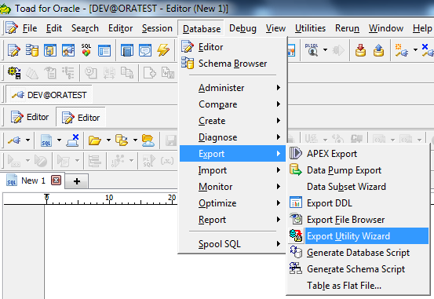
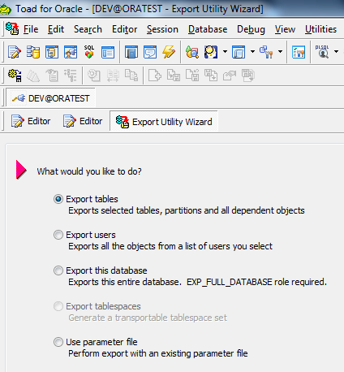
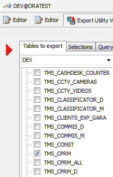
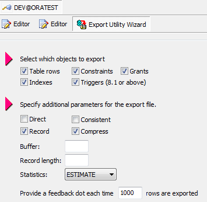
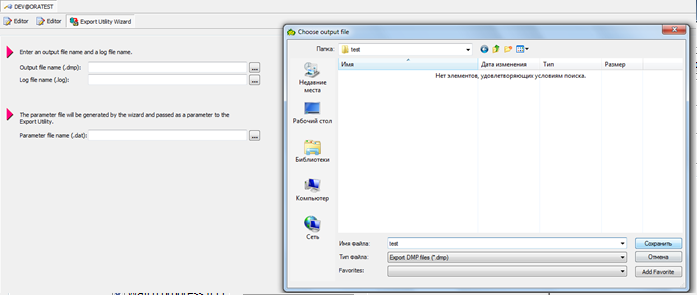
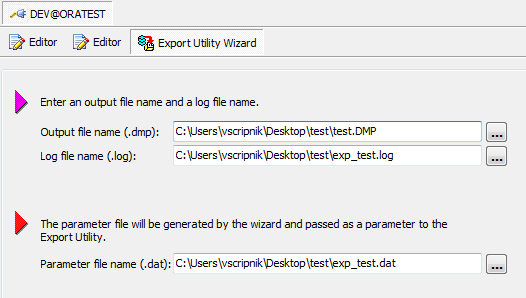

# Экспорт данных

1 Запустить программу toad,  я использую 11 версию и подключиться к нужной схеме \(Dev @oratest\).

В верхней строке меню, найти Database и выбрать Database  -&gt; Export -&gt; Export Utility Wizard. 

 2  Выберите Экспорт таблицы \(Export tables\) из следующих опций и нажмите Далее.

 3 Выберите доступные пользователю таблицы, которые нужно экспортировать, и нажмите Далее. 

 4 Выставляем нужные параметры \(я оставила значения по умолчанию\)  и нажимаем  далее \(next\)

5  Укажите каталог, в месте, которое вы хотите сохранить экспорт файлов.

На открывшейся вкладке напротив output file name нажимаем кнопку для указания пути и имени файла, в моем случае я выбрала папку на рабочем столе с именем test и имя файла тоже тест.

 После нажимаем сохранить и видим , что создалось три файла и нажимаем  далее \(next\)

И нажмите кнопку Готово  \(Finish\).

После экспорта данных создаются файлы для дальнейшего использования.

