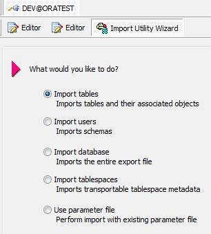
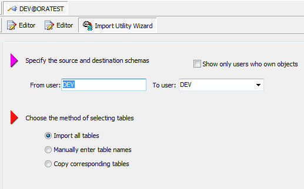
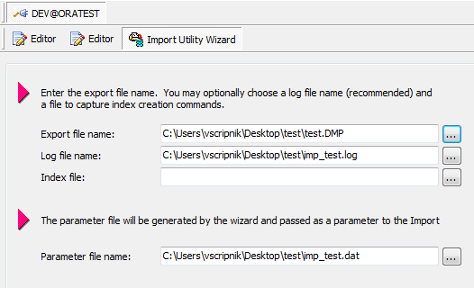
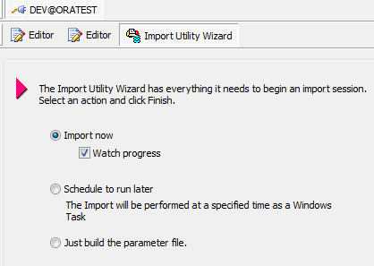

# Импорт данных

1 В программе toad создаем соединение со схемой Dev@oratest или используем уже существующее. 

В верхней строке меню, найти Database и выбрать Database  -&gt; Import -&gt; Import Utility Wizard.

 2  Выберите Импорт таблицы \(Import tables\) из следующих опций и нажмите Далее.

 3 В поле From user вести название схемы с которой был сделан экспорт.

 4 Выбрать в Export file name  файл с разрешением DMP

 5 И нажать на кнопку

И нажмите кнопку Готово  \(Finish\).

После импорта данных создаются  таблица для дальнейшего использования.

