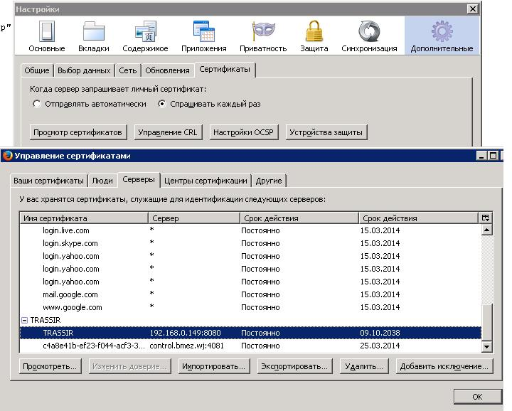

# Oracle wallet

  
Использование Oracle Wallets для UTL\_HTTP и SSL \(HTTPS\).

Ссылка на источник: [http://www.oracle-base.com/articles/misc/utl\_http-and-ssl.php](http://www.oracle-base.com/articles/misc/utl_http-and-ssl.php)

Частичный [перевод статьи utl\_http-and-ssl.php](perevod-stati-utl_http-and-ssl.php.md)

Описание [Утилита для управления Oracle wallets](http://docs.oracle.com/cd/E11882_01/network.112/e10746/asoappf.htm#ASOAG9830)

**Пример настройки Oracle Wallets для HTTPS запросов \(для серв. trassir\).**

**Выгрузка сертификатов из Mozilla** \(кнопка просмотр сертификатов, сертификаты из вкладки серверы - оба\)

Для выгрузки сертификата, нужно зайти в меню Настройки - Дополнительные - вкладка сертификаты. 

Далее кнопка просмотр сертификатов и на вкладке серверы выбрать нужные нам сертификаты \(пример на скриншоте\).



Экспортировать нужно оба сертификата, которые относятся к серверу трассир \(тип файла выбираем "Все"\)

Полученные файлы сертификатов нужно разместить в каталоге линукс, доступном для чтения польз. oracle

Например, /share/un4/cert/

**Добавление сертификата** с действующими путями к папкам сертификаты и wallet

 Сертификаты можно добавить к существующему wallet или создать новый wallet и добавить туда сертификаты

 Для создания нового wallet нужна папка:

 mkdir -p /u01/app/oracle/admin/orcl/wallet

Создаем wallet в имеющейся папке:

 $ORACLE\_HOME/bin/orapki wallet create -wallet /u01/app/oracle/admin/orcl/wallet -pwd WalletPasswd123 -auto\_login

 Добавляем сертификаты к существующему wallet

 $ORACLE\_HOME/bin/orapki wallet add -wallet /u01/app/oracle/admin/orcl/wallet -trusted\_cert -cert "/share/un4/cert/trasir1.crt" -pwd WalletPasswd123

**Тестирование нового сертификата** \(кэширование запроса для получения сертификата\) 

Для тестирования нового сертификата необходимо вызвать команду utl\_http.set\_wallet  

    utl\_http.set\_wallet\('file:/u01/app/oracle/admin/orcl/wallet', 'WalletPasswd123'\);

При этом команда utl\_http.set\_wallet может закэшировать старое состояние wallet и в таком случае новые сертификаты не будут применены.

Поэтому вызываем      utl\_http.set\_wallet для несуществующего пути, например

    utl\_http.set\_wallet\('file:/u01/app/oracle/admin/orcl/wallet12345', 'WalletPasswd123'\);

После чего снова  выполняем команду utl\_http.set\_wallet\('file:/u01/app/oracle/admin/orcl/wallet', 'WalletPasswd123'\);

Если команда utl\_http.set\_wallet выдает ошибку "Файл не найден" или "Каталог не найден", то необходимо дать права на каталог и файл пользователю oracle

Затем можно тестировать запрос https.  

 **Примеры для теста запроса**:

```sql
declare
--req:=utl_http.begin_request(url);
req  utl_http.req;
begin
 -- Сертификат
    utl_http.set_wallet('file:/u01/app/oracle/admin/orcl/wallet', 'WalletPasswd123');
    req:=utl_http.begin_request('https://192.168.0.149:8080/login?password=eybcbv');
end;
begin
 pkg_cctv.trassir_export_process(:p_date);
end;
```


