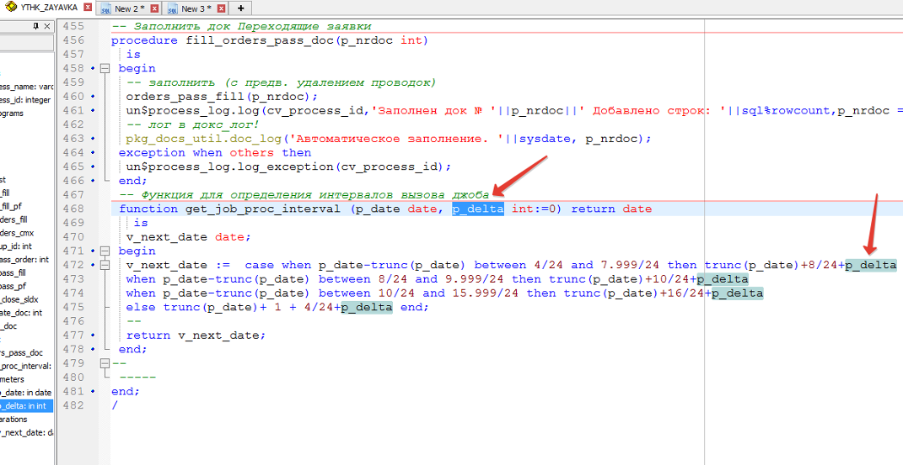

# Создание JOB

```sql
 -- Простой job, в качестве интервала передается SYSDATE + 1
DECLARE
  X NUMBER;
BEGIN
  SYS.DBMS_JOB.SUBMIT
    ( job       => X 
     ,what      => 'begin pkg_tms_export.process_export; end;'
     ,next_date => to_date('25.07.2012 05:00:22','dd/mm/yyyy hh24:mi:ss')
     ,interval  => 'SYSDATE + 1'
     ,no_parse  => TRUE
    );
  SYS.DBMS_OUTPUT.PUT_LINE('Job Number is: ' || to_char(x));
END;
/
commit;
```

```sql
-- Job, который выполняется по графику
-- Для определения интервала вызывается функция get_job_dolg_interval(sysdate)
DECLARE
  X NUMBER;
BEGIN
  SYS.DBMS_JOB.SUBMIT
  ( job       => X 
   ,what      => 'ythk_zayavka.dolg(sysdate);'
   ,next_date => to_date('14.01.2014 10:00:00','dd/mm/yyyy hh24:mi:ss')
   ,interval  => 'get_job_dolg_interval(sysdate)'
   ,no_parse  => FALSE
  );
  SYS.DBMS_OUTPUT.PUT_LINE('Job Number is: ' || to_char(x));
COMMIT;
END;
```

```sql
-- Пример функции для определения интервала
-- При этом функция обязательно должна возвращать значение для любого входного параметра, 
-- иначе Job может отключиться с ошибкой (например, при первом вызове)
CREATE OR REPLACE function get_job_dolg_interval(p_date date) return date
  is
 v_date_h varchar2(5) := to_char(p_date,'hh24');
 v_date_trunc date := trunc(p_date,'hh24');
 v_date date;
begin
 if v_date_h = '08' then
  v_date := v_date_trunc + 2/24;
 elsif v_date_h = '10' then
  v_date := v_date_trunc + 3/24;
 elsif v_date_h = '13' then
  v_date := v_date_trunc + 6/24;  
 elsif v_date_h = '19' then
  v_date := v_date_trunc + 2/24;
 elsif v_date_h = '21' then
  v_date := v_date_trunc + 11/24;
 else
  v_date := v_date_trunc + 1/24;
 end if;
 return v_date; 
end;
```

```sql
--Job по продажам. Показаны разные примеры задания интервала (в частности: если время между 23-48 и 24-00, то выполнить job в 00-30 следующего дня).
DECLARE
  X NUMBER;
BEGIN
  SYS.DBMS_JOB.SUBMIT
  ( job       => X 
   ,what      => 'pkg_sales.process_sales(trunc(sysdate));'
   ,next_date => to_date('16.05.2016 09:10:37','dd/mm/yyyy hh24:mi:ss')
   ,interval  => 'case when sysdate-trunc(sysdate) >= 23.8/24 then trunc(sysdate+1)+30/24/60 when sysdate-trunc(sysdate) between 2.25/24 and 4.8/24 then trunc(sysdate)+5/24 else sysdate + 5/24/60 end'
   ,no_parse  => FALSE
  );
  SYS.DBMS_OUTPUT.PUT_LINE('Job Number is: ' || to_char(x));
COMMIT;
END;
```

Пример джоба с автокилом:

Функция для расчета интервала джоба:



 Используется для джоба:


 И с дельтой для автокила:


