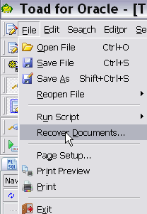
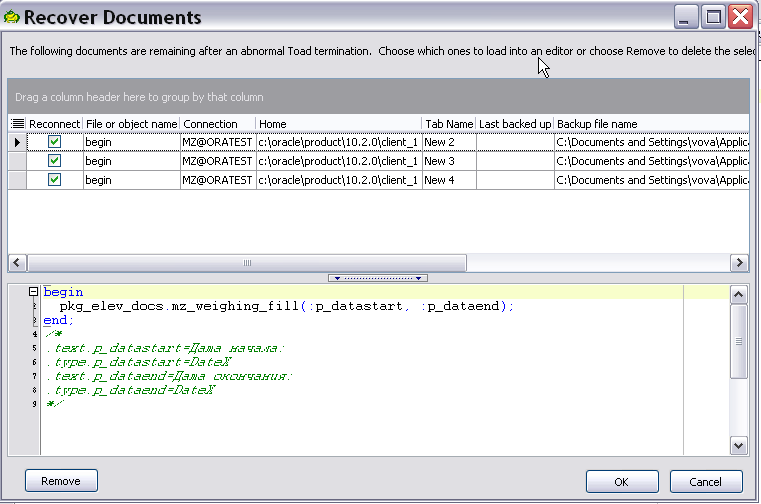

# Утилиты и опции в toad

### Восстановление закрытых вкладок в toad.

 В главном меню программы выбрать File - Recover Documents...

При выборе пункта меню "Recover documents" открывается следующее окно: \(такое же окно открывается, если предыдущая работа в toad была прервана с ошибкой\)

В окне "Recover documents"  выделяем документы\(с зажатой клавишей shift\), которые нужно восстановить.

Для восстановления документов должно работать подключение к соответствующим схемам.

