# Создание вида

##  **2 Создание вида**

###  **2.1 Создание вида \(вариант № 1\)**

 Так как напрямую с таблицами не работают, создадим вид \(_View_\). Для этого перейдем в список _Views_ и нажмем на

 для создания нового вида \(_View_\).

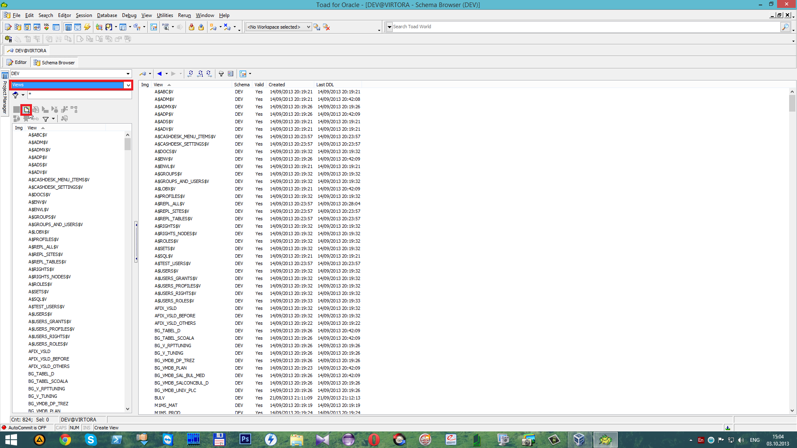

 Напротив

 записываем имя вида \(_View_\). На вкладке 

 пишем скрипт, который выберет все колонки из таблицы `YVEINE_TMDB_INTAKE_LIST_A`. После чего нажимаем

 Для создания второго вида\(_View_\) нажимаем

 и напротив

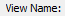

 пишем имя. На вкладке 

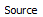

 записываем скрипт, который выберет все колонки из таблицы YVEINE\_TMDB\_INTAKE\_LIST\_B и нажмем

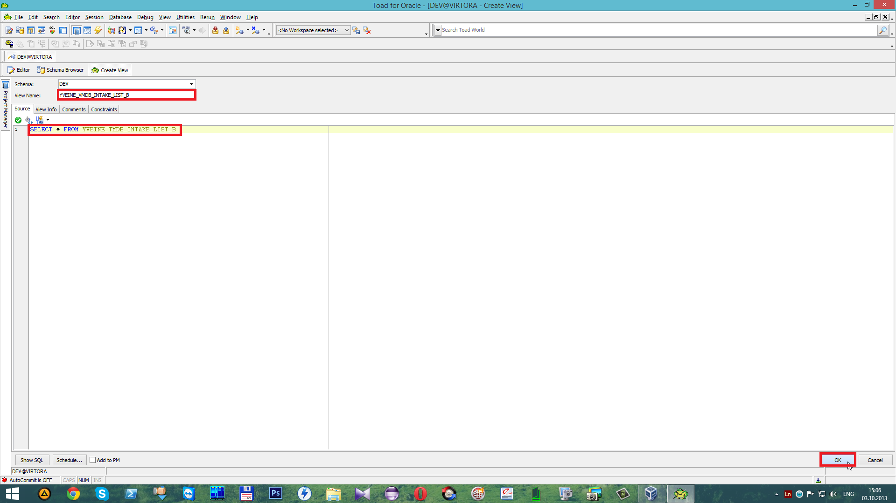

 Для создания третьего вида делаем тоже самое, что и на предыдущих шагах. Нажимаем 

 Напротив

 записываем имя третьего вида\(_View_\). На вкладке 

 записываем скрипт на выборку всех колонок из таблицы `YVEINE_TMDB_INTAKE_LIST_С` и нажимаем

 Для появления созданных видов \(_Views_\) нажимаем

 "**Refresh all objects**". Для завершения транзакции с сохранением нажимаем

 **“Commit”**.

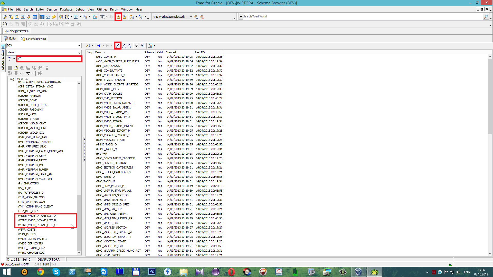

###  **2.2 Создание вида \(вариант № 2\)**

 Для более быстрого создания вида \(_View_\) перейдем в редактор, для этого нажмем на

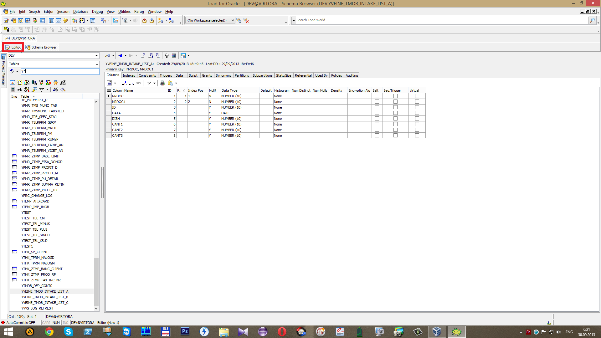

 Напишем скрипт создания вида \(_`CREATE VIEW`_\) и выберем все колонки \(_`SELECT *`_\) из таблицы \(`FROM YVEINE_TMDB_INTAKE_LIST_A`\). Для его запуска используем горячие клавиши **Ctrl+Enter**.

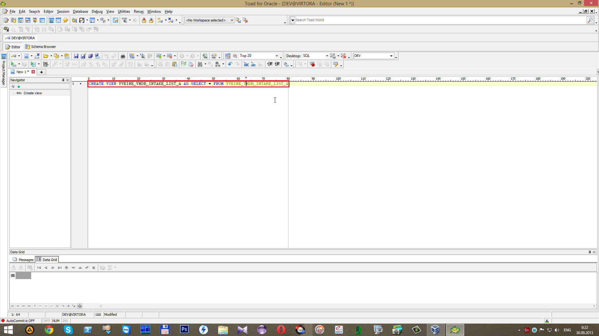

 Напишем скрипт создания вида \(_`CREATE VIEW`_\) и выберем все колонки \(_`SELECT *`_\) из таблицы \(`FROM YVEINE_TMDB_INTAKE_LIST_B`\). Для его запуска используем горячие клавиши **Ctrl+Enter**.

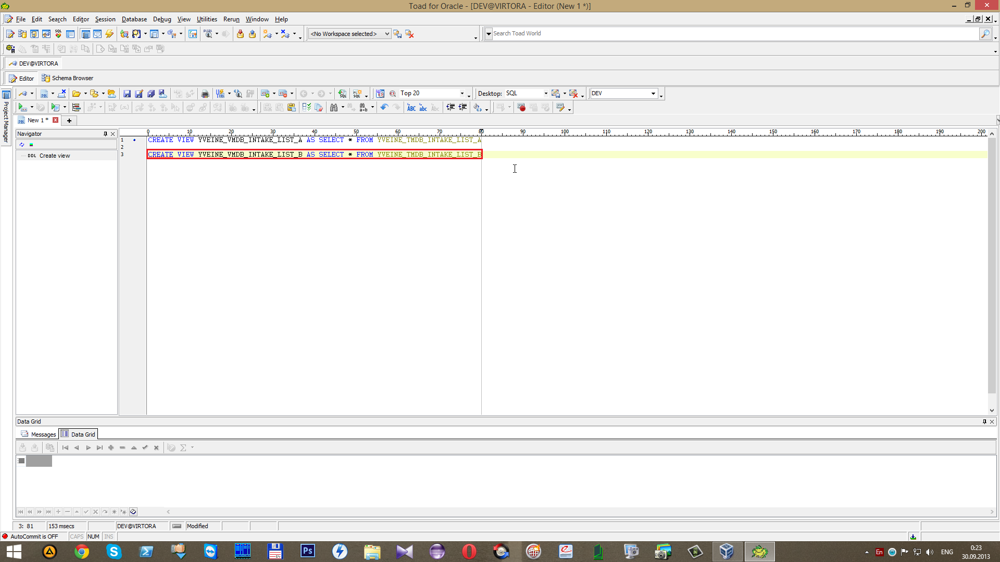

 Напишем скрипт создания вида \(_`CREATE VIEW`_\) и выберем все колонки \(_`SELECT *`_\) из таблицы \(`FROM YVEINE_TMDB_INTAKE_LIST_C`\). Для его запуска используем горячие клавиши **Ctrl+Enter**.

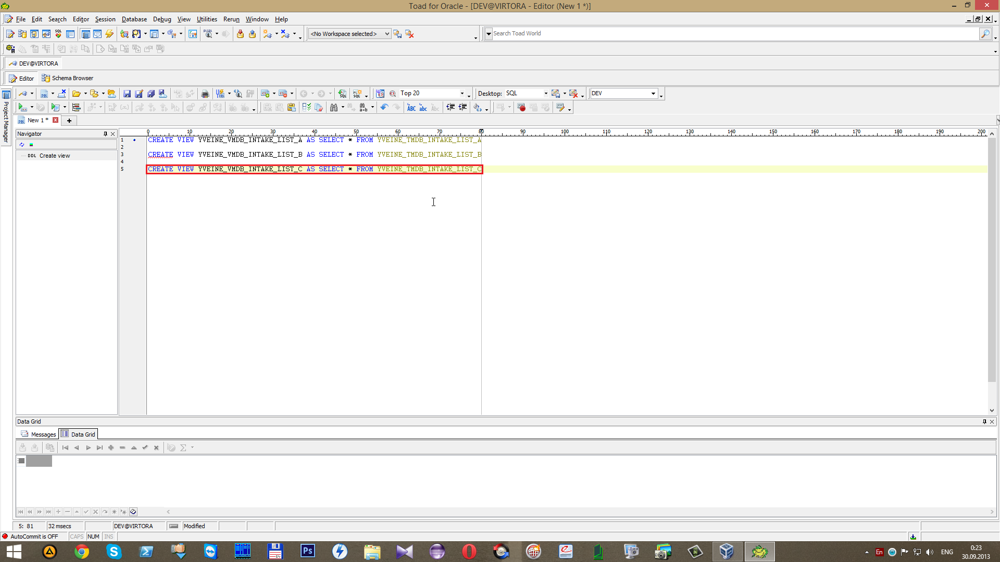

 После чего откроем _Views_.

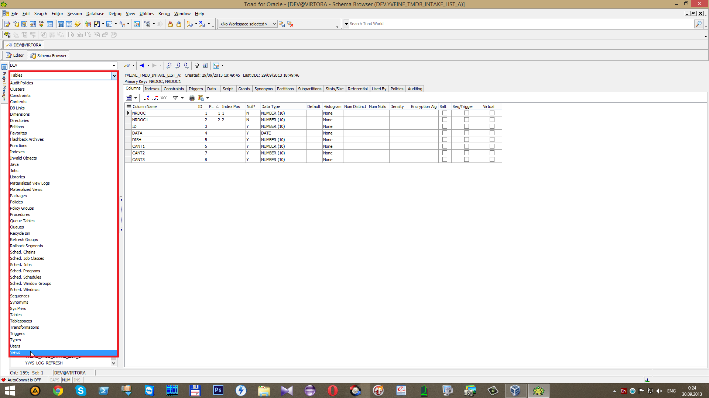

 C помощью поиска найдем созданные виды \(_Views_\).

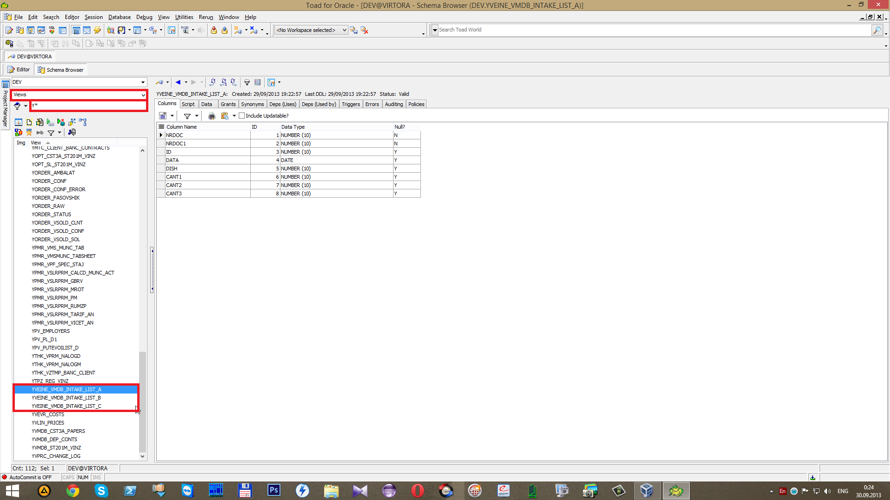

###  **2.3 Добавление дополнительных колонок в вид**

 Тип данных у всех колонок\(кроме _`DATA`_\) "`Data Type`" _`NUMBER(10)`_, а это значит, что данные из справочников будут в виде цифрового кода, так как колонка _`COD`_в справочнике _`TMS_UNIVERS`_ имеет такой же тип данных _`NUMBER(10)`_. Именно поэтому необходимо создать новые колонки, в которых будет другой тип данных. Для этого переходим на вкладку

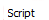

 и копируем его в редактор с помощью

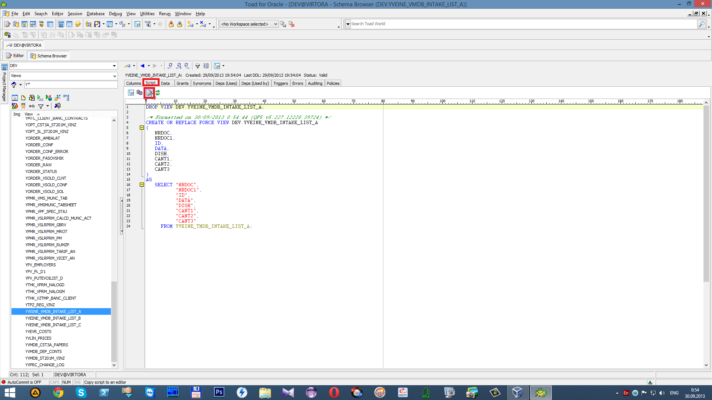

Добавляем вычисляемую \(_`CLC`_\) текстовую \(_`T`_\) колонку _`CLCDISHT`_ и записываем к ней подзапрос \(`SELECT DENUMIREA FROM TMS_UNIVERS WHERE COD = A.DISH`\).

Для выполнения скрипта используем горячие клавиши **Ctrl+Enter**.

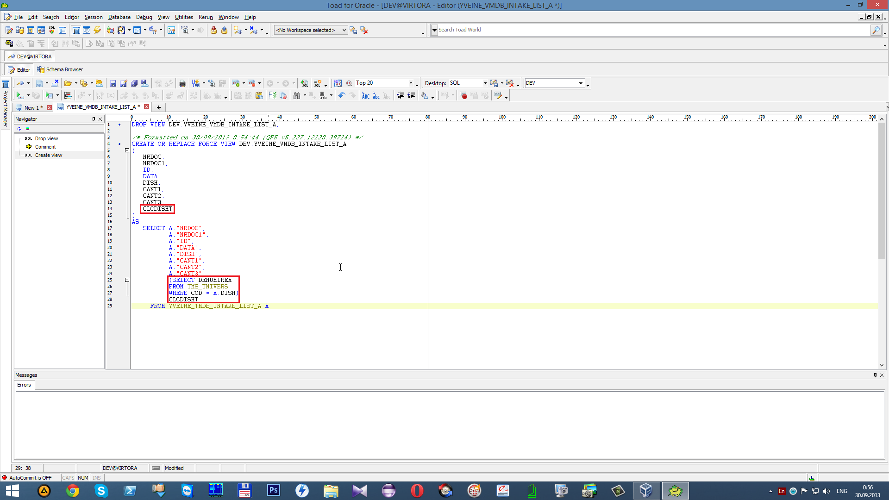

 В результате чего появится дополнительная колонка _`CLCDISHT`_.

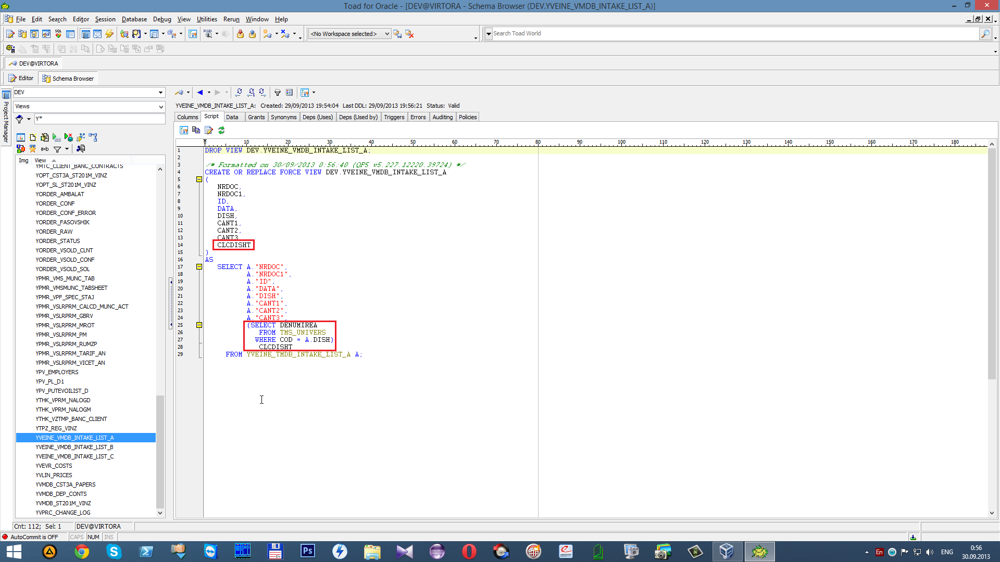

 Для второго вида\(_View_\) делаем идентичное действие. Переходим на вкладку

 и копируем скрипт в редактор с помощью

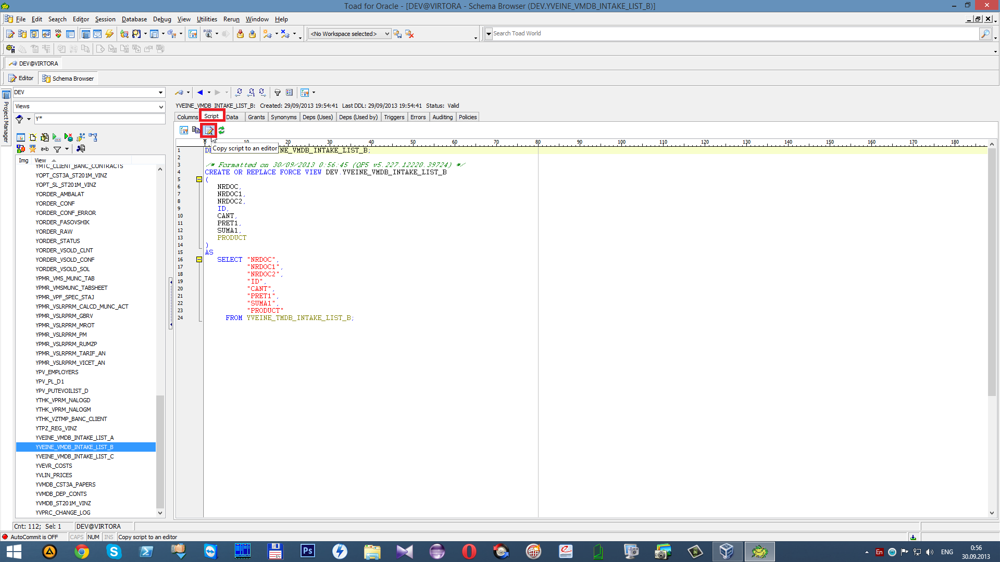

Добавляем вычисляемую \(_`CLC`_\) текстовую \(_`T`_\) колонку _`CLCPRODUCTT`_. Записываем подзапрос \(`SELECT DENUMIREA FROM TMS_UNIVERS WHERE COD = A.PRODUCT`\)

Для выполнения запроса используем горячие клавиши **Ctrl+Enter**.

 В результате чего появится дополнительная колонка _`CLCPRODUCTT`_.

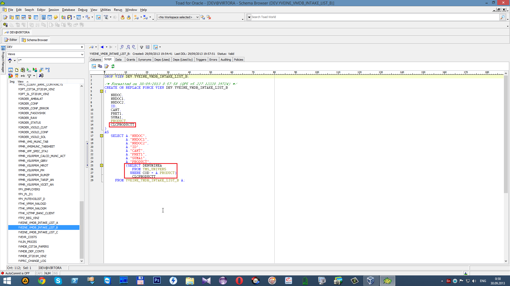

 Тоже самое выполняем и для третьего вида\(_View_\). Переходим на вкладку и копируем его в редактор с помощью кнопки

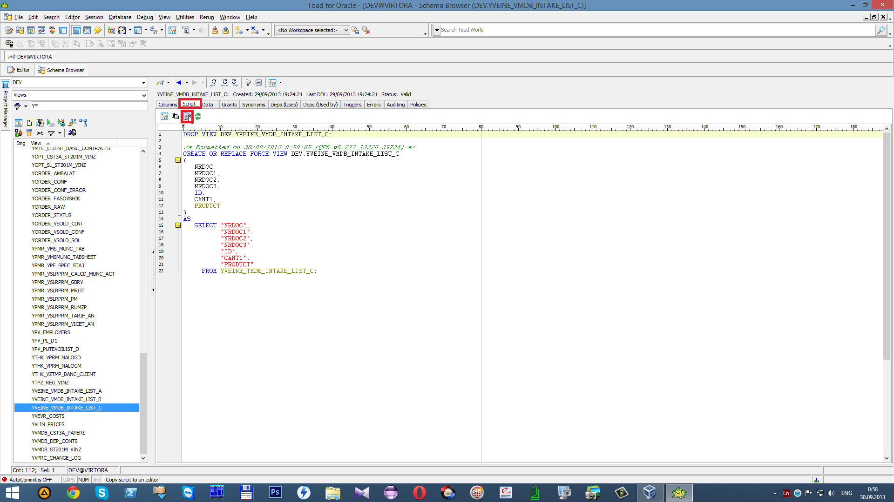

Добавляем вычисляемую \(_`CLC`_\) текстовую \(_`T`_\) колонку _`CLCPRODUCTT`_. Записываем подзапрос \(`SELECT DENUMIREA FROM TMS_UNIVERS WHERE COD = A.PRODUCT`\)

Для выполнения запроса используем горячие клавиши **Ctrl+Enter**.

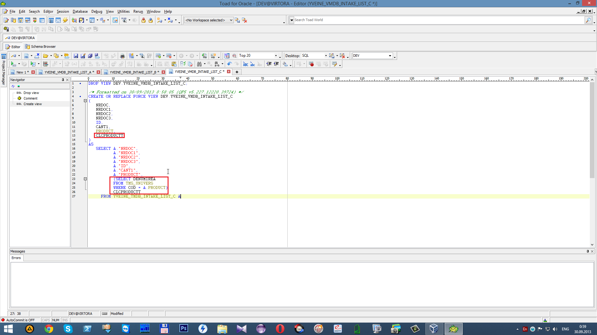

 В результате чего появится дополнительная колонка _`CLCPRODUCTT`_. После проведенных действий сохраняем изменения в текущей транзакции с помощью

  “**Commit”**.

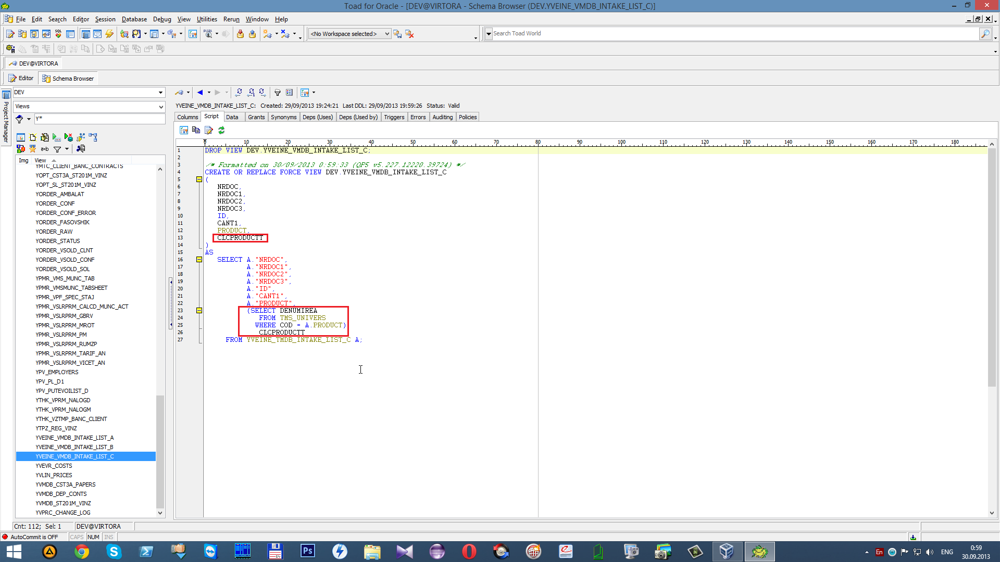

