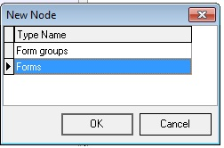
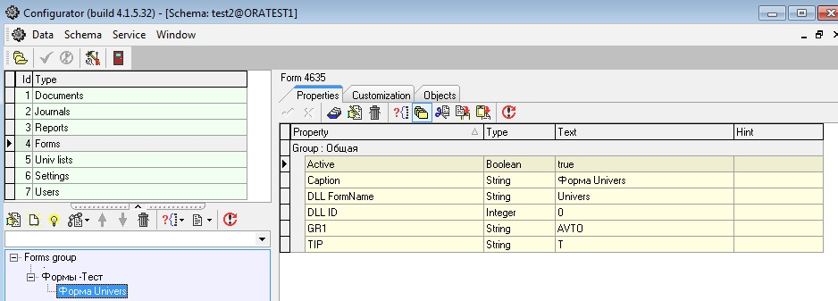
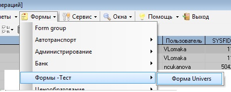

# Создание формы отображающей справочник Univers

 В конфигураторе выбираем узел Forms -&gt;Forms group -&gt; Формы -Тест


В этот узел добавим новый узел, форму которая будет отображать данные из справочника Univers.

Выделяем узел Формы-Тест  и в меню выбираем  Add subnode , в открывшемся окне выбираем Forms



нажимаем Ок

и вводим имя: Форма Univers.

В конфигураторе видно, что в узел дерева Формы-Тест добавился под узел.

Настройка свойств формы.

| **Название свойства** | **Тип** | **Описание**  | **Значение для примера**  |
| --- | --- | --- | --- | --- | --- | --- | --- |
| Active | Boolean | действующий объект | true |
| Caption | Boolean | подпись формы | Форма Univers |
| DLL FormName | String | тип формы | Univers |
| DLL ID | Integer | идентификационный номер DLL | 0 |
| TIP | String | тип справочника SysS | T |
| GR1 | String | подгруппа справочника GR1 | AVTO |
| GR2 | String | подгруппа справочника GR2 |  |

 В конфигураторе: 



И обязательно нужно нажать Commit \(красную галочку\).

В Une нажимаем F5 \(Обновить\).

В меню формы добавится наш справочник.



Выбрав Форма Univers откроется справочник T AVTO, который можно дальше настраивать.

**Примечание:**

Если не работает привязка справочника в уне к унивЛисту в конфигураторе, то причиной может быть пустое свойство Active или его отсутствие

```sql
[ZZZ]
Active=true
.type.Active=Boolean
```


