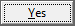
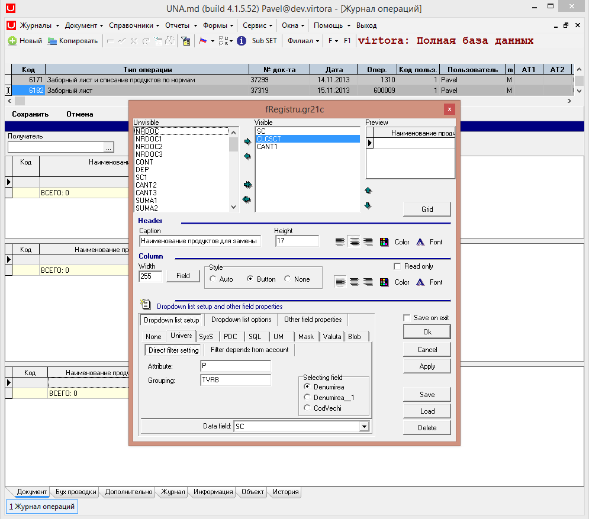
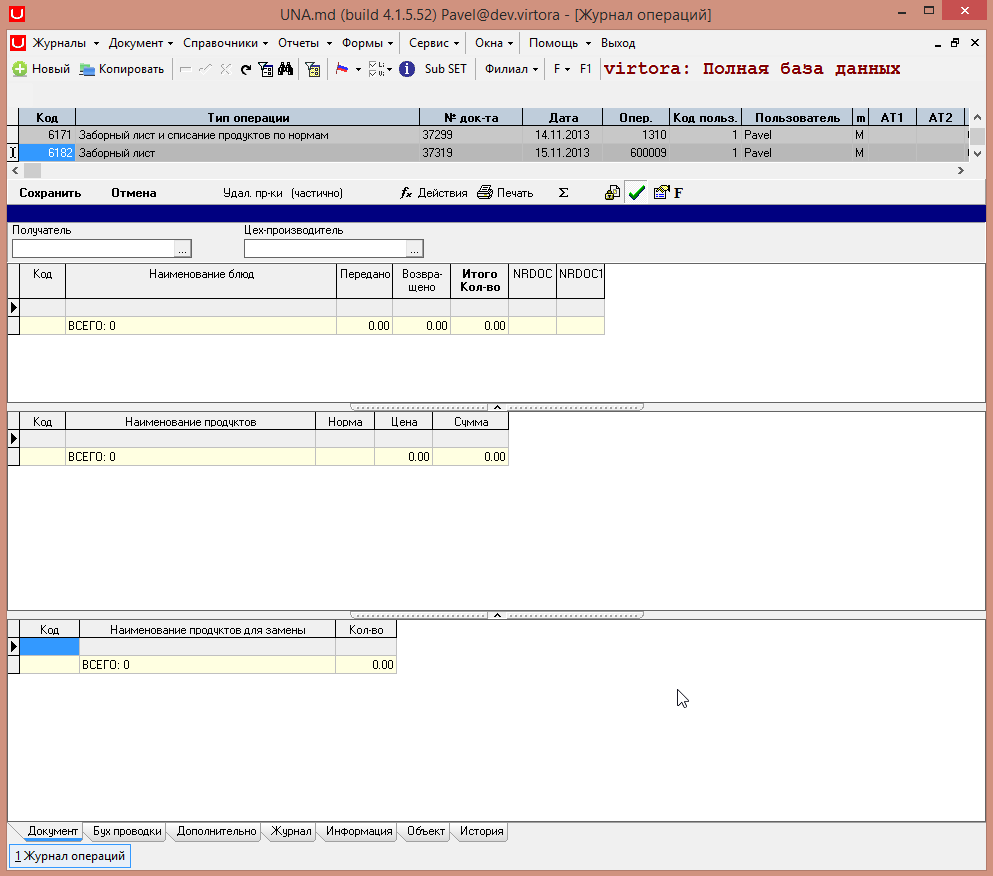

# Инструкция по фокусам

Для того чтобы при открытии документа был сфокусирован какой-либо Control, необходимо в конфигураторе добавить свойство FocusControl и его название \(тип свойства по умолчанию String\). Сохраняем изменения с помощью галочки

 "Commit".

 В программе нажимаем горячую клавишу F5 для обновления настроек. В появившемся окне нажимаем кнопку

 Далее выйдет окно о успешном обновлении настроек, нажимаем кнопку

 После открытия документа на редактирование, фокус находится на Control'e `UnDBEdit1`.

 Для того, чтобы при открытии документа на редактирование фокусировался другой Control, изменим его название в конфигураторе на другое.

 При сохранении, обновлении настроек и открытии документа, фокусируется на Control `UnDBEdit2`.

 Для того, чтобы при открытии документа на редактирование фокусировался третий Control, изменим его название в конфигураторе.

 При сохранении, обновлении настроек и открытии документа, фокусируется на Control `UnDBEdit3`.

 Для перехода в дизайн Header'a нажимаем на ролик мыши или с зажатым Ctrl нажимаем правой кнопкой мыши и в появившемся списке выбираем

 Здесь можно посмотреть имена объектов Control, которые уже созданы.

 Для того, чтобы при открытии документа на редактирование фокусировался Control `DBMemo1`, запишем его название в конфигураторе.

 При сохранении, обновлении настроек и открытии документа, фокусируется Control `DBMemo1`.

Для того, чтобы при открытии документа на редактирование фокусировался Control `DBCheckBox1`, запишем его название в конфигураторе.

 При сохранении, обновлении настроек и открытии документа, фокусируется Control `DBCheckBox1`.

Так же можно фокусироваться на грид. Документ, выбранный в качестве примера, имеет 3  грида. Соответственно `gr21a` это первый грид. 

 В документе при нажатии на каждом гриде горячих клавиш Alt+D сверху можно посмотреть

 Для второго грида это соответственно

 А для третьего

 При записи свойства 

 сохранении изменений с помощью

 и обновлении настроек, фокусируется первый грид:

 При записи свойства

 сохранении изменений с помощью

 и обновлении настроек, фокусируется второй грид:

 При записи свойства

 сохранении изменений с помощью

 и обновлении настроек, фокусируется третий грид:

Список объектов Control, имена которых можно записывать в свойстве FocusControl в конфигураторе:

| **Имя Control’a:** | **Свойство в конфигураторе:** | **Внешний вид:** |
| --- | --- | --- | --- | --- | --- | --- | --- | --- | --- | --- | --- | --- | --- | --- | --- | --- | --- |
| Edit1 |  |  |
| DBEdit1 |  |  |
| UnDBEdit1 |  |  |
| UnScList1 |  |  |
| CheckBox1 |  |  |
| DBCheckBox1 |  |  |
| DateEdit1 |  |  |
| DBDateEdit1 |  |  |
| DateTimeEdit1 |  |  |
| DBDateTimeEdit1 |  |  |
| RadioGroup1 |  |  |
| DBRaditGroup1 |  |  |
| Memo1 |  |  |
| DBMemo1 |  |  |
| Button1 |  |  |
| DBImage1 |  |  |
| DBImage1 \(с картинкой\) |  |  |

