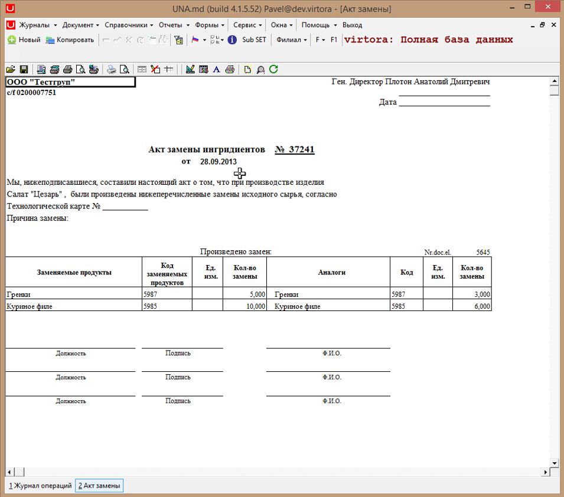
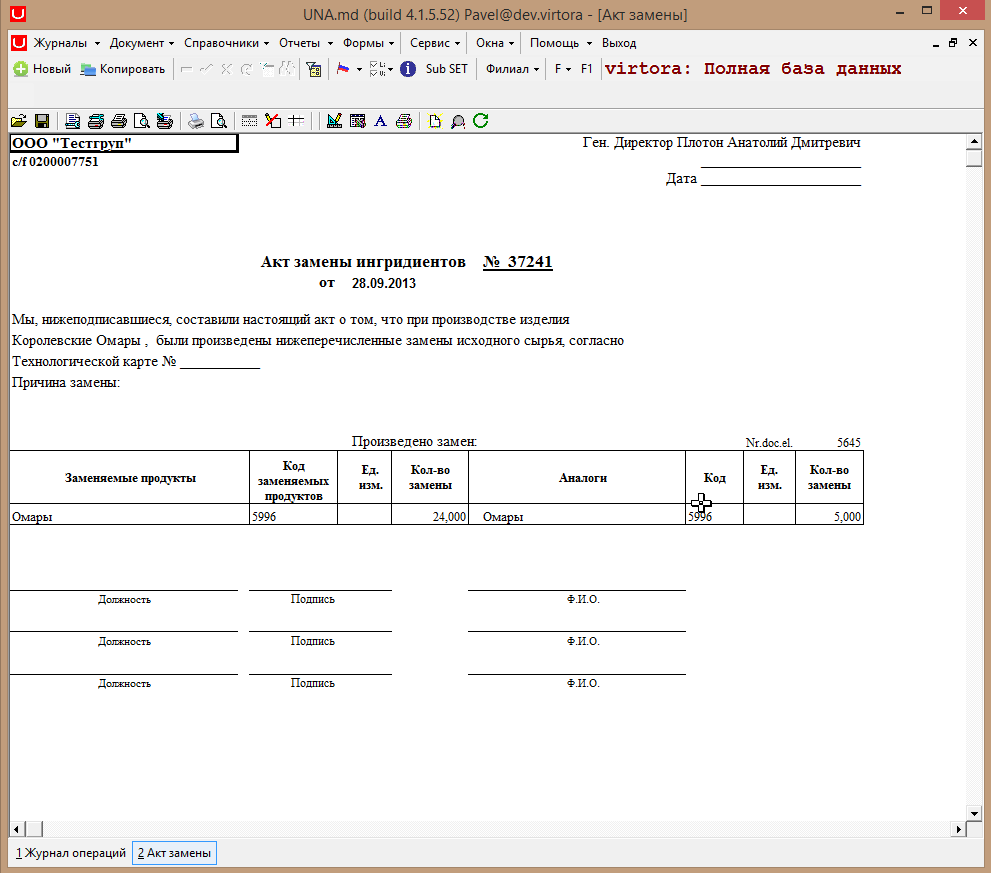
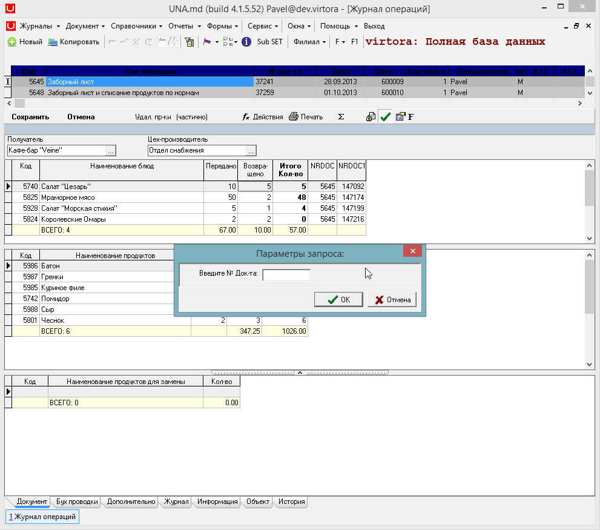

# Инструкция по прыжкам

###  **Прыжки из документа**

 Открываем дизайн первого грида


 с помощью горячих клавиш Alt+D, нажимаем


```sql
DblClick=goto                      
TargetType=doc.print           
NrDoc=_NRDOC                
TargetSection=6:5:PRINTDOC_AKTRAZDELKI           
GotoNextRecord=1   
```

 Сохраняем изменения с помощью


 и нажимаем


 После двойного клика по любой строке колонки CANT2 \(Возвращено\) построится печатная форма данного документа.



 После закрытия построенной печатной формы произошел переход на другую строку \(GotoNextRecord\).


 После двойного клика мыши построится печатная форма с другими данными \(\_NRDOC\).


 После закрытия построенной печатной формы произошел переход на другую строку \(GotoNextRecord\).


 После двойного клика мыши построится печатная форма с другими данными \(\_NRDOC\).


 После закрытия построенной печатной формы произошел переход на другую строку \(GotoNextRecord\).


 После двойного клика мыши построится печатная форма с другими данными \(\_NRDOC\).



 Открываем дизайн первого грида


 с помощью горячих клавиш Alt+D, нажимаем


 и записываем:

```sql
DblClick=goto
TargetType=doc.action
Action_ID=4
```

 Сохраняем изменения с помощью


 и нажимаем


 После двойного клика мыши на любой строке поля CANT3 \(возвращено\) выполнится действие с ID=4.



 В данном случае это


 Открываем дизайн первого грида


 с помощью горячих клавиш Alt+D, нажимаем


```sql
DblClick=goto
TargetType=form
TargetSection=CURS
```

 Сохраняем изменения с помощью


 и нажимаем 


 В результате двойного клика мыши по полю CANT3 \(Возвращено\), откроется форма


 Открываем дизайн первого грида


 с помощью горячих клавиш Alt+D, нажимаем


 и записываем:

```sql
DblClick=goto
TargetType=cartela
TargetSection=ATTR_ORD_ADD
nrdoc=_nrdoc
MainTA=1
```

 Сохраняем изменения с помощью


 и нажимаем 


 В результате двойного клика мыши по полю CANT3 \(Возвращено\), открывается карточка.


 Открываем дизайн первого грида


 с помощью горячих клавиш Alt+D, нажимаем


 и записываем:

```sql
DblClick=goto
TargetType=report
TargetSection=1:0:RG113
```

 Сохраняем изменения с помощью


 и нажимаем


 В результате двойного клика мыши по полю CANT3 \(Возвращено\), строится отчет.


 Имя секции можно посмотреть в конфигураторе, нажав кнопку


 Имя секции для данного отчёта


###  **Прыжки из форм.**

 Открываем любую форму, например


 Выделяем любое поле.


 Открываем дизайн грида с помощью горячих клавиш Alt+D и нажимаем


 Записываем:

```sql
DblClick=goto
TargetType=document
nrdoc=5645
```

 Сохраняем изменения с помощью


 и нажимаем


 В результате двойного клика мыши на любой строке поля COD1 \(Код1\) происходит переход в документ с Nrdoc=


 Добавляем свойство


 для пользователя или группы пользователей. Это свойство открывает документ на редактирование после перехода на него по двойному клику. Сохраняем изменения в текущей транзакции с помощью галочки


 В программе нажимаем горячую клавишу F5 для обновления настроек. В появившемся окне нажимаем


 Далее выйдет окно об успешном обновлении настроек. Нажимаем


 Переходим на открытую вкладку


 Дважды кликнем левой кнопкой мыши на любой строке поля COD1 \(Код1\).


 В результате происходит переход в открытый документ с Nrdoc=


 Переходим на открытую вкладку


 Открываем дизайн грида с помощью горячих клавиш Alt+D, нажимаем


 и записываем:

```sql
DblClick=goto
TargetType=document
nrdoc=5645
ReturnType=Form
ReturnSection=CURS
```

 Сохраняем изменения с помощью


 и нажимаем


 В результате двойного клика мыши происходит переход в открытый документ с Nrdoc=


 но после нажатия на


 или


 или


 \(или горячих клавиш Ctrl+~ или Ctrl+-\)


 происходит возвращение в форму с именем секции


 \(откуда происходил переход в документ\).


 Имя секции можно посмотреть в конфигураторе, нажав кнопку


 при выделенной форме. В данном случае имя секции


 Открываем форму


 Далее открываем дизайн грида с помощью горячих клавиш Alt+D, нажимаем


 и записываем:

```sql
DblClick=goto
TargetType=form.print
TargetSection=0:0:PRINTFORM:SCALESEXP
```

 Сохраняем изменения с помощью


 и нажимаем


 В результате двойного клика мыши на строке в поле STRIH1\_CODPRODUCER \(Штрихкод\) происходит построение печатной формы.


 Имя секции печатной формы можно посмотреть в конфигураторе, нажав кнопку


 В данном случае это 


 У данной формы только одна печатная форма, которая и была построена ранее.


 Переходим на открытую вкладку


 Далее открываем дизайн грида с помощью горячих клавиш Alt+D, нажимаем


 и записываем:

```sql
DblClick=goto
TargetType=doc.new
TargetSysFID=1400
TargetJournal=MATERIALE
```

 Сохраняем изменения с помощью 


 и нажимаем


 В результате двойного клика мыши происходит создание нового документа с SysFID=


 Открываем конфигуратор, выбираем документ, у которого будут дочерние документы. Добавляем свойство


 где 10-это DB ID дочернего документа. Так же можно добавить свойство


 если в процессе создания дочернего документа возникает ошибка, то вставка в tmdb\_docs отменяется. Сохраняем изменения в текущей транзакции с помощью галочки


 В программе нажимаем горячую клавишу F5 для обновления настроек. В появившемся окне нажимаем кнопку


 Далее выйдет окно о успешном обновлении настроек, нажимаем кнопку


 Открываем форму


 Выделяем любую строчку в любой колонке.


 Далее открываем дизайн грида с помощью горячих клавиш Alt+D, нажимаем


 и записываем:

```sql
DblClick=goto
TargetType=doc.child
```

 Сохраняем изменения с помощью


 и нажимаем


