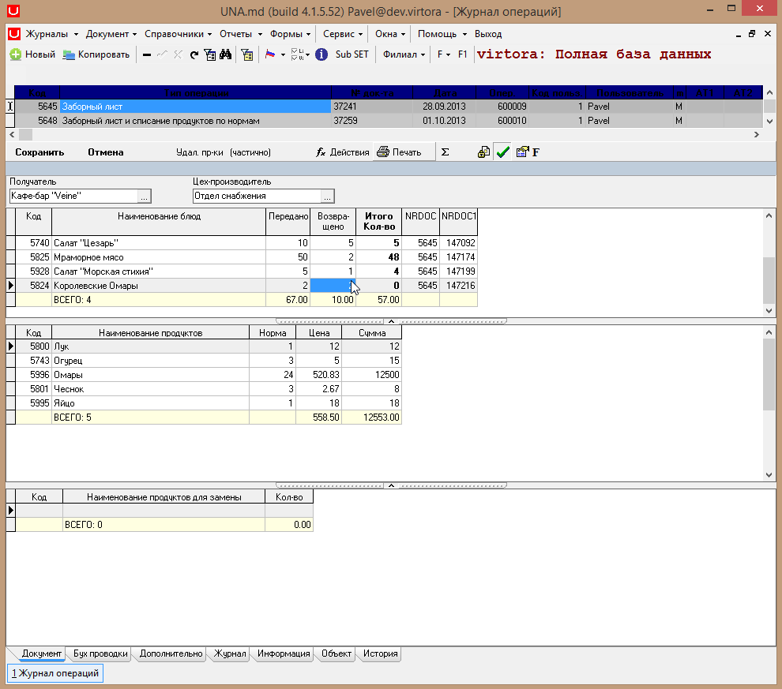

# Инструкция по прыжкам

###  **Прыжки из документа**

 Открываем дизайн первого грида


 с помощью горячих клавиш Alt+D, нажимаем


```sql
DblClick=goto                      
TargetType=doc.print           
NrDoc=_NRDOC                
TargetSection=6:5:PRINTDOC_AKTRAZDELKI           
GotoNextRecord=1   
```

 Сохраняем изменения с помощью


 и нажимаем


 После двойного клика по любой строке колонки CANT2 \(Возвращено\) построится печатная форма данного документа.


 После закрытия построенной печатной формы произошел переход на другую строку \(GotoNextRecord\).


 После двойного клика мыши построится печатная форма с другими данными \(\_NRDOC\).


 После закрытия построенной печатной формы произошел переход на другую строку \(GotoNextRecord\).


 После двойного клика мыши построится печатная форма с другими данными \(\_NRDOC\).


 После закрытия построенной печатной формы произошел переход на другую строку \(GotoNextRecord\).



 После двойного клика мыши построится печатная форма с другими данными \(\_NRDOC\).


 Открываем дизайн первого грида


 с помощью горячих клавиш Alt+D, нажимаем


 и записываем:

```sql
DblClick=goto
TargetType=doc.action
Action_ID=4
```

 Сохраняем изменения с помощью


 и нажимаем


 После двойного клика мыши на любой строке поля CANT3 \(возвращено\) выполнится действие с ID=4.


 В данном случае это


 Открываем дизайн первого грида


 с помощью горячих клавиш Alt+D, нажимаем


```sql
DblClick=goto
TargetType=form
TargetSection=CURS
```

 Сохраняем изменения с помощью


 и нажимаем 


 В результате двойного клика мыши по полю CANT3 \(Возвращено\), откроется форма


 Открываем дизайн первого грида


 с помощью горячих клавиш Alt+D, нажимаем


 и записываем:

```sql
DblClick=goto
TargetType=cartela
TargetSection=ATTR_ORD_ADD
nrdoc=_nrdoc
MainTA=1
```

 Сохраняем изменения с помощью


 и нажимаем 


 В результате двойного клика мыши по полю CANT3 \(Возвращено\), открывается карточка.


 Открываем дизайн первого грида


 с помощью горячих клавиш Alt+D, нажимаем


 и записываем:

```sql
DblClick=goto
TargetType=report
TargetSection=1:0:RG113
```

 Сохраняем изменения с помощью


 и нажимаем


 В результате двойного клика мыши по полю CANT3 \(Возвращено\), строится отчет.


 Имя секции можно посмотреть в конфигураторе, нажав кнопку


 Имя секции для данного отчёта


###  **Прыжки из форм.**

 Открываем любую форму, например


 Выделяем любое поле.


 Открываем дизайн грида с помощью горячих клавиш Alt+D и нажимаем


 Записываем:

```sql
DblClick=goto
TargetType=document
nrdoc=5645
```

 Сохраняем изменения с помощью


 и нажимаем


