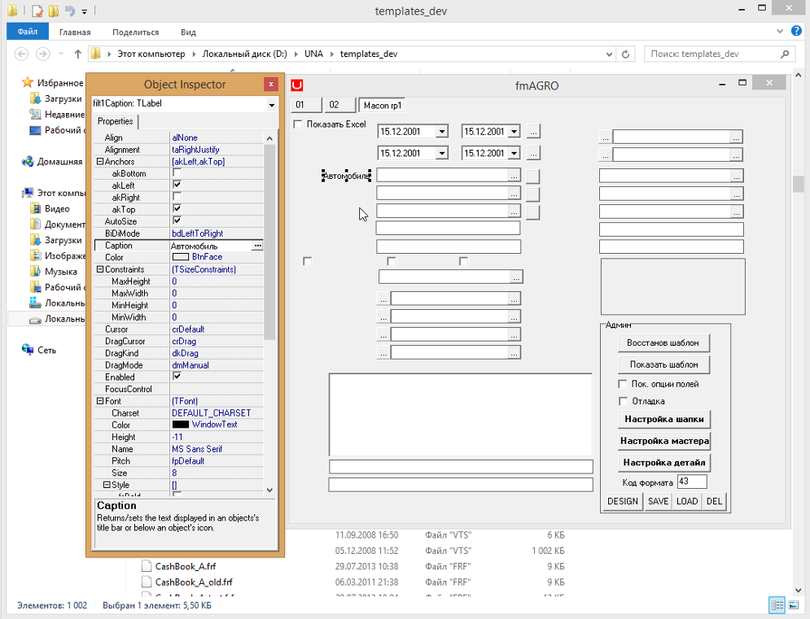

# Инструкция по созданию новой схемы

**Инструкция по созданию новой схемы**

Данная инструкция описывает этапы создания новой \(пустой\) схемы программы ”Universal Accounting”, путем экспорта имеющейся рабочей схемы. После завершения всех этапов данной инструкции создается схема идентичная рабочей схеме, но с незаполненными журналами документов. При этом в новой схеме полностью сохраняется структура, настройки и содержание справочников, форм, отчетов и печатных форм документов.

**Содержание:**

1. Предварительные настройки.
2. Экспорт рабочей схемы.
3. Импорт новой схемы.
4. Проверка отличий.

### **1. Предварительные настройки.**

1.1 Подключиться посредством удаленного помощника \(командная строка : mstsc \) к серверу, на котором находится необходимая схема.

1.2 Запустить программу un4Versions.exe. Приложение находится в папке GOOD на локальном диске \(интерфейс приложения un4Versions.exe – рис.1\).

1.3 Посредством приложения un4Versions.exe подключиться к нужному серверу с правами супервизора. Для этого необходимо выполнить следующие действия :

 1.3.1 Выбрать вкладку "Настройки"

 или пункт меню "Настройки подключения"

 1.3.2 В поле "сервер или ..." ввести имя сервера

 1.3.3 Если пароль на подключение к схеме с правами супервизора SYS/SYS, нажать кнопку "Подключиться" 

 Если пароль другой, нажать "Подключиться с вводом пароля"

 и ввести необходимый пароль.

### **2. Экспорт рабочей схемы.**

Необходимо сделать экспорт имеющейся схемы с фильтром на данные. Для этого необходимо выполнить следующие шаги:

 2.1 Выбрать вкладку "DataPump"

 или пункт меню "Экспорт/импорт схемы"

 2.2 Во внутренних вкладках выбрать вкладку "Действия"

 2.3 Ввести или выбрать из списка поле "Схема-источник"

 Это поле содержит название рабочей схемы, которую мы экспортируем.

 2.4 Ввести или выбрать из списка поле "Oracle Directory"

 Если оставить поле пустым, то по умолчанию берется директория оракла DATA\_PUMP\_DIR.

 2.5 При необходимости откорректировать поле "Файл экспорта"

 \(по умолчанию - совпадает с именем схемы-источника\)

 2.6 Нажать кнопку "Скомпилировать ист."

 2.7 Нажать кнопку "Создать таблицу объектов"

 2.8 Выбрать вкладку "Фильтр на таблицы"

 2.9 Нажать кнопку "Заполнить главные"

 \(в нижней части окна\)

 2.10 Просмотреть и, если не установлен, поставить фильтр: галка "Контроль вручную"

  \(рис.2\).

2.11 Снова вернуться на вкладку "Действия"

2.12 Нажать кнопку "Экспорт по фильтру"

 При этом появится окно сообщений

 Следует дождаться успешного завершения процесса экспорта.

### **3. Импорт новой схемы.**

Необходимо сделать импорт полученного файла в новую схему. Для этого необходимо выполнить следующие шаги:

3.1 Подключиться к серверу импорта \(туда, где будет стоять база\). Если он на другом сервере – см. пункт 1.3.

3.2 Если необходимо - снова заполнить поле "Схема-источник"

\(поле обязательно должно быть заполнено при импорте!\). Здесь указывается имя схемы, которая экспортировалась \(без документов\) для создания новой схемы.

3.3 В поле "Новая схема" ввести название \(по умолчанию имя схемы-источника\)

 3.4 Нажать кнопку "Импорт всей схемы"

 При этом появится окно сообщений

 Следует дождаться успешного завершения процесса

 Как правило, процесс импорта завершается с ошибками. Ошибки можно посмотреть нажав кнопку

 3.5 Обязательно нажать кнопку "Скомпилировать ист." 

### **4. Проверка отличий.**

Необходимо проверить в наличии и состоянии объектов. Для этого необходимо выполнить следующие действия :

1. Выбрать вкладку "Сравнение объектов"

 2. Установить фильтр \(галку\) "Контроль вручную"

 \(рис.3\).

3. Необходимо добиться, чтобы количество невалидных объектов было минимальным.

