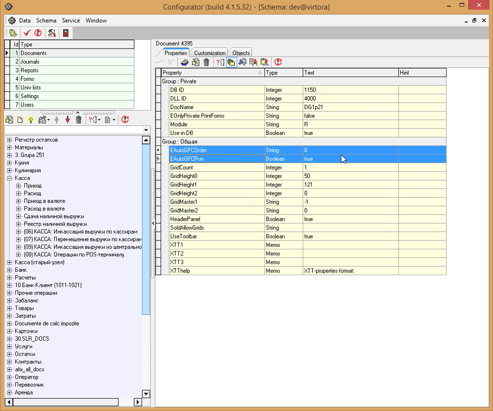

# Нумерация документов

 Как видно из поля № док-та нумерация не происходит.

 Переходим в конфигуратор и находим Action для нумерации

 Копируем данный Action с помощью:

 Получаем сообщение о завершении экспорта одного узла:

 Далее нажимаем

 Вставляем как подузел  в Document Actions требуемого документа в помощью:

 Получаем сообщение о завершении импорта одного узла:

 Выделяем свойство

 и нажимаем

для открытия окна редактирования \(либо двойным кликом левой кнопкой мыши\). В открывшемся окне указываем пакет Un$vp$util и через точку \(!\) процедуру alt\_seq

И в скобках передаём номер документа через двоеточие \(!\) \(:nrdoc,'10'\)

 Далее нажимаем

 Переходим к свойствам для автовыполнения действия \(Action\). Для этого находим свойства EAutoGFCOrder и EAutoGFCRun. Включаем Multiselect, нажав кнопку

 Далее копируем два свойства для автовыполнения действия \(Action\) с помощью кнопки 

 или с помощью горячих клавиш Ctrl+C.

 Вставляем свойства с помощью кнопки

 или с помощью горячих клавиш Ctrl+V.

 Таким образом в свойстве EAutoGFCOrder указывается ID действия \(Action\), которое должно выполниться при сохранении документа. Свойство EAutoGFCRun включает автовыполнение действий \(Action\) при сохранении документа.

 Сохраняем изменения  с помощью

 \(Commit\). Для вступления изменений в силу в программе нажимаем горячую клавишу F5 для обновления настроек:

 В открывшемся окне нажимаем

 Получаем сообщение об успешном обновлении настроек:

 После чего нажимаем

 Создадим новый документ с помощью кнопки

 Далее сохраняем документ с помощью кнопки

 В результате чего в поле № док-та автоматически установилась цифра 1.

 При создании и сохранении других документов, происходит автоматическая нумерация.

