# Экспорт/Импорт шаблона документа в конфигураторе

##  **6 Экспорт/Импорт шаблона документа в конфигураторе**

 Таблицы, виды, последовательность и триггеры созданы, но для того чтобы создать документ необходимо в конфигураторе сделать следующее: Запускаем файл **uniConf.exe**.

 Заполняем поля _Home_, _Server_, _User name_ и _Password_. \(Если имя схемы совпадает с паролем, то пароль можно не заполнять\). Далее нажимаем

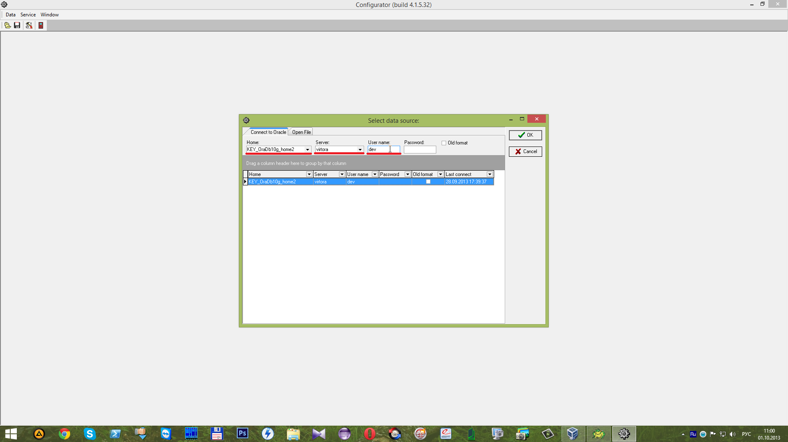

 После чего заполняем имя пользователя и пароль для доступа к программе и нажимаем

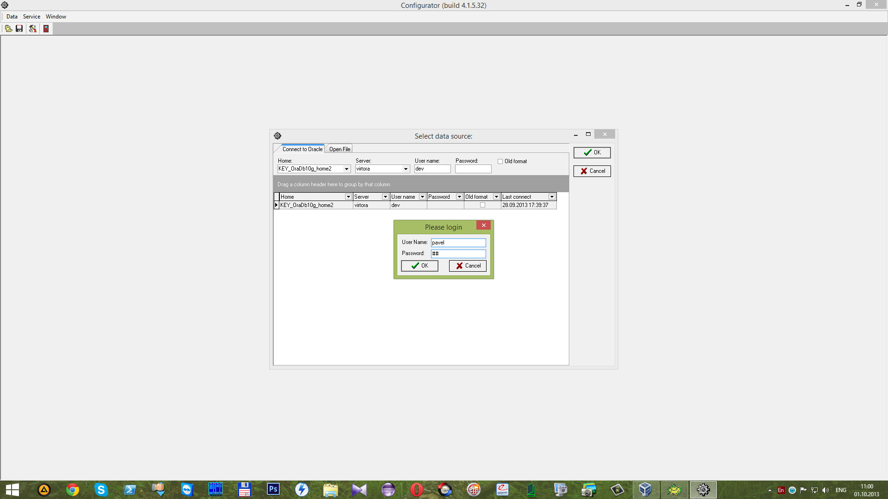

 Выбираем шаблонный документ.

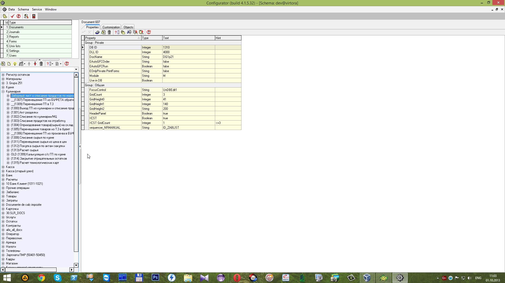

 Нажимаем на

 и выбираем из списка _Export-SubTree_. В результате чего будет экспортировано поддерево \(с действиями \(_Actions_\) и печатными формами \(_Print Forms_\)\).

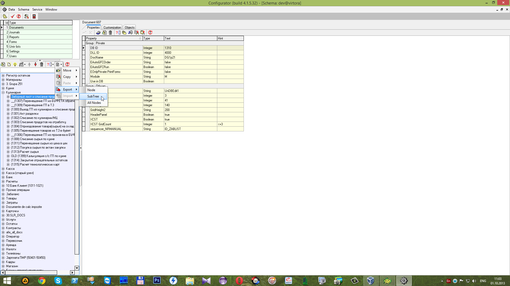

 После чего получаем сообщение о завершении экспорта. Нажимаем

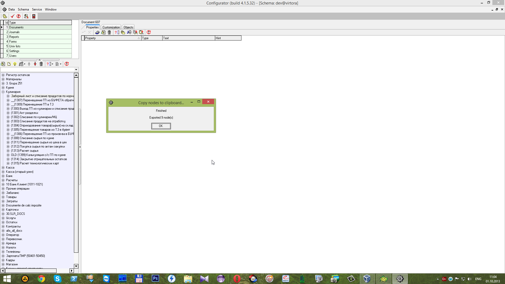

 Далее выбираем группу документов в которую необходимо сделать импорт. В данном случае эта группа

 Нажимаем на

 и выбираем _Import-New Subnode_.

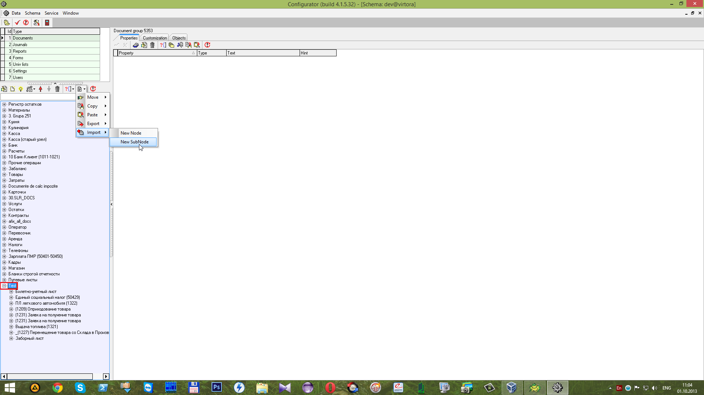

 После чего получаем сообщение о завершении импортирования.

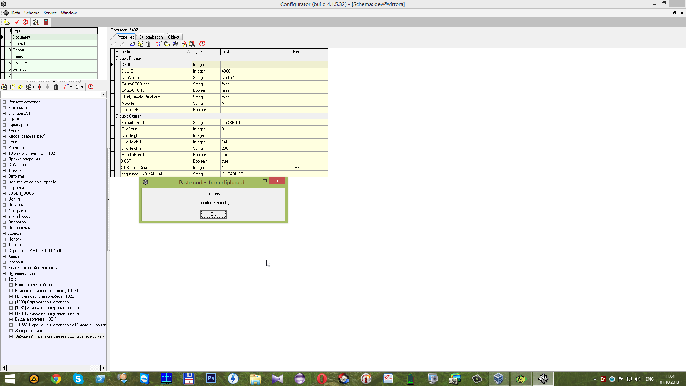

 В колонку _DB ID_ записываем уникальное значение. Для этого двойным щелчком левой кнопкой мышки \(_ЛКМ_\) кликаем на колонку _DB ID_. В появившемся окне напротив 

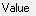

 записываем уникальное значение и нажимаем

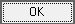

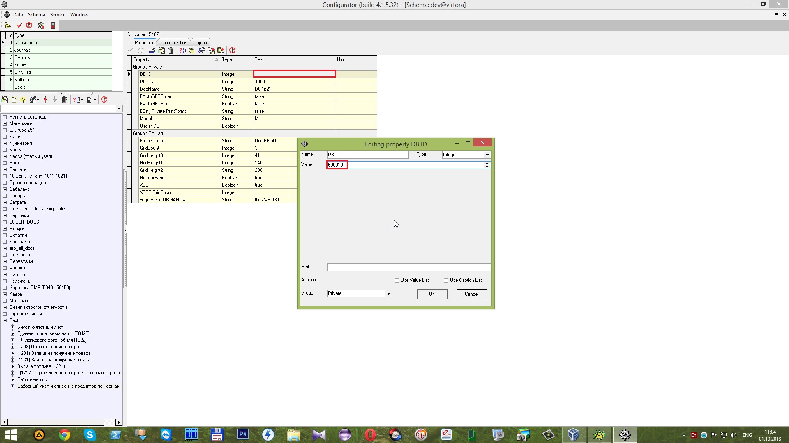

 Далее переходим на вкладку

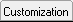

 Здесь можно заметить заполненные данные. Они относятся к документу с которого был произведен экспорт. Эти данные необходимо удалить посредством сочетания горячих клавиш **Ctrl+Delete**.

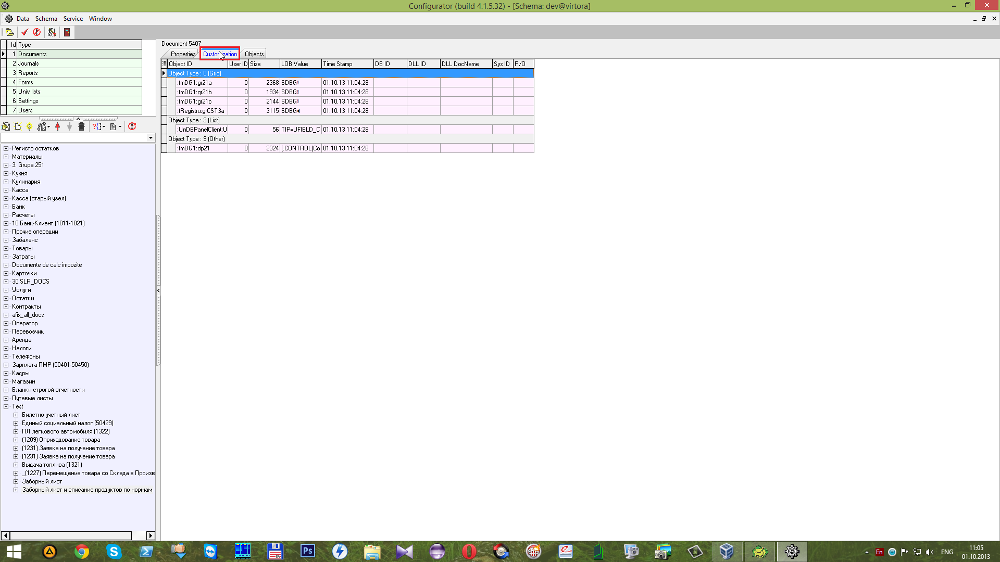

 В результате чего поля будут очищены.

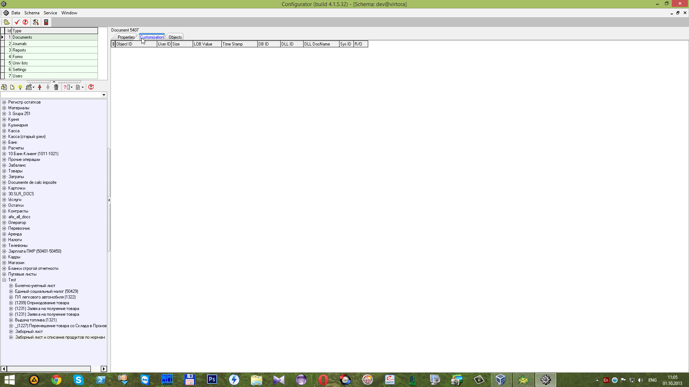

 После проделанных действий сохраняем все изменения в этой транзакции посредством кнопки

 “**Commit**”.

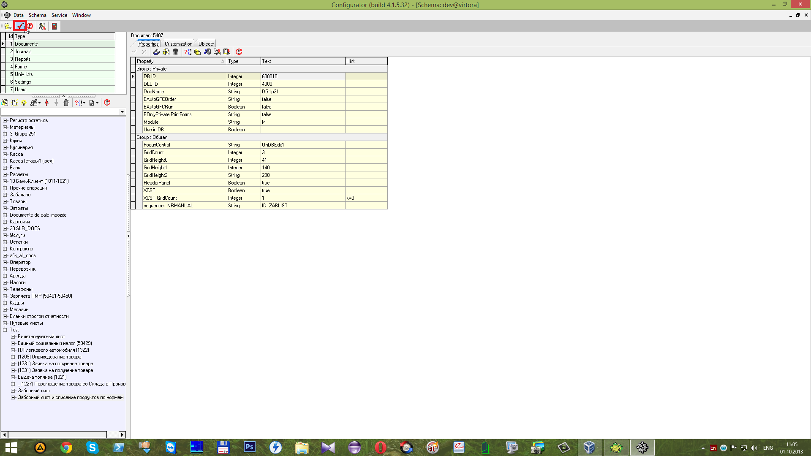

