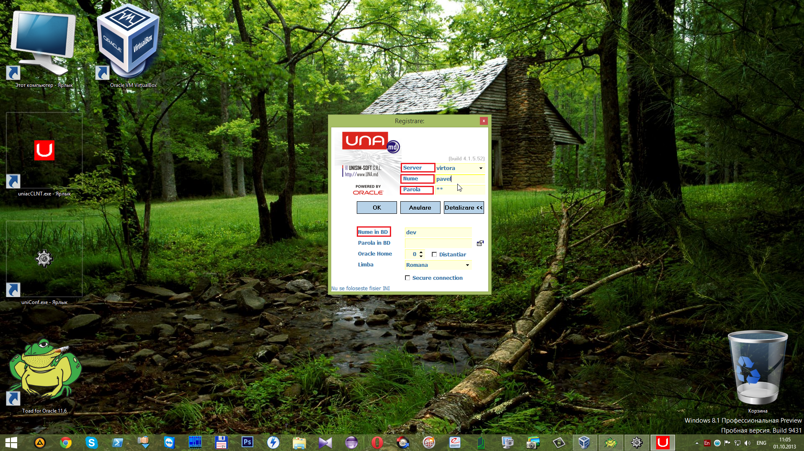
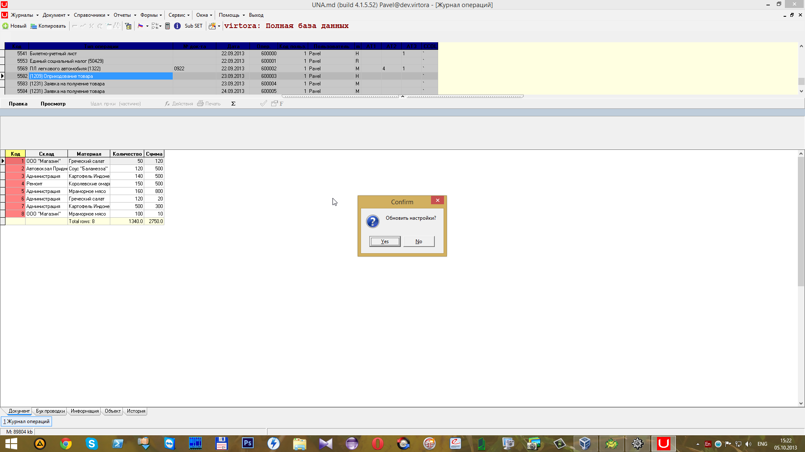
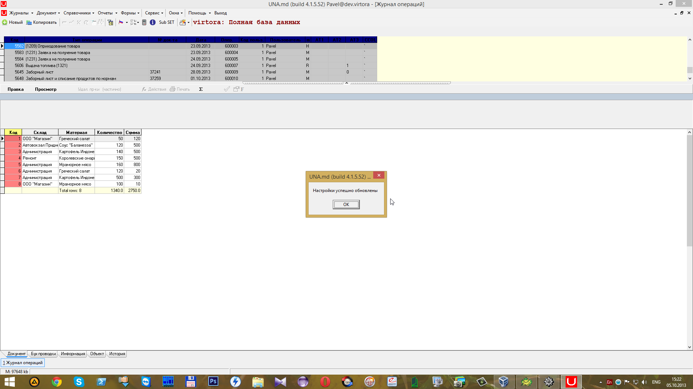
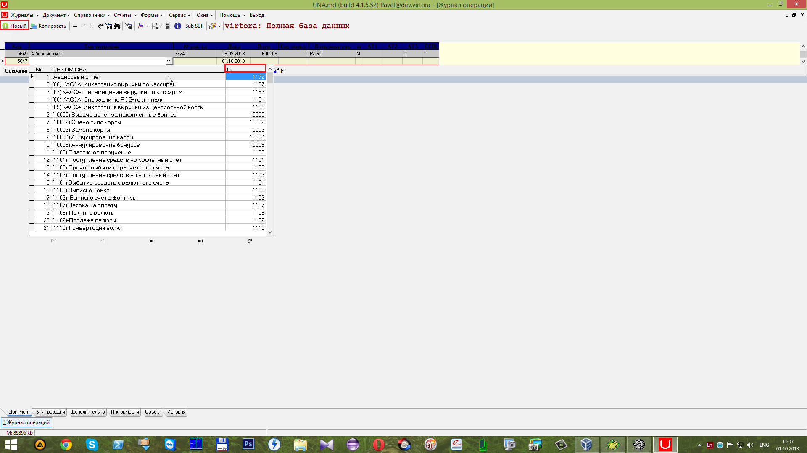
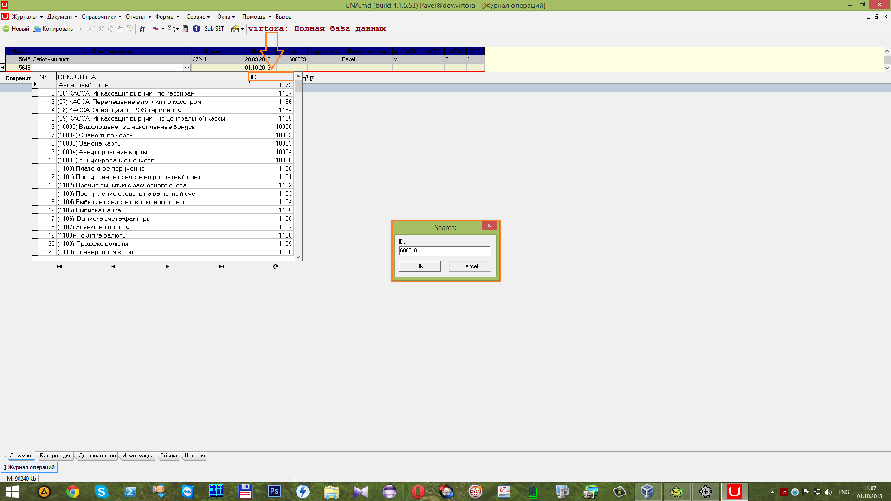
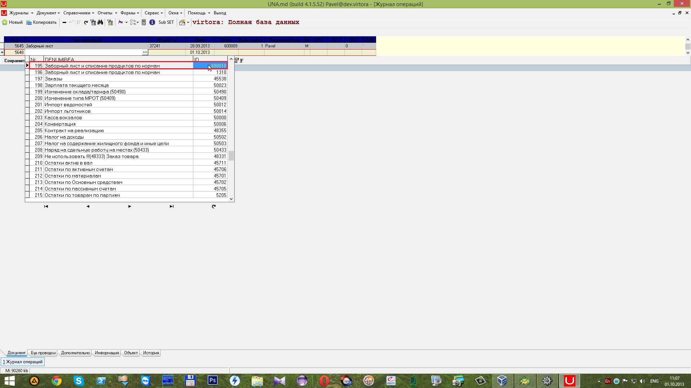
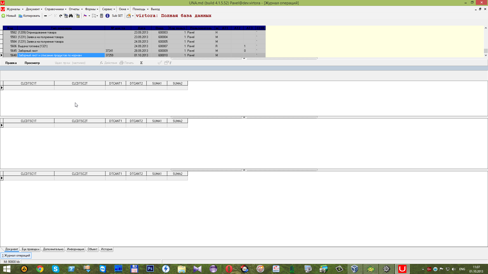

# Создание документа

##  **7 Создание документа**

 Запускаем клиент программы Universal Accounting **uniacCLNT.exe**.

 В открывшемся окне вводим имя сервера, имя и пароль для доступа в программу и имя и пароль схемы \(если пароль совпадает с именем схемы, его можно не заполнять\) и нажимаем

 Для того, чтобы документ созданный в конфигураторе появился в списке воспользуемся горячей клавишей **F5**. В открывшемся окне нажимаем кнопку

 После обновления настроек появится окно об успешном обновлении настроек. Нажимаем кнопку

 Далее нажимаем на кнопку

 и по полю _ID_ ищем уникальный номер, который мы записали в конфигураторе в поле _DB ID_.

 Можно воспользоваться поиском, начиная вводить цифры, находясь в поле ID.

Для выбора документа дважды кликаем на нём левой кнопкой мыши \(ЛКМ\).

 После чего он будет создан.

