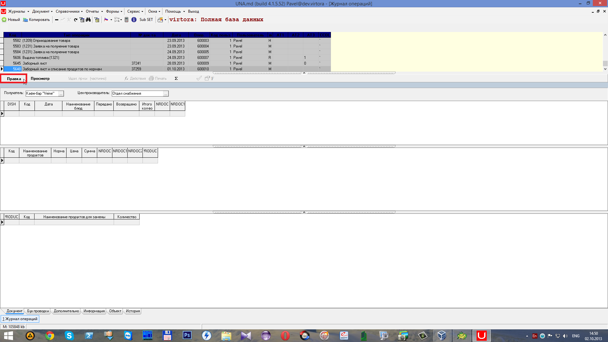
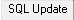
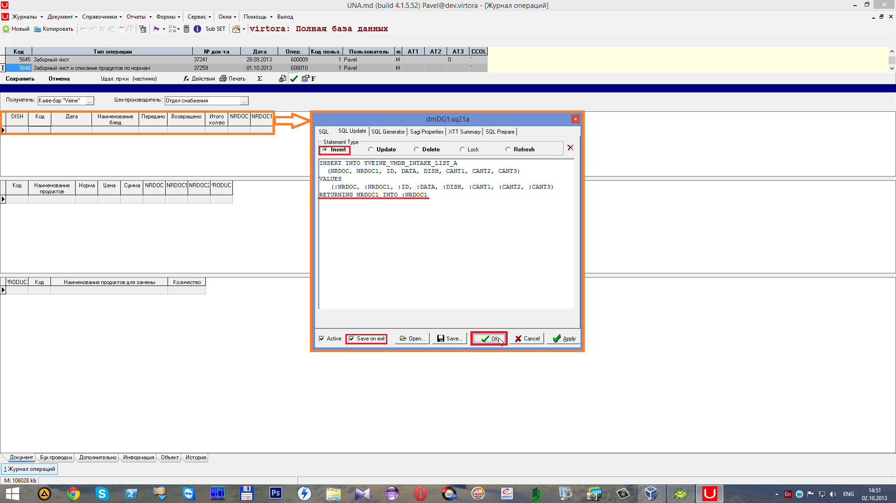
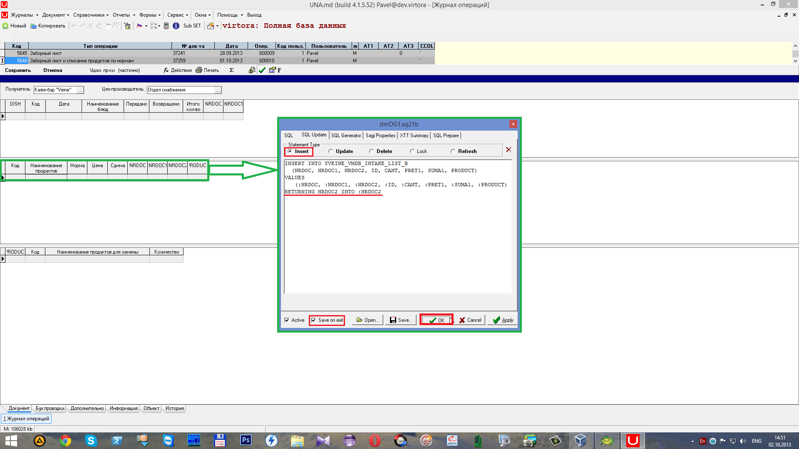
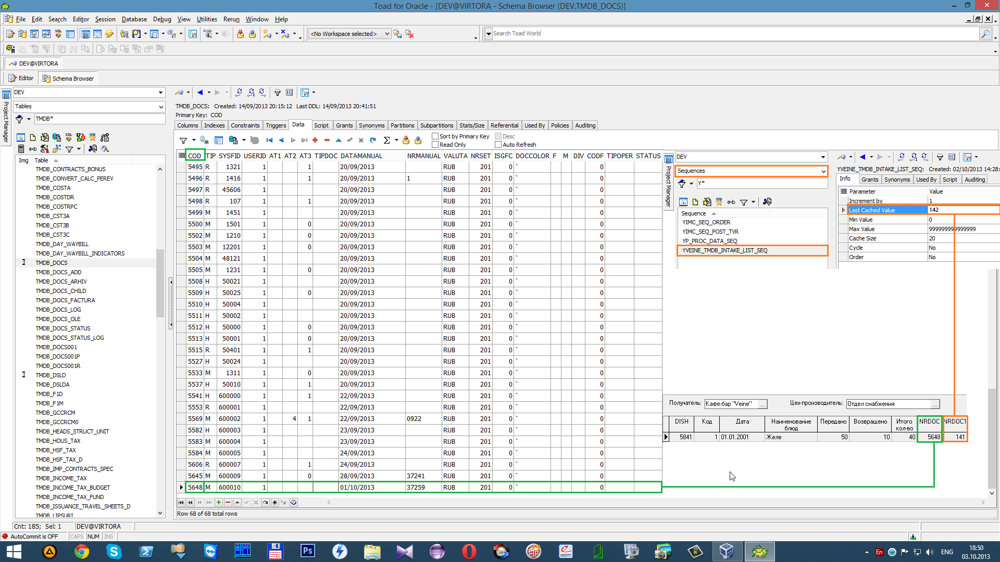
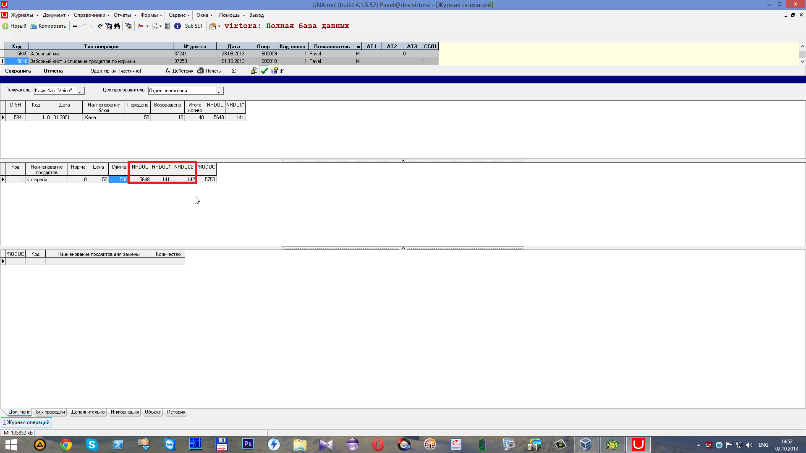

# Использование последовательности

##  **7.4 Использование последовательности**

 Для использования последовательности \(_SEQ_\) нажмем на кнопку

 \(либо на горячие клавиши **Ctrl+~**\) для начала редактирования документа.

 Отроем запрос к первому гриду с помощью горячих клавиш \(**Alt+Q**\) и допишем на вкладке

 в поле

следующую строку:

"_`RETURNING NRDOC1 INTO :NRDOC1`_". После сохраним изменения с помощью галочки

 и нажмём кнопку

 Отроем запрос ко второму гриду с помощью горячих клавиш \(**Alt+Q**\) и допишем на вкладке

 в поле

следующую строку:

"_`RETURNING NRDOC2 INTO :NRDOC2`_". После сохраним изменения с помощью галочки

 и нажмём кнопку

 Цифра в колонке _NRDOC_ записана в колонке _COD_ таблицы _TMDB\_DOCS_ \(где одна запись приравнивается к одному документу\). Цифра в колонке _NRDOC1_ появляется благодаря последовательности, которая используется триггерами. На скриншоте ниже показано значение _NRDOC1_, которое равно 141, оно уже использовано, и следующее значение в последовательности используется 142.

 Таким образом запись в колонке _NRDOC2_, которая добавлена сразу после записи в первом гриде\(_NRDOC1_-141\) использует цифру 142.

