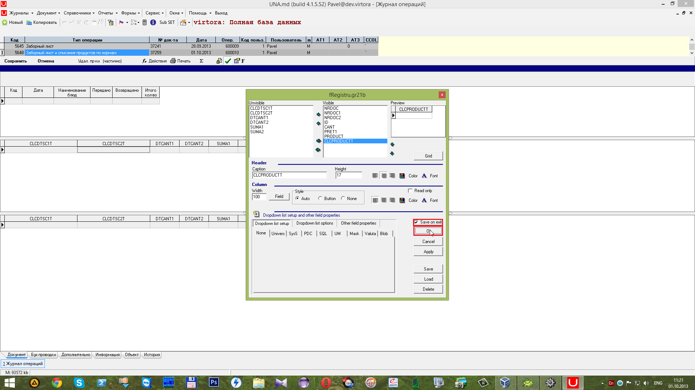

# Редактирование дизайна

##  **7.2 Редактирование дизайна**

Открываем дизайн с помощью горячих клавиш **Alt+D**. В правой части находятся поля из шаблона, в левой части сформированные колонки из вида\(_View_\) YVEINE\_VMDB\_INTAKE\_LIST\_A. Колонки из левой части необходимо перенести в правую, а колонки из правой части в левую \(при следующем вызове окна дизайна их не будет\).

 Для переноса колонок можно использовать двойной клик левой кнопки мыши \(_ЛКМ_\) или кнопки

После чего сохраняем изменения при выходе и нажимаем кнопку

 В результате появились колонки из вида \(_View_\) `YVEINE_VMDB_INTAKE_LIST_A` 

Который находится на вкладке

 Далее открываем окно дизайна \(горячие клавиши **Alt+D**\) и задаём название каждой колонке. В поле _Caption_ записываем имя колонки, в поле _Height_ задаём высоту колонки, в поле _Width_ задаём ширину поля. Для поля _ID_ записываем имя "Код",

 Для поля _DATA_ записываем имя "Дата",

 Для поля _CANT1_ задаём имя "Передано",

 Для поля _CANT2_ задаём имя "Возвращено",

 Для поля _CANT3_ задаём имя "Итого кол-во",

 Для поля _CLCDISHT_ задаём имя "Наименование блюд".

 С помощью кнопок

 можно перемещать колонки по списку.

 Для сохранения изменений при выходе поставим галочку и нажмем кнопку

Для сохранения высоты колонок перейдем в окно дизайна \(горячие клавиши **Alt+D**\).

Нажимаем на кнопку 

 Далее ставим галочку напротив 

 И сохраняем изменения при выходе

 В итоге **Grid № 1** примет следующий вид.

 Далее приступаем к редактированию дизайна **Grid'a № 2**. Для этого открываем окно дизайна \(горячие клавиши **Alt+D**\) и меняем местами колонки.

 В результате слева остались колонки из шаблона, а справа колонки из вида \(_View_\) `YVEINE_VMDB_INTAKE_LIST_B`, который был оформлен на вкладке

Сохраняем изменения при выходе и нажимаем кнопку

 При следующем запуске окна дизайна \(горячие клавиши **Alt+D**\) колонки шаблона \(левая часть\) отсутствуют.

 Колонке _ID_ задаём имя "Код", выставляем нужную высоту и ширину колонки;

 Колонке _`CLCPRODUCTT`_задаём имя "Наименование продуктов", выставляем нужную высоту и ширину колонки;

 Колонке _PRET1_ задаём имя "Цена", выставляем нужную высоту и ширину колонки;

 Колонке _SUMA1_ задаём имя "Сумма", выставляем нужную высоту и ширину колонки.

 Далее нажимаем на кнопку

 и ставим галочку напротив

 Сохраняем изменения с помощью галочки и нажимаем на кнопку 

 В результате **Grid № 2** принимает вид.

 Далее приступаем к редактированию дизайна **Grid'a № 3**. Открываем окно дизайна \(горячие клавиши **Alt+D**\) и переносим поля слева направо, а справа налево.  Сохраняем изменения и нажимаем на кнопку

 В итоге будут показаны выбранные колонки вида \(_View_\) `YVEINE_VMDB_INTAKE_LIST_C`.

Открываем окно дизайна \(горячие клавиши **Alt+D**\) и задаём имена и размер колонок.

Колонке _ID_ задаём имя "Код".

 Колонке _`CLCPRODUCTT`_задаём имя "Наименование продуктов для замены".

 Колонке _`CANT1`_ задаём имя "Количество". Сохраняем изменения с помощью галочки и нажимаем кнопку

 В результате **Grid № 3** примет вид.

 Для редактирования шапки используем горячие клавиши **Ctrl+ПКМ** \(_Правая Кнопка Мыши_\) в результате выйдет меню, где выбираем пункт 

 Создадим надписи "Получатель" и "Цех-производитель", для этого нажмем на кнопку

 для создания первого _Static Text_.

 После размещения первого _Static Text_ нажимаем еще раз на кнопку 

 и создаём второй _Static Text_.

 Далее выбираем из списка _`UnDBEdit`_для создания справочника

 и нажимаем на кнопку

 Размещаем его рядом с первым _Static Text_. И создаём второй _`UnDBEdit`_с помощью кнопки

 После размещения шапка примет вид.

 Нажимаем на _Static Text_ и в поле _Caption_ задаём имена. В данном случае это "Получатель:" и "Цех-производитель:".

 После завершения редактирования сохраняем результат при выходе с помощью галочки

  и нажимаем

 В поле _Caption_ задаётся имя колонки, в поле _Height_ задаётся высота колонки и в поле _Width_ задаётся ширина колонки.

 Для редактирования шрифта необходимо нажать

 В открывшемся окне можно изменить шрифт.

 Для изменения цвета колонки нажмём на кнопку

 В появившемся окне можно задать цвет колонки.

 В результате в окне _Preview_ можно увидеть результат изменения. В данном случае выбран полужирный шрифт и цвет колонки желтый.

 Ниже представлены скриншоты изменения шрифта, цвета, названия и размера колонок. Все действия идентичны действиям описанным ранее.

 Для изменения положения слова в колонке и записях можно воспользоваться кнопкой

 таким образом слова будут выровнены по центру.

 В результате выполненных действий **Grid № 1** принимает вид.

 Ниже представлены скриншоты изменения шрифта, цвета, выравнивание, названия и размера колонок. Все действия идентичны действиям описанным ранее.

 В результате изменений в окне Дизайна \(горячие клавиши **Alt+D**\) **Grid № 1**, **Grid № 2** и **Grid № 3** примут вид:

