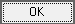

# Редактирование справочников

##  **7.3 Редактирование справочников**

 Для редактирования справочников в шапке нажмем горячие клавиши **Ctrl+ПКМ-**

 или нажатие на ролик мыши, находясь в области шапки

 Нажимаем на _`UnDBEdit1`_ и в поле _DataField_ выбираем любое вычисляемое \(_CLC_\) текстовое \(_T_\) поле.

 Далее нажимаем на 

 и заполняем справочник на вкладке

  Поле _Data_ _field_ автоматически устанавливает поле находящееся между _CLC_ и _T_, в данном случае поле _DTSC0_. Выбираем поле_Denumirea_ справочника _`TMS_UNIVERS`_. _`Attribute`_0, _`Grouping`_E \(External\). После нажимаем кнопку

 Сохраняем редактирование перед выходом с помощью галочки 

 и кнопки

 В результате в поле _`UnDBEdit1`_ выходит справочник с организациями.

 Используем горячую клавишу \(клик ролика мыши в области шапки\) для входа в дизайн шапки.

 Нажимаем на _`UnDBEdit2`_ и в _DataField_ выбираем любое вычисляемое \(_CLC_\) текстовое \(_T_\) поле.

 После чего нажимаем на

 для настройки справочника. Для этого переходим на вкладку

 и заполняем _`Attribute`_ O, _`Grouping`_ I \(Internal\), выбираем поле _`Denumirea`_ справочника _`TMS_UNIVERS`_._`Data field`_ заполнится автоматически. После чего нажимаем

 Сохраняем редактирование перед выходом с помощью галочки

 и кнопки

 Теперь в поле _`UnDBEdit2`_ выходит справочник с внутренними отделами организации.

 После заполнения шапка принимает следующий вид:

 Для того чтобы в поле "Наименование блюд" выходил справочник, Откроем дизайн **Grid'a № 1** с помощью горячих клавиш \(**Alt+D**\). Выделяем колонку _`CLCDISHT`_ в поле _Data field_ автоматически вставляется слово между _CLC_ и _T_. _`Attribute`_ P \(Product\). _`Grouping`_ TVRIKUH \(Товар Кухни\). Выбираем поле _Denumirea_ и сохраняем изменения перед выходом

 и нажимаем кнопку 

 В результате в поле Наименование блюд \(_`CLCDISHT`_\) выходит справочник с блюдами.

 Для **Grid'a № 2** делаем идентичные действия. Откроем дизайн **Grid'a № 2** с помощью горячих клавиш \(**Alt+D**\). Выделяем колонку _`CLCPRODUCTT`_ в поле _Data field_ автоматически вставляется слово между _CLC_ и _T_. _`Attribute`_ P \(Product\). _`Grouping`_ TVRB \(Товар\). Выбираем поле _Denumirea_ и сохраняем изменения перед выходом

 и нажимаем кнопку

 В результате в поле "Наименование продуктов" \(_`CLCPRODUCTT`_\) выпадает справочник с продуктами для приготовления блюд.

 Для **Grid'a № 3** делаем идентичные действия. Откроем дизайн **Grid'a № 3** с помощью горячих клавиш \(**Alt+D**\). Выделяем колонку _`CLCPRODUCTT`_ в поле _Data field_ автоматически вставляется слово между _CLC_ и _T_. _`Attribute`_ P \(Product\). _`Grouping`_ TVRB \(Товар\). Выбираем поле _Denumirea_ и сохраняем изменения перед выходом

 и нажимаем кнопку

 В результате в поле "Наименование продуктов для замены" \(_`CLCPRODUCTT`_\) выпадает справочник с продуктами для замены. \(Справочник точно такой же как и у **Grid'a № 2**\)

