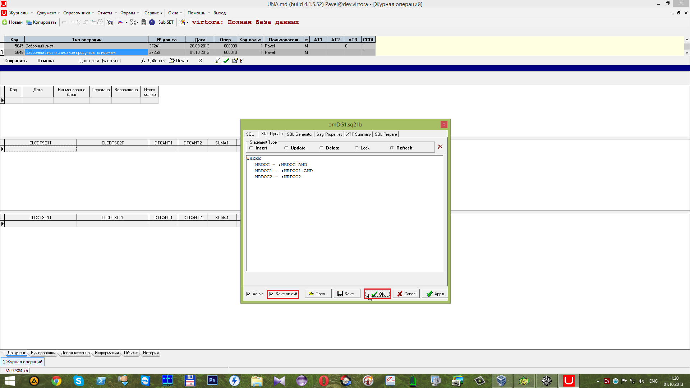

# Редактирование запроса

##  **7.1 Редактирование запроса**

 Для изменения запроса воспользуемся горячими клавишами **Alt+Q** \(находясь в поле **Grid № 1**\).

 Далее переходим на вкладку

 И записываем имя представления \(_`View`_\) `YVEINE_VMDB_INTAKE_LIST_A`. В фильтре на выборку записываем _`RDDOC=:COD`_, порядок сортировки по колонке _NRDOC1_ и список ключевых полей для обновления _`NRDOC`_и _`NRDOC1`_.

 После чего переходим на вкладку

 и нажимаем на кнопку

 для получения таблицы.

Далее нажимаем на кнопку

для получения табличных полей.

 После чего нажимаем на кнопку

  для генерирования SQL запроса.

 После проведённых выше действий сгенерировался запрос для добавления записей

 Изменения записей

 Удаления записей

 и

Обновления записей 

На вкладке

 сгенерирован `SQL` запрос, который выбирает данные из вида \(_View_\) `YVEINE_VMDB_INTAKE_LIST_A`, где фильтр на выборку _`NRDOC =: COD`_ и сортируется по колонке _`NRDOC1`_.

 Для сохранения изменений ставим галочку напротив

 и нажимаем на кнопку

 В результате чего все изменения будут сохранены при выходе.

 Для редактирования запроса **Grid'a № 2** воспользуемся горячими клавишами **Alt+Q**. Далее переходим на вкладку

 и записываем имя представления \(_`View`_\) `YVEINE_VMDB_INTAKE_LIST_B`. В поле Фильтр на выборку записываем _`NRDOС=:NRDOC AND NRDOC1=:NRDOC1`_. В поле Порядок сортировке записываем _`NRDOC2`_. В поле Список ключевых полей для обновления записываем _`NRDOC`_`;`_`NRDOC1`_`;`_`NRDOC2`_`.`

 Далее переходим на вкладку

 и нажимаем на кнопку

 Далее нажимаем на кнопку

 После чего на кнопку

 В результате появился SQL запрос для добавления записей

 Обновления записей 

 Удаления записей

  и

 Обновлении записей

 Для сохранения изменений ставим галочку напротив

 и нажимаем на кнопку

 Далее приступаем для редактирования запроса для **Grid'a № 3**. Для этого открываем окно изменения запроса \(горячие клавиши **Alt+Q**\). Далее переходим на вкладку

 и записываем имя представления \(_`View`_\) `YVEINE_VMDB_INTAKE_LIST_C`. Напротив поля "Фильтр на выборку" записываем _`NRDOC=:NRDOC AND NRDOC1=:NRDOC1 AND NRDOC2=:NRDOC2`._ Напротив поля "Порядок сортировки" записываем поле _`NRDOC3`_. Напротив поля "Список ключевых полей для обновления" пишем _`NRDOC`_`;` _`NRDOC1`_`;` _`NRDOC2`_`;` _`NRDOC3`_.

 Далее переходим на вкладку

 и нажимаем на кнопку

 Далее нажимаем на кнопку

 После чего на кнопку

 В результате появился SQL запрос на добавление записей 

 Изменения записей

 Удаления записей

 и

 Обновления записей

 На вкладке

 появился SQL запрос, который выбирает поля из вида \(_`View`_\) `YVEINE_VMDB_INTAKE_LIST_C`, где _`NRDOC=:NRDOC AND NRDOC1=:NRDOC1 AND NRDOC2=:NRDOC2`_ и сортирует по колонке _`NRDOC3`_.

