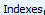
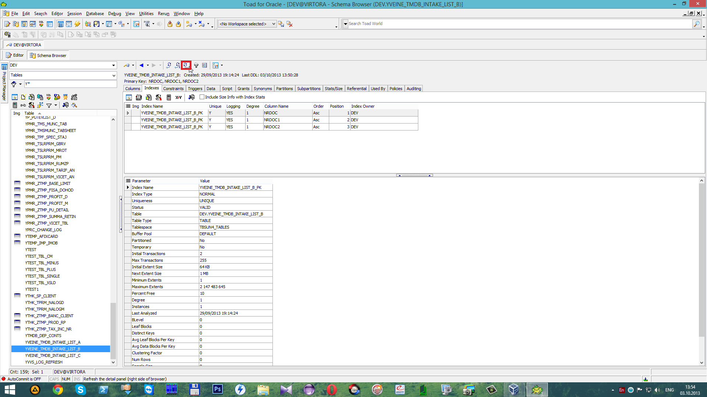

# Создание индексов

##  **3 Создание индексов**

 Для создания индексов необходимо выбрать таблицу и перейти на вкладку

 Далее нажимаем

 для создания нового индекса.

 Напротив

 записываем название индекса. В данном случае это `YVEINE_TMDB_INTAKE_LIST_A_IND` \(см. Введение\).

 С помощью кнопки

 выбираем таблицу для которого создаётся индекс. В данном случае это таблица YVEINE\_TMDB\_INTAKE\_LIST\_A и нажимаем

 По умолчанию создается неуникальное значение \(_Non-unique_\).

 Далее переходим на вкладку

 и выбираем с помощью

 либо двойного клика левой кнопкой мыши \(_ЛКМ_\) колонки. В данном случае это колонка _`NRDOC`_. После чего нажимаем

 Для появления нового индекса в списке нажмем

 **"Refresh the detail panel".**

 В результате чего добавился созданный ранее индекс.

 Далее открываем вторую таблицу \(YVEINE\_TMDB\_INTAKE\_LIST\_B\), переходим на вкладку

 и нажимаем на 

 для создания нового индекса.

 Напротив 

 записываем имя индекса. В данном случае это `YVEINE_TMDB_INTAKE_LIST_B_IND` \(см. Введение\) и с помощью кнопки

 выбираем таблицу `YVEINE_TMDB_INTAKE_LIST_B` и нажимаем

 Далее переходим на вкладку

 и выбираем колонки _`NRDOC`_ и _`NRDOC1`_, после чего нажимаем

 Для того чтобы новый индекс появился в списке нажмем

 **"Refresh the detail panel".**

 В результате чего появился индекс по двум колонкам _`NRDOC`_ и _`NRDOC1`_.

 Далее переходим к третьей таблице `YVEINE_TMDB_INTAKE_LIST_C`, переходим на вкладку

 и нажимаем

 кнопку  для создания нового индекса.

 Напротив

пишем имя нового индекса. В данном случае это `YVEINE_TMDB_INTAKE_LIST_C_IND` \(см. Введение\). С помощью кнопки

 выбираем таблицу `YVEINE_TMDB_INTAKE_LIST_C` и нажимаем

 Далее переходим на вкладку 

  и выбираем колонки _`NRDOC`_, _`NRDOC1`_ и _`NRDOC2`_. После чего нажимаем

 Чтобы новый индекс появился в списке нажмем

 **"Refresh the detail panel".**

 В результате чего появился индекс с колонками _`NRDOC`_, _`NRDOC1`_и _`NRDOC2`_.

 Для сохранения изменений в текущей транзакции нажмём

