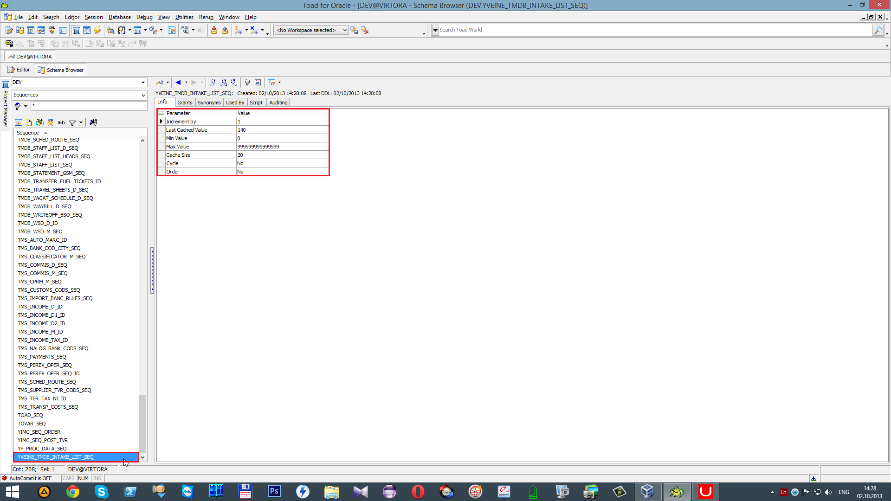

# Создание последовательности

##  **4 Создание последовательности.**

При добавлении новой записи \(_`Insert`_\) в колонке _`NRDOC`_ автоматически записывается код. Этот код одинаковый для всех записей, так как колонка _`NRDOC`_имеет внешний ключ с колонкой _`COD`_ таблицы _`TMDB_DOCS`_. \(В таблице _`TMDB_DOCS`_одна запись приравнивается к одному документу\). Таким образом при добавлении любого количества записей \(_`Insert`_\) в колонке _`NRDOC`_ будет один и тот же код. Колонка _`NRDOC1`_ использует последовательность \(_`Sequence`_\). Каждая запись в этой колонке уникальна.

 В данном случае последовательность начинается с цифры 28 \(т.е. следующая запись будет с кодом 29\).

 Для создания последовательности перейдем к списку _Sequences_ и нажмем 

 В открывшемся окне заполняем

 в данном случае это `YVEINE_TMDB_INTAKE_LIST_SEQ` \(см. Введение\). В поле _`Start With`_  указывается с какого значения начинать. _`Min Value`_- минимальное значение, _`Max Value`_-максимальное значение, _`Increment by`_- увеличивается на определенное значение.

 При нажатии на

 открывается в отдельном окне скрипт. \(Все вышеперечисленные операции можно сделать посредством скрипта в редакторе\)

 После нажатия на

последовательность будет создана.

 Для появления последовательности в списке необходимо нажать

 "**Refresh all objects**".

 В поиске вводим имя только что созданной последовательности `YVEINE_TMDB_INTAKE_LIST_SEQ`.

