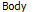
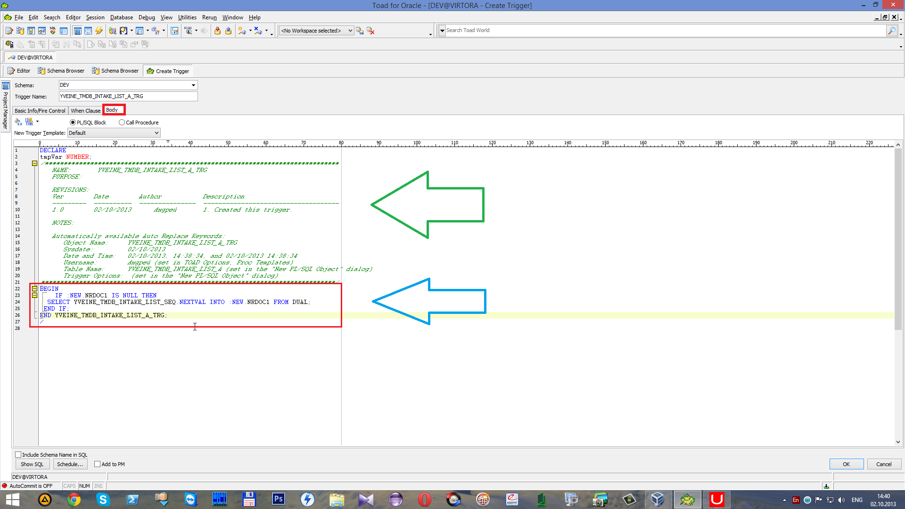

# Создание триггеров

##  **5 Создание триггеров**

 Для использования последовательности создадим для каждой таблицы триггер. Для этого перейдем в списке на вкладку _Triggers_.

 Нажимаем на кнопку

 для создания нового триггера. В данном случае это `YVEINE_TMDB_INTAKE_LIST_A_TRG` \(см. Введение\).

 Напротив

 записываем имя триггера, в данном случае это `YVEINE_TMDB_INTAKE_LIST_A_TRG`. С помощью кнопки

 выбираем таблицу, для которой создаётся данный триггер. В данном случае это таблица `YVEINE_TMDB_INTAKE_LIST_A` и нажимаем

 Ставим галочку напротив _`Insert`_ ``\(триггер будет действовать до \(_`Before`_\) добавления \(_`Insert`_\)\).

 Далее переходим на вкладку

 Здесь зеленой стрелкой отмечен комментарий, а синей PL/SQL блок \[Если новая колонка _`NRDOC1`_ с нулевым значением, тогда Выбирается последовательность следующего значения из виртуальной таблицы _`DUAL`_\]. Работа этого триггера будет давать колонке _`NRDOC1`_ уникальное значение при добавлении новой записи исходя из последовательности\(_`Sequence`_\).

 После нажатия на кнопку

 триггер будет создан.

 Для появления только что созданного триггера для первой таблицы нажмем кнопку

 "**Refresh all objects**".

 В результате чего в списке _Triggers_ появился созданный триггер `YVEINE_TMDB_INTAKE_LIST_A_TRG`. На вкладке

  находится PL/SQL блок.

 На вкладке

 выбранная строка для которой создан триггер.

 Вкладка

 показывает ошибки.

 Приступим к созданию второго триггера. Для этого нажмем на

 Напротив

 запишем имя второго триггера. В данном случае это `YVEINE_TMDB_INTAKE_LIST_B` \(см. Введение\). С помощью кнопки

выбираем таблицу, для которой создаётся данный триггер. Это таблица `YVEINE_TMDB_INTAKE_LIST_B`.

Ставим галочку напротив _`Insert`_. В этом случае триггер будет работать \(_`Before Insert`_\) До Добавления записи.

 Переходим на вкладку 

 и записываем PL/SQL блок, аналогичный первому триггеру. В данном случае колонка _`NRDOC2`_.

 После чего нажимаем

 Для появления нового триггера в списке нажмём

 "**Refresh all objects**".

 В списке находим второй триггер YVEINE\_TMDB\_INTAKE\_LIST\_B\_TRG. На вкладке

  находится PL/SQL блок.

 Теперь создадим третий триггер. Для этого нажмем на

 Напротив

 записываем имя третьего триггера `YVEINE_TMDB_INTAKE_LIST_C_TRG` \(см. Введение\). С помощью кнопки

 выбираем таблицу для создаваемого триггера. В данном случае это `YVEINE_TMDB_INTAKE_LIST_C` и нажимаем

 Далее переходим на вкладку

 и записываем PL/SQL блок аналогичный двум предыдущим триггерам. В данном случае колонка _`NRDOC3`_.

 Для завершения редактирования нажимаем

 Для появления нового триггера в списке нажмём

 "**Refresh all objects**".

 Триггер `YVEINE_TMDB_INTAKE_LIST_A_TRG` предназначен для колонки _`NRDOC1`_.

 Триггер `YVEINE_TMDB_INTAKE_LIST_B_TRG` предназначен для колонки _`NRDOC2`_.

 Триггер `YVEINE_TMDB_INTAKE_LIST_C_TRG` предназначен для колонки _`NRDOC3`_.

 Для завершения текущей транзакции с сохранением нажмем 

 **“Commit”**.

