# Создание документа

 Документы - реализуют ввод первичных и специализированных документов пользователя. Конфигурирование системы в разрезе документов – это создание новых документов, настройка интерфейсной части документов, настройка действий по обработке данных, настройка печатных форм из документа.

### **1 способ**

Сделаем настраиваемый документ следующего вида:


Открыть конфигуратор, выбрать схему `Dev`. Нужно два раза щелкнуть по строке схемы `Dev` и ввести учетные данные. Для каждого пользователя создается учетная запись или можно использовать стандартную учетную запись логин - pavel, пароль - p0 или сочетание клавиш Ctrl+F12.

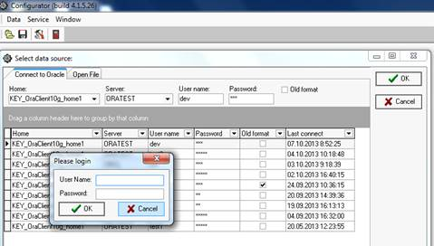

Выбрать  в верхнем левом гриде логический узел \[`Documents`\].  

На  панели инструментов выбрать пункт меню \[`Create`\]  и подпункт \[`Add node`\].

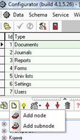

 Выбрать тип нового узла \[`Document groups`\], т.е. создать новую группу документов в дереве объектов типа Документы.  Назовем новую группу -  Тест.

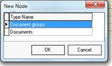

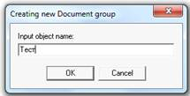

 Добавим в новый узел документ. Выбираем новую группу, на панели инструментов выбрать пункт меню \[`Create`\]  и подпункт \[`Add subnode`\], тип объекта \[`Documents`\], имя объекта – Тестовый документ. В итого в дереве объектов будет новый узел и документ.

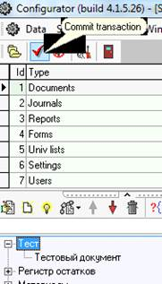

После добавления узлов, нужно обязательно нажимать кнопку \[`Commit transaction`\].

**Настройка свойств документа.**

В правом гриде узла - Тестовый документ, введем стандартные свойства:

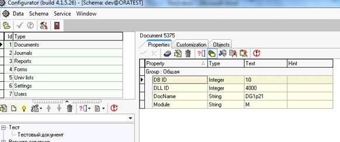

 Свойства уровня документа:

| **Имя свойства** | **Назначение свойства** |
| --- | --- | --- | --- | --- |
| DB ID | Идентификационный номер типа документа. Соответствует значению поля \[SysfID\] в таблице документов |
| DLL ID | Идентификационный номер DLL |
| DocName | Идентификатор документа в DLL |
| Module | Модуль, которому принадлежит документ. Соответствует значению поля \[m\] в таблице документов |

Базовый тип документа идентифицируется значениями свойств `DLL ID` и `DocName`.

Так же можно скопировать стандартный набор свойств и вставить в конфигураторе:

```sql
[ZZZ]
DB ID=10
.type.DB ID=Integer
DLL ID=4000
.type.DLL ID=Integer
DocName=DG1p21
.type.DocName=String
Module=M
.type.Module=String
```

Чтобы увидеть новый документ, необходимо создать новый журнал:

Раскрыть логический узел \[`Journals group`\].

Выбрать какой – либо объект \(журнал\) для экспорта: например узел Материалы. Правой кнопки мыши вызываем контекстное меню, выбираем \[`Data`\], потом \[`Export`\] \(Экспорт\),  подменю \[`Node`\] \(Текущий без вложенных\),  для копирования в буфер данных узла \(объекта\).

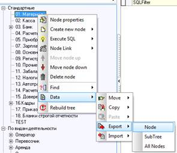

 Указав уровень в дереве объектов типа Журналы \(например: выбрав узел Стандартные\) выбрать последовательно пункт \[`Data`\] - \[`Import`\], подменю \[`New SubNode`\] \(\[Как новый узел\]\) для импорта объекта на указанный уровень дерева.

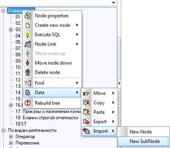

Переименовать узел \( в свойствах узла, пункт  меню \[`Node Properties`\] указать `Caption` – Test и `Section` – `J_Test`\)

Изменить свойства узла:  `Caption`,  `DocTypesFilter` \(Условие для `ID`\), `SQLFilter` \(Условие для `SysFID`\), `DLL` `JournalName`.

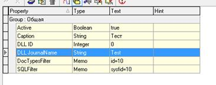

Зафиксировать изменения в базе данных \[`Commit transaction`\].

Открыть клиента и убедиться, что там появился новый документ \(Если клиент-приложение было открыто, нажать кнопку \[F5\]\).

Выбираем Журналы – Test и создаем новый документ \(нажать кнопку Insert\), создаем документ и сохраняем, должно получится как на рисунке.

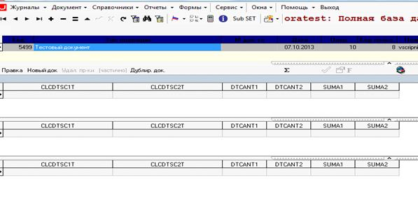

Так выглядит стандартный не настроенный документ.

**Настройка документа:**

В конфигураторе добавляем свойства:

- `HeaderPanel = true`  - отображение панели

- `GridCount = 1` - количество гридов

Внешний вид документа изменился:

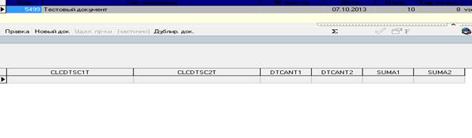

```sql
-- Создать таблицу для шапки документа.
create table tmdb_test_m
(
 nrdoc number not null,
 cod number,
 txtcoment  varchar2(200 byte)
); 

-- Создать уникальный индекс для таблицы tmdb_test_m.
create unique index tmdb_test_m_pk on tmdb_test_m
(nrdoc);

-- Добавить ограничения в таблицу tmdb_test_m.
alter table tmdb_test_m add (
constraint tmdb_test_m_pk
primary key
(nrdoc)
using index tmdb_test_m_pk
enable validate);

alter table tmdb_test_m add (
constraint tmdb_test_m_fk
foreign key (nrdoc)
references tmdb_docs (cod)
on delete cascade
deferrable initially deferred
enable validate);

-- Создать вид(вьюху) vmdb_test_m 
create or replace view vmdb_test_m
as
select t.*
,(select denumirea from vms_univers where cod=t.cod) clccodt
from tmdb_test_m t;

-- Создать таблицу для  грида  документа.
create table tmdb_test_d
(
nrdoc number(38) not null,
nrdoc1 number(38) not null,
cod integer,
cant number 
);

-- Создать последовательность tmdb_test_d_seq.
create sequence tmdb_test_d_seq
start with 1
maxvalue 999999999
minvalue 1
nocycle
cashe 20
noorder;

-- Создать уникальные индексы для таблицы tmdb_test_d.
create index tmdb_test_d_fk on tmdb_test_d
(nrdoc);

create unique index tmdb_test_d_pk on tmdb_test_d
(nrdoc, nrdoc1);

-- Создать триггер для таблицы tmdb_test_d.
create or replace trigger tmdb_test_d_trg
before insert on tmdb_test_d for each row
begin
 if :new.nrdoc1 is null then
  select tmdb_test_d_seq.nextval into :new.nrdoc1 from dual;
 end if;
end;

-- Создать ограничения для таблицы tmdb_test_d.
alter table tmdb_test_d add (
constraint tmdb_test_d_pk
primary key
(nrdoc, nrdoc1)
using index tmdb_test_d_pk
enable validate);

alter table tmdb_test_d add (
constraint tmdb_test_d_fk
foreign key (nrdoc)
references tmdb_docs (cod)
on delete cascade
deferrable initially deferred
enable validate);

-- Создать вид(вьюху) vmdb_test_d.
create or replace view vmdb_test_d
as
select t.*
,(select denumirea from vms_univers where cod=t.cod) clccodt
from tmdb_test_d t;
```

Настроить в документе шапку и грид, в шапке будет вьюха `vmdb_test_m`, в гриде - `vmdb_test_d`.

Зажав клавишу Ctrl + щелкнуть правой кнопкой мыши в шапке, откроется контекстное меню, выбрать подпункт  `Edit query`.


 В открывшемся окне настроить так же как и на рисунке.

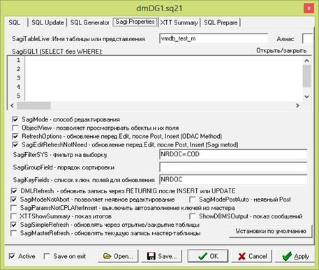

 После перейти на вкладку

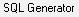

 и нажать последовательно на кнопки:


 Поставить галочку

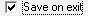

 Нажать на кнопку


 Нажать на кнопку 

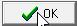

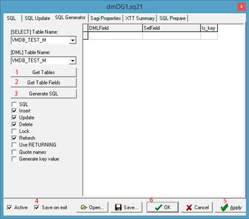

 На гриде нужно нажать сочетание клавиш Alt+Q и аналогичным образом настроить для вида `vmdb_test_d`.

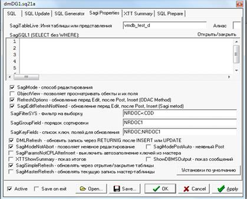

Основное отличие, это  список ключей для обновления, так же указывается порядок сортировки.

На вкладке `Insert` добавляем `SQL` запрос: `select tmdb_test_d_seq.nextval into :nrdoc1 from dual;` - этот запрос заполняет поле `nrdoc1`, значениями из `sequence - tmdb_test_d_seq`. 

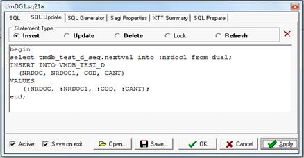

Настроим шапку, Ctrl+правой кнопкой мыши выбрать `Design`

Добавить на панель 4 элемента:

`StaticText` - это элементы для отображения подписей Справочник и Комментарий 

`UnDBEdit` - для ввода значения поля Справочник

`DBEdit` - для ввода значения поля Комментарий

в свойствах компонентов `UnDBEdit`  и `DBEdit`  выбрать свойство `DataField` установить значения, для поля Справочник - `CLCCODT`, а для поля комментарий в `DataField` – `TXTCOMENT`.

Шапка документа:

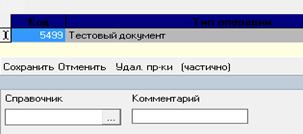

 Настройка грида\(таблицы\), нужно на гриде нажать сочетание клавиш Alt+D и в открывшемся окне настроить свойства:

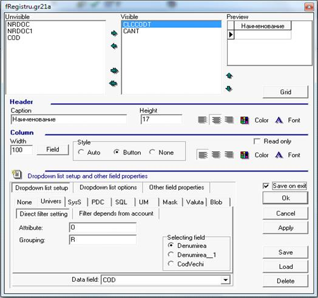

 В результате получился документ.

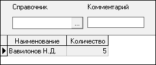

