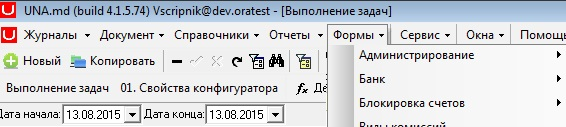
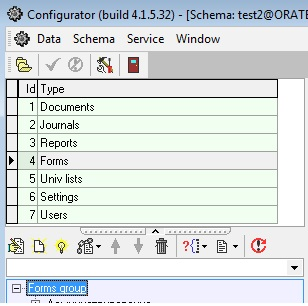
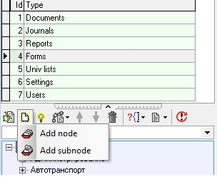
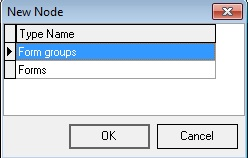
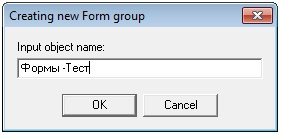
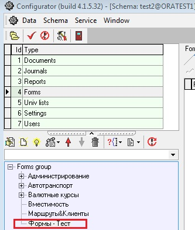

# Создание форм

Формы реализуют интерфейс работы с определенными данными. Настройка существующих и новых форм включает интерфейсную часть и часть обработки данных.

Формы служат для работы пользователя со специализированной справочной информацией либо для выполнения определенных действий с данными.

Открытие формы производится выбором соответствующего пункта меню Формы.

О свойствах формы, можно почитать по [ссылке](https://bsoft.gitbook.io/wiki/razrabotka/konfigurator/formy).

Добавим к конфигураторе тестовый узел, в котором будем создавать формы.

В конфигураторе выбираем узел Forms -&gt;Forms group \( щелкните правой кнопкой мыши по Forms group\)

 и выберите на панели добавить элемент  Add subnode.

 В открывшемся окне выбираем группу Forms groups

нажимаем Ok.

Открывается новое окно в которое надо ввести имя группы Форм.

Вводим имя узла групп:  Формы - Тест

нажимаем Ок.

В конфигураторе видно, что добавился новый узел Формы - Тест.

[Создание формы справочника Univers.](http://wiki.bsoft.biz/xwiki/bin/view/%D0%98%D0%BD%D1%81%D1%82%D1%80%D1%83%D0%BA%D1%86%D0%B8%D0%B8/%D0%A1%D0%BE%D0%B7%D0%B4%D0%B0%D0%BD%D0%B8%D0%B5+%D1%84%D0%BE%D1%80%D0%BC%D1%8B+%D0%BE%D1%82%D0%BE%D0%B1%D1%80%D0%B0%D0%B6%D0%B0%D1%8E%D1%89%D0%B5%D0%B9+%D1%81%D0%BF%D1%80%D0%B0%D0%B2%D0%BE%D1%87%D0%BD%D0%B8%D0%BA+Univers)

[Создание формы справочника SysS.](http://wiki.bsoft.biz/xwiki/bin/view/%D0%98%D0%BD%D1%81%D1%82%D1%80%D1%83%D0%BA%D1%86%D0%B8%D0%B8/%D0%A1%D0%BE%D0%B7%D0%B4%D0%B0%D0%BD%D0%B8%D0%B5+%D1%84%D0%BE%D1%80%D0%BC%D1%8B+%D1%81%D0%BF%D1%80%D0%B0%D0%B2%D0%BE%D1%87%D0%BD%D0%B8%D0%BA%D0%B0+SysS.)

