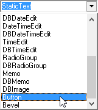

# Создание кнопок

 Для установки кнопок используется универсальный документ


 Для перехода в дизайн Header'a нажимаем на ролик мыши или с зажатым Ctrl нажимаем правой кнопкой мыши и в появившемся списке выбираем


 В дизайне сверху открываем список с помощью


 и выбираем




 Для создания выбранного Control'a нажимаем


 Вторым способом считается клик правой кнопкой мыши на свободном месте и выбор


 из списка:


 С помощью зажатой левой клавиши мыши перемещаем control


 в нужное место.

### **Кнопка Cartela**


 В свойстве


 записываем имя кнопки, в данном случае "Cartela":


 Чтобы открыть карточку \(cartela\) при нажатии кнопки и передать в нее параметр \(nrdoc\), необходимо в свойстве


 нажать


 и в открывшемся окне записать:

```sql
TargetType=cartela
TargetSection=ATTR_ORD_ADD
nrdoc=_nrdoc
MainTA=1
```


аким образом, мы определяем, что по кнопке открывается карточка, имя секции которой = ATTR\_ORD\_ADD. Передаем в форму параметр nrdoc=\_nrdoc, значение которого берется из запроса для панели, на которой расположена кнопка. После чего нажимаем


для завершения редактирования.

Сохраняем изменения с помощью галочки


 и нажимаем


 При нажатии на кнопку


 выйдет окно с карточкой:


### **Кнопка Form** {#H41A43D43E43F43A430-1}


 В свойстве


 записываем имя кнопки, в данном случае "Form".


 Чтобы открыть форму по нажатию кнопки, необходимо в свойстве


 кнопки нажать


 и в открывшемся окне прописать:

```sql
TargetType=form
TargetSection=CURS
```


 Мы указываем, что по нажатию кнопки открывается форма с именем секции = CURS

 После чего нажимаем


 для завершения редактирования. Сохраняем изменения с помощью галочки


 и нажимаем


_Подсказка:_

В конфигураторе при выделенной форме нажав кнопку


 в свойстве


 можно посмотреть имя секции:


 При нажатии на кнопку


 откроется форма с курсами:


### **Кнопка Action** {#H41A43D43E43F43A430-2}


 В свойстве


 записываем имя кнопки, в данном случае "Action"


 Чтобы выполнить действие при нажатии кнопки, необходимо в свойстве


 кнопки нажать


 и в открывшемся окне прописать:

```sql
TargetType=doc.action
action_id=1
```


 Мы указываем, что по нажатию кнопки выполняется действие, которое имеет id=1

 После чего нажимаем


 для завершения редактирования. Сохраняем изменения с помощью галочки


 и нажимаем


 В данном случае у документа первое и единственное действие это:


 Именно это действие будет выполнено после нажатия кнопки


 На вкладке


 показано выполненное действие:


 Документ с проводками после сохранения примет вид:


### Кнопка Print {#H41A43D43E43F43A430-3}


 В свойстве


 записываем имя кнопки, в данном случае "Print".


 Чтобы открыть печатную форму при нажатии кнопки, необходимо в свойстве


 кнопки  нажать


 и в открывшемся окне прописать:

```sql
TargetType=doc.print
TargetSection=2:0:ABSTRACT PRINT DOCUMENT (D):1:0:0:8
```


 Мы указываем, что при нажатии кнопки построится печатная форма с именем секции =2:0:ABSTRACT PRINT DOCUMENT \(D\):1:0:0:8

 После чего нажимаем


 для завершения редактирования. Сохраняем изменения с помощью галочки


 и нажимаем


 В данном случае построится 


 имя секции которой можно посмотреть нажав в конфигураторе при выделенной печатной форме


 и в открывшемся окне напротив


 При нажатии на кнопку


  построится печатная форма:


### Кнопка Report {#H41A43D43E43F43A430-4}


 В свойстве


 записываем имя кнопки, в данном случае "Report".


 Чтобы открыть отчёт при нажатии кнопки, необходимо в свойстве


 кнопки нажать


 и в открывшемся окне прописать:

```sql
TargetType=report
TargetSection=1:0:RG113
```


Мы указываем, что при нажатии кнопки построится отчёт с именем секции

=`1:0:RG113`

 После чего нажимаем


 для завершения редактирования. Сохраняем изменения с помощью галочки 


 и нажимаем


 Имя секции отчёта можно посмотреть нажав в конфигураторе при выделенной печатной форме


 и в открывшемся окне напротив


 При нажатии на кнопку


 построится отчёт:


 Вид кнопок в шапке \(Header\) документа:


 Подсказка:

В дизайне Header'a в свойстве


 можно задать любое имя для кнопки. Имена Action, Cartela, Form, Print и Report  выбраны в качестве примера.

