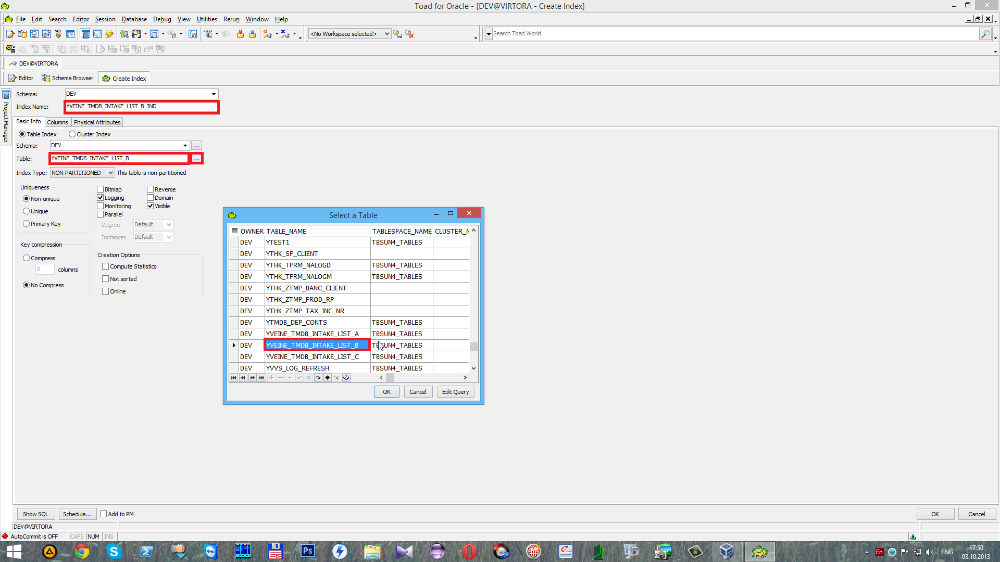
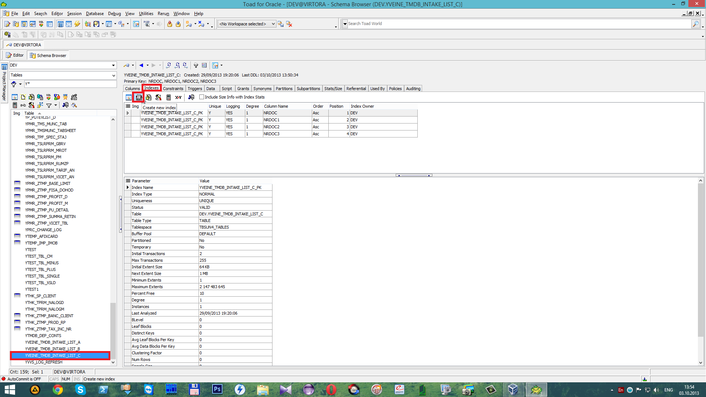

# Создание отчета

###  **1. Создание узла отчета \(конфигуратор\)**

Целью данной инструкции является создание отчета с произвольными параметрами в формате Formula One. \(DLL ID = 9002, ReportID = univ\).

Найдя подходящий отчет, копируем его с помощью

 Выйдет сообщение о завершении экспорта одного узла. Нажимаем

 Выбираем журнал и вставляем узел с помощью

 В результате чего объект будет вставлен как подузел.

 Получаем сообщение о завершении импорта одного узла. Нажимаем

 Нажимаем на кнопку

 В открывшемся окне переименовываем название отчета \(Тестовый отчет\) и _Section \(RPT\_BS\_BOOK\_TEST\),_ \(по желанию можно задать перевод на английском и румынском\) и нажимаем

 В поле

 указываем имя шаблона \(bs\_book\_rep\_test.vts\), который мы скопировали и нажимаем

 В поле

 записан блок _PL/SQL_ для отчета который мы скопировали. Необходимо создать свой пакет с процедурой.

###  **2. Создание шаблона**

