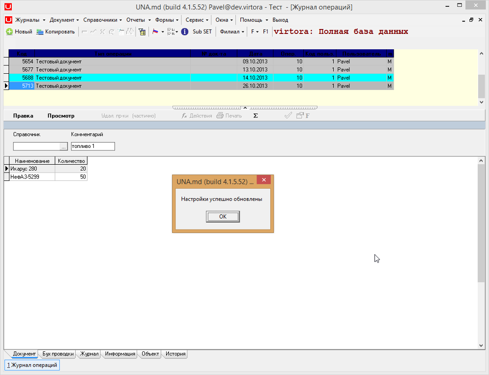

# Создание отчета

###  **1. Создание узла отчета \(конфигуратор\)**

Целью данной инструкции является создание отчета с произвольными параметрами в формате Formula One. \(DLL ID = 9002, ReportID = univ\).

Найдя подходящий отчет, копируем его с помощью

 Выйдет сообщение о завершении экспорта одного узла. Нажимаем

 Выбираем журнал и вставляем узел с помощью

 В результате чего объект будет вставлен как подузел.

 Получаем сообщение о завершении импорта одного узла. Нажимаем

 Нажимаем на кнопку

 В открывшемся окне переименовываем название отчета \(Тестовый отчет\) и _Section \(RPT\_BS\_BOOK\_TEST\),_ \(по желанию можно задать перевод на английском и румынском\) и нажимаем

 В поле

 указываем имя шаблона \(bs\_book\_rep\_test.vts\), который мы скопировали и нажимаем

 В поле

 записан блок _PL/SQL_ для отчета который мы скопировали. Необходимо создать свой пакет с процедурой.

###  **2. Создание шаблона**

 Для начала выбираем похожий шаблон. Открываем папку с шаблонами template, находим файлы формата _.vts._ Шаблон откроется в программе _Formula One_.

Копируем нужный файл и тут же вставляем. После чего переименовываем шаблон \(в данном случае это _bs\_book\_rep\_test.vts\)._ При открытии файла откроется полная копия скопированного файла. В процессе редактирования называем наш отчет "Выдача топлива". В поле \_company выводится имя компании. Поля _\_datastart_ и _\_dataend_ образуют период. В поле _\_clcavtot_ выводится название автомобиля из справочника _VMS\_UNIVERS_. _detail1_ образуют 4 поля \(в _\_avto_ попадает код автомобиля из справочника _VMS\_UNIVERS_; в _\_clcavtot_ попадает название автомобиля из справочника _VMS\_UNIVERS_; в поле \_cant попадает количество, в поле _txtcoment_ комментарий\). Напротив summary ведется подсчет всех строк в поле с двойным \(!\)  нижним подчеркиванием _\_\_cant_. Напротив _title_ задаются названия.

###  **3. Создание пакета**

 Открываем _Toad_ и в редакторе записываем скрипт создания пакета _pkg\_bs\_book\_reps_ и процедуры _test_. Выполняем и компилируем скрипт с помощью кнопки

В процедуре приравниваем для _Header'a_ поля с именем компании из таблицы _VMS\_COMPANY_, дату начала и дату конца. Для _filt1_ подселектом из справочника _VMS\_UNIVERS_ в поле _clcavtot_ будет выводиться название автомобиля.

Для _Master'a_ приравниваем поля с кодом автомобиля, его названием, количеством, комментарием, _datamanual_ \(период от _:datastart_ до _:dataend_\) и кодом документа. Где _nrdoc_ _Master'a_ равен коду документа, _nrdoc_ _Detail'a_ равен коду документа, _sysfid_ документа равен 10, _cod_ _Detail'a_ приравниваем к _filt1_ и используем нулевые значения. Выполняем и компилируем скрипт с помощью кнопки

 Завершаем транзакцию с сохранением с помощью кнопки  **Commit**.

###  **4. Создание запроса**

 В поле

 записываем название только что созданного пакета _pkg\_bs\_book\_reps_ и через точку название процедуры _test_. После чего нажимаем

 Сохраняем изменения посредством **Commit**.

###  **5. Изменение шаблона**

 Для того чтобы изменения вступили в силу обновляем настройки с помощью кнопки _F5_. В появившемся окне нажимаем

 После чего получаем сообщение об успешном обновлении настроек. Нажимаем

 Открываем дерево отчетов и находим тестовый отчет в журнале _Доходы_. Нажимаем правой кнопкой мыши и выбираем

 В открывшейся вкладке выбираем

 Для _filt1Caption:TLabel_ задаём в поле _Caption_ "Автомобиль".

 Для _filt1:TUnDBEdit_ в поле _Params_ задаём фильтр выпадающего справочника. Для этого нажимаем на

 В открывшемся окне вводим фильтр, благодаря которому из справочника будет выпадать только список автомобилей. Нажимаем

 После чего закрываем окно

 И сохраняем изменения с помощью кнопки

 В появившемся окне нажимаем

 Нажав на 

 выпадает справочник с автомобилями.

 Выбираем например Икарус 280 и нажимаем

 \(или горячую клавишу F9\).

 В результате чего построится отчет.

###  **6. Изменение шаблона**

 Откроем наш шаблон и изменим поля title на группировку GroupH \(Header\) по полю \_cod и GroupF \(Footer\). Так же добавим переход на новую страницу pagebreak. Таким образом будет происходить переход на новую страницу сразу после названия компании \(\_company\) и после шапки \(код, автомобиль, кол-во и комментарий\). Для сохранения изменений нажимаем на кнопку

 Для того чтобы увидеть изменения необходимо построить новый отчет, либо воспользоваться кнопкой  обновить отчет

 \(если отчет уже построен\).

 Можно строить отчеты для разных документов, которые будут отличаться по \_cod от datamanual и считать итоги до документу с помощью поля с двойным \(!\) нижним подчеркиванием \(\_\_cant\). Сохраняем изменения с помощью кнопки

 При обновлении отчета, будет построен отчет для двух документов \(от 13.10.2013 и 26.10.2013\) и для каждого ведется подсчет итогов.

 Так же можно изменять внешний вид отчета. Для этого необходимо выделить нужные поля и нажав левой кнопкой мыши в меню выбрать

 Перейдя на вкладку

 можно выбрать цвет окна ниже 

 Выберем например цвет

 ниже

 выбираем цвет

 \(ниже Sample показан выбранный цвет\) и нажимаем

 В результате выделенные поля будут в новом цвете. После проделанных операций сохраняем изменения с помощью кнопки 

 В результате отчет примет вид.

 При включении свойства SetRowHeightAuto on, в отчете будет устанавливаться автоматическая высота строки. Сохраним изменения с помощью кнопки

 После построения отчет примет вид.

