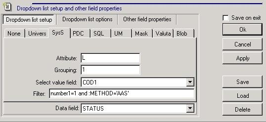

# Настройка документа

### Настройка документа

Основные свойства документа определяются 2-мя параметрами:

**DLL ID \(Integer\) =4000;**

И

**DocName \(String\)=DG1p21;**

Включение шапки документа:

**HeaderPanel \(Boolean\)=true;**

Включение панели в нижней части экрана:

**PanelHeight1 \(String\)=100;**

Количество гридов в документе:

**GridCount \(Integer\)=1**

Параметр для доступа к документу пользователей из других групп \(не админов\), доступ к документу в журнале:

**Use in DB \(Boolean\)=true**

Поле типа DBMemo в дизайнере панели или шапки используется для вывода больших текстовых полей. Выбираем **DATAFIELD** из грида, которому подчиняется данное поле.

Привязка экшена к объекту button:

Изменяем свойство **params** объекта button

**TargetType=doc.action**

**action\_id=5**

Открываем произвольную панель \(карточку\) по кнопке:

**Внимание! Для работы панели необходимо добавить в tms\_univers строку с полем cod=0, иначе карточка не откроется.**

**TargetType=cartela**

**TargetSection=ATTR\_EDI\_PL**

**nrdoc=\_nrdoc**

**MainTA=1**

**При смене сисфида подгружается весь дизайн и функционал.**

**Итоги в документах \(XTT\).**

Необходимо включить в гриде по **ALT+D**, затем включить в **SagiProperties** по **ALT+Q** и добавить вычисляемые поля на вкладке **XTT**.

**Соответствие полей документа и полей вьюхи:**

**Счет - Ct и Dt**

**Аналитика Ctsc, Dtsc**

**Центр затрат CtDep, DtDep**

**Субконто \(или МОЛ\) CtSc1, Dtsc1.**

**Стандартные \(НЕНАСТРАИВАЕМЫЕ\) документы имеют следующие настройки Alt+Q:**

Для шапки вьюха **VMDB\_ST201M**

И поля для **Кт части Ct, CtDep, CtSc, CtSc1 и Dt, DtDep, DtSc, DtSc1 для Дт части** соответственно.

Для грида вьюха **VMDB\_ST201D.** Поля настраиваются аналогично.

**Автозаполнение шапки**

В запросе шапки документа , на вкладке SQL запросав, в Insert добавить :

DECLARE

v\_par  number;

BEGIN

**// Устанавливаем значение параметра, например , если выбираем из узла**

v\_par : = pkg\_adm\_util.get\_adm\_text\('cont\_topl','','PTL'\) ;

**//Указать параметр в запросе**

INSERT INTO имя таблицы   \(поля, наше поле\)

VALUES   \(:поля, **v\_par**\);

end;

можно в шапке документа в дизайне указать параметр default на нужном поле

#### Быстрый поиск

**Например:**

ORIGIN=COD\_OC \(поле для поиска\)

\_KB=0

SpeedSearch=1

SpeedText=1

SpeedWhole=1

TIP=Q

SQL1=SELECT COD,pkg\_mat\_docs.tmc\_get\_ct\(cod\) denumirea

SQL2=,Un$to\_Number\(CODVECHI\) inv\_num

SQL3=FROM VMS\_UNIVERS U WHERE TIP='F' AND GR1='100' AND ISARHIV IS NULL

SQL4=ORDER BY CODVECHI

LISTFIELDS=COD,DENUMIREA,INV\_NUM

RESULTFIELDS=COD\_OC,CLCCOD\_OCT,INV\_NUM

### Опции на документе

**GridMaster1, GridMaster2, GridMaster3**  в документах типа **DG1p21**:

Если свойство **HeaderPanel=true, то:**

**Для первого грида GridMaster1, для второго грида  gridMaster2 и т.д.**

**Для любого грида применимо:**

**если = 0** то грид подчиняется **Headery**;

**если =-1** то грид подчиняется docs-у.

**Случай, когда в документе есть 3 грида:**

Настраиваем **подчинение** для 3-го грида:

**если gridMaster3 =-1**, то 3-й грид подчиняется **docs-у**

**если gridMaster3 = 0**, то 3-й грид подчиняется **шапке**

**если gridMaster3 = 1**, то 3-й грид подчиняется **первому**

**если gridMaster3 = 2**, то 3-й грид подчиняется **второму**

Если свойство **HeaderPanel=false, то:**

**Номера X свойств каждого из гридов, описанные выше будут действовать как X-1.**

**GridHeight1** определяет размер и положение первого грида. Если значение **&gt; 0** - грид будет расположен снизу по отношению к шапке\(или главному гриду\). Если значение   **&lt; 0**, то грид будет справа.

**Для остатков**

**SoldAllowGrids=gr21a,gr21b** Указываем гриды, для которых будет открываться форма остатков

**SoldGRB\_CANT=cant** указываем поле\(в гриде\), по которому будет суммироваться значение, \(например, чтобы кол-во в гриде не превысило кол-во в остатках\). Также на этом поле позиционируется курсор при добавлении строки из остатков в грид.

**Следующие 2 параметра работают, если в SoldAllowGrids указан только один грид.**

**Если гридов несколько, то имена полей в гридах остатков и гридах документа должны совпадать соответственно.**

**SoldListFields=cod\_tvr,brand\_cod** \(Указываем поля для выборки из грида остатков\)

**SoldRezultFields=cod\_tvr,brand** \(Указываем поля для вставки в грид документа\)

**Для настройки второго грида в форме остатков:**

**SoldSubMaster** - определяет подчиненность второго грида в остатках \(F8\)

если **= 0** то второй грид подчиняется **первому**; если **= -1** то подчиняется **docs-у**.

**SoldSubMasterSize=350** - определяет размер подчиненного грида \(положение вроде не меняется\)

**Для вкладки дополнительно:**

\[ZZZ\]

XCST=true

.type.XCST=Boolean

XCST GridCount=2

.type.XCST GridCount=Integer

.Hint.XCST GridCount=&lt;=3

XCST GridHeight1=150

.type.XCST GridHeight1=Integer

XCST GridHeight2=150

.type.XCST GridHeight2=Integer

XCST GridMaster1=-1

.type.XCST GridMaster1=Integer

XCST GridMaster2=-1

.type.XCST GridMaster2=Integer

**Позиционирование панели инстр. \(toolbar\)**

\[ZZZ\]

UseToolBar=true

.type.UseToolBar=Boolean

UseToolBarBottom=true

.type.UseToolBarBottom=Boolean

UseToolbarHints=false

.type.UseToolbarHints=Boolean

UseToolbarSorting=true

.type.UseToolbarSorting=Boolean

**- будет задаваться вопрос для подтвеждения**

\[ZZZ\]

ConfirmText=Generam formulele contabile?

.type.ConfirmText=String

.MISS.eng.ConfirmText=Сформировать проводки?

.MISS.rom.ConfirmText=Generam formulele contabile?

.MISS.rus.ConfirmText=Сформировать проводки?

скрыть кнопку экшенов

\[ZZZ\]

ShowActionsEnabled=false

.type.ShowActionsEnabled=Boolean

параметры в экшене, загрузка файла

declare

v\_nrdoc1 int;

v\_comment varchar2\(100\):='Loaded '\|\|to\_char\(sysdate,'dd.mm.yyyy hh24:mi:ss'\);

v\_encoding number\(10\):=:encoding\_def;

v\_separator char\(1\):=:separator\_def;

v\_ROW1\_DETAIL number\(10\):= :ROW1\_DETAIL\_def;

v\_ROW1\_MASTER number\(10\):= :ROW1\_MASTER\_def;

v\_ROWN\_MASTER number\(10\):= :ROWN\_MASTER\_def;

begin

--

select nvl\(max\(nrdoc1\),0\)+1 into v\_nrdoc1 from tmdb\_docs\_ole where nrdoc=:nrdoc;

insert into tmdb\_docs\_ole \(nrdoc,nrdoc1,pfile,txtcomment,oleobj\)

values \(:nrdoc,v\_nrdoc1,:filename,v\_comment,empty\_blob\(\)\) returning oleobj into :file;

--

update VMDB\_ORDERS\_SETINGS

set unicode=:encoding,separator=:separator,ROW1\_MASTER=:ROW1\_MASTER,ROWN\_MASTER=:ROWN\_MASTER,

ROW1\_DETAIL=:ROW1\_DETAIL

where nrdoc=:nrdoc;

end;

/\*

.text.file=Nume fisier:

.type.file=file

.width.file=401

.filter.file=CSV files \(\*.csv\)\|\*.csv\|MS Excel files \(\*.xls\)\|\*.xls\|All files \(\*.\*\)\|\*.\*

.type.filename=filename

.src.filename=file

.text.encoding= Codificarea fisierului:

.type.encoding=List,S,U,1

.def.encoding=:encoding\_def

.width.encoding=150

.text.separator=Separator:

.def.separator=:separator\_def

.width.separator=40

.text.ROW1\_DETAIL=Primul rind din tabel

.def.ROW1\_DETAIL=:ROW1\_DETAIL\_def

.width.ROW1\_DETAIL=40

.text.ROW1\_MASTER=Primul rind al caciulei

.def.ROW1\_MASTER=:ROW1\_MASTER\_def

.width.ROW1\_MASTER=40

.text.ROWN\_MASTER=Ultimul rind al caciulei

.def.ROWN\_MASTER=:ROWN\_MASTER\_def

.width.ROWN\_MASTER=40

encoding\_def=field\_dmDG1\_sq21\_UNICODE

separator\_def=field\_dmDG1\_sq21\_separator

ROW1\_DETAIL\_def=field\_dmDG1\_sq21\_ROW1\_DETAIL

ROW1\_MASTER\_def=field\_dmDG1\_sq21\_ROW1\_MASTER

ROWN\_MASTER\_def=field\_dmDG1\_sq21\_ROWN\_MASTER

\*/

экшен, который выполняет скрипт

5. На форме настроено действие "Экспорт заявки в EDI"

Его имя секции - ZAIAVAKA\_POSU.MAKE\_XML

Его SQL1:

begin

ylnl\_edi\_order\_xml\(:order\);

:batch:=

'move \\oravirt\dpdump\order-'\|\|:order\|\|'.xml'\|\|

' X:\EDI\ExiteSync\outbox\'\|\|chr\(13\)\|\|chr\(10\)\|\|

'X:'\|\|chr\(13\)\|\|chr\(10\)\|\|

'cd \EDI\ExiteSync\'\|\|chr\(13\)\|\|chr\(10\)\|\|

'main.bat';

end;

/\*

order=field\_fmFS1c\_sq01\_NRDOC

\*/

## Опции на  экшене {#H41E43F44643843843D43044D43A44843543D435}

 **в xwiki**

## Опции на печатной форме: {#H41E43F44643843843D43043F43544743044243D43E43944443E44043C435:}

\[ZZZ\]

AutoOk=true

.type.AutoOk=Boolean

AutoSelect=true

.type.AutoSelect=Boolean

Эти 2 св-ва используются для автоматической печати ПФ без возможности выбора из списка \(т.е. список ПФ не отображается\).

Если использовать любое из свойств отдельно, то на этой ПФ будет ставиться галочка \(автовыбор ПФ\).

**ПФ с шаблоном в ворде:**

\[ZZZ\]

DLL ID=5002

.type.DLL ID=Integer

Report ID=MSWord

.type.Report ID=String

SQL Main=.MEMO.ZZZ.SQL Main

.type.SQL Main=Memo

SQL1=.MEMO.ZZZ.SQL1

.type.SQL1=Memo

Template=perev\_prof\_vicet.doc

.type.Template=String

WindowCaption=Заявление на вычет

.type.WindowCaption=String

\[.MEMO.ZZZ.SQL Main\]

select clcdtsc0t clcarendt, clcdtsc1t clcavtot,

     \(select sum\(suma0\) from vmdb\_arenda\_act where nrdoc=:nrdoc\) suma\_tot,

     to\_char\(datamanual,'month'\) p\_month,

     to\_char\(datamanual,'YYYY'\) p\_year,

     c.\*

   from VMDB\_REG r, vms\_company c, vmdb\_docs d

  where nrdoc = :nrdoc

    and r.nrdoc = d.cod

\[.MEMO.ZZZ.SQL1\]

select dtnum0 num\_doc, descr\_type clcsct, kontr clckontrt, suma0 suma

   from vmdb\_arenda\_act

  where nrdoc = :nrdoc

**В шаблоне мастре имеет заголовок: \[\[Table1\]\]. Этот заголовок ОБЯЗАТЕЛЬНО должен располагаться в верхней ячейке таблицы, которая является гридом для строк мастера.**

**Пример:**

|  **\[\[Table1\]\]** |  |  |  |
| --- | --- |
|  \[Num\_doc\] чек | \[Clckontrt\] | За \[clcsct\] | \[suma\] руб.
 |

Каждому свойству вида **SQL1, SQL2** соответвует таблица в шаблоне с заголовком вида:

**Table1, Table2.**

**Чтобы коректно выпадал календарь на поле дата \(заполнялось\) нужно:**

в Edit query , вкладка Sagi Properties установить галочку напротив свойства :

SagiModeNotAbort - позволяет неявное редактирование

**Настройка справочника в гриде VMS\_SYSS :**

поле **Filter** можно задавать ограничение в зависимости от соседних полей и обращаться к ним через :

Например

