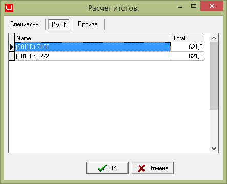

# Объекты типа Totals

**Объекты типа** Totals

Объекты типа Totals служат для выполнения запросов, связанных с подсчетом итогов по таблице проводок и таблицам спец регистра в документах соответствующего типа.Набор записей итогов отображается в окне итогов \[`Document Action`\].

`Основные свойства объекта типа Totals`

| **Имя свойства**  | **Тип** | **Описание** | **Значение для примера** |
| --- | --- | --- |
| `CM_SQL` | `Memo` | Содержит `SQL` команды подсчета итогов по таблице проводок. Результат отображается на вкладке \[`Pe CM`\] окна итогов \[`Document Action`\] |  |
| `SPEC_SQL` | `Memo` | Содержит `SQL` команды подсчета итогов по таблицам спецрегистра.  Результат отображается на вкладке \[`Special`\] окна итогов \[`Document Action`\] |  |

  Расчет итогов осуществляется с помощью кнопки 

 В результате чего выйдет окно:

