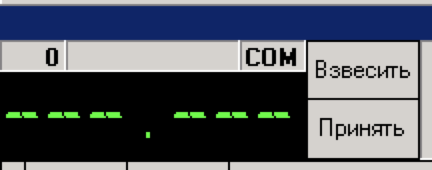

# Свойства документа DG1p21

Документы типа DLL ID = 4000, DocName = DG1p21 имеют свойства для настройки гридов и шапки.

| **Имя свойства** | **Тип** | **Описание** | **Значение для примера** |
| :--- | :---: | :--- | :--- |
| FocusControl | String | Предположительно при создании документа фокус переходит на указанный control.  При insert/update документа фокус будет на контроле UnDBEdit1. | UnDBEdit1 |
| GridCount | Integer | Определяет количество гридов | 2 |
| GridHeight1 | Integer | Определяет размер и положение первого грида. Если значение &gt; 0 - грид будет расположен снизу по отношению к шапке\(или главному гриду\). Если значение   &lt; 0, то грид будет справа. | 120 |
|  |  | **Свойства для настройки подчиненных гридов:** |  |
| GridMaster3 | String | GridMaster1, GridMaster2, GridMaster3  `в документах типа DG1p21. Если свойство HeaderPanel=true, то: Для первого грида GridMaster1, для второго грида GridMaster2`и т.д. Для любого грида применимо: Если = 0, то грид подчиняется Header'y; Если =-1, то грид подчиняется Docs'y; Случай, когда в документе есть 3 грида: Настраиваем подчинение для 3-го грида: Если gridMaster3 =-1, то 3-й грид подчиняется docs-у, Если gridMaster3 = 0,то 3-й грид подчиняется шапке, Если gridMaster3 = 1, то 3-й грид подчиняется первому, Если gridMaster3 = 2, то 3-й грид подчиняется второму        ------------------------------------------ Если переподчиняем гриды с шапки на docs или обратно нужно менять и параметры фильтра на выборку в Alt+Q:- если 0, то NRDOC=:NRDOC- если -1, то NRDOC=:COD | 0 |
| HeaderPanel | Boolean | Если свойство HeaderPanel=false, то: Номера X свойств каждого из гридов, описанные выше будут действовать как X-1 | true |
| RefreshFriends0 | Integer | Свойство для обновления \(верхнего\) мастер-грида при изменении строк в шапке | 1 |
| RefreshFriends1 | Integer | Свойства для обновления \(верхнего\) мастер-грида при удалении/изменении строк в дитейл-гриде | 2 |
| RefreshFriends2 | Integer | Свойства для обновления \(верхнего\) мастер-грида при удалении/изменении строк в дитейл-гриде \(В названии свойства указывается № грида, к которому относится свойство.  В значении указывается № грида, который должен обновляться\) | 1 |
|  |  | **Количество записей в гридах** |  |
| MaxRecords1 | Integer | Количество записей в гриде. Если установить значение равным 1, то в грид нельзя будет добавить больше одной строки - способ реализован в контрактах. | 1 |
| MaxRecords2 | Integer | Количество записей в гриде | 5 |
| MaxRecords3 | Integer | Количество записей в гриде \(В названии свойства указывается № грида, к которому оно относится.  Если добавляешь в грид больше, чем здесь установлено, то будет ошибка\) | 5 |
|  |  | **Сочетание свойств в документе** |  |
| GridCount | Integer | Позволяет получить документ с одним гридом,  в который  нельзя вставить более одной строки, то есть грид | 0 |
| GridHeight0 | Integer | заменяет шапку документа. При попытке сделать insert в такой грид начинает редактироваться текущая строка. | 300 |
| FocusDocument | Boolean |  | true |
| GridInsert | Boolean | При insert открывается справочник первой колонки | true |
|  |  | Настройка желтой кнопки остатков |  |
| SoldAllowGrids | String |  | gr04 |
| SoldAutoRefresh | Boolean |  | true |
| SoldGRB\_CANT | String | При добавлении новой позиции \(плюсиком\) фокус окажется на поле clcsc\_munct | clcsc\_munct |
| SoldListFields | String |  | datastart, id\_div\_io, clcid\_div\_iot, id\_rang, clcid\_rangt, id\_prof\_syss, clcid\_prof\_sysst, oklad,id, calc\_tip\_r\_61, clccalc\_tip\_r\_61t, shtat\_id |
| SoldMasterHeight | String | \(или SoldSubMasterSize\) | 200 |
| SoldRezultFields | String |  | datastart, dep\_sectia, clcdep\_sectiat, KADR\_KETEGOR\_R\_501, clcKADR\_KETEGOR\_R\_501t, KADR\_DOLJN\_R\_502, clcKADR\_DOLJN\_R\_502t, calc\_saltar, id\_statr\_sl, calc\_tip\_r\_61, clccalc\_tip\_r\_61t, shtat\_id |
| SoldUniquePosition | Boolean |  | true |
| sequencer\_NRMANUAL | String | Имя сиквенса для автонумерации документов | ID\_217 |
|  |  | **Прочие свойства:** |  |
| HideOleBar | Boolean | Скрывает стандартную панель инструментов на вкладке объект и включает новые кнопки | true |
| HeaderPanel | Boolean | Включение шапки документа | true |
| PanelHeight1 | String | Включение панели в нижней части экрана | 100 |
| PanelHeight2 | String | свойство задает 2-ю нижнию панель, связанную со 2 м гридом, если в конце 1 - то 1-ый грид | + |
| ScalesLevel | Integer | Отображение панели весов в шапке | 1 |

