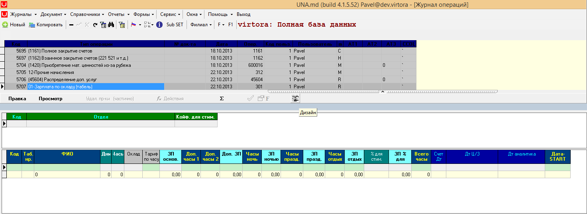
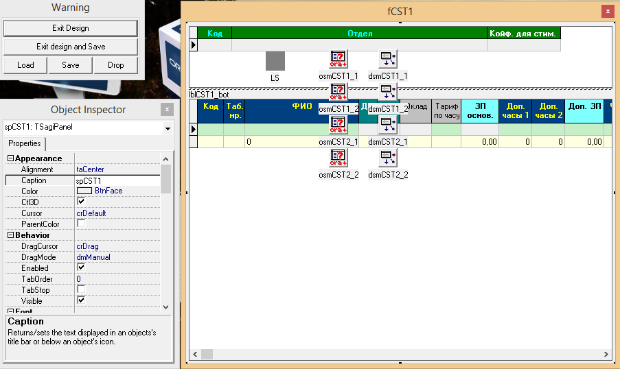
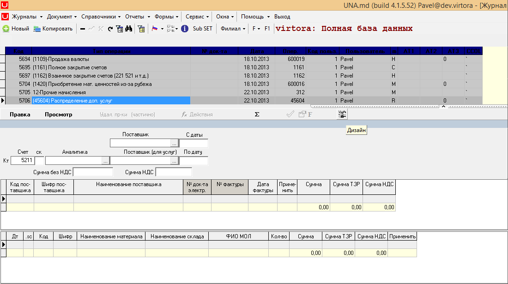
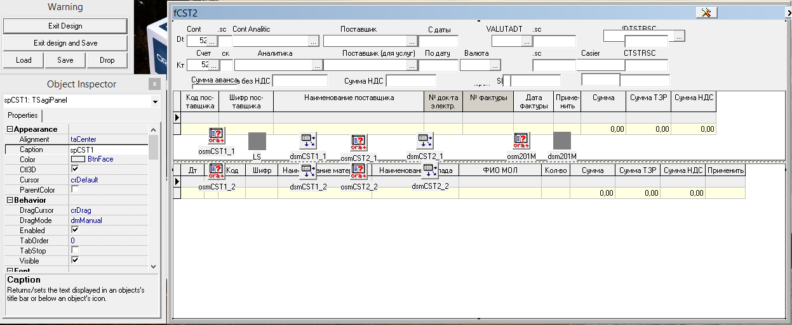
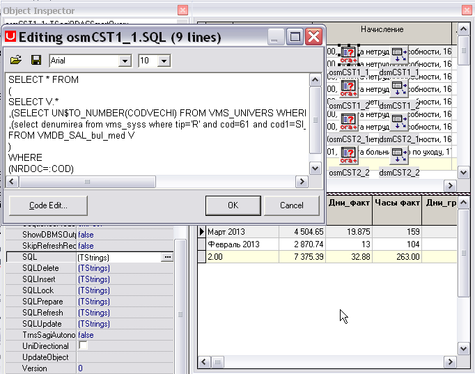

# Свойства документов CST1 и CST2

Документы типа DLL ID = 900, DocName = CST1 или DLL ID = 900, DocName = CST2 имеют свойство Design позволяющее настраивать внешний вид документа в окне конструктора формы. 

Тип документа CST1 имеет 2 грида.

 При нажатии на кнопку  откроется окно изменения дизайна.

 Тип документа CST2 имеет 2 грида и шапку.

  При нажатии на кнопку  откроется окно изменения дизайна.

Дочерние объекты объектов типа Документы – объекты типа Action, объекты типа Totals и объекты типа PrintForms. Узлы для этих объектов не могут иметь субузлов.

SQL запросы для документов DocName = CST1 и DocName = CST2 можно настроить следующим образом:

В дизайне документа выбираем объект osmCST1\_1-для первого грида \(или osmCST1\_2 для второго\) и пишем запросы в соответствующих свойствах этого объекта.

На рисунке пример изменения свойства SQL для объекта osmCST1\_1:

