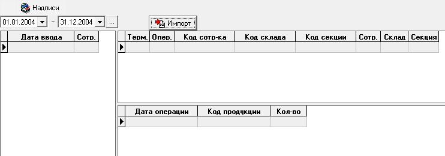

# FSal1p011

  
Форма "Импорт данных сканера штрих-кодов"  отличается от других форм наличием свойства:

| **Название свойства** | **Тип** | **Описание** | **Значение для примера** |
| --- | --- |
| `ImportFileName` | `S` | Импорт данных их текстового файла | C:\Program Files\Multdrop\Recv\data.txt |

В левом гриде используется таблица `UN9BCOD_DATA1`, в правом верхнем - `UN9BCOD_DATA2`, в  правом нижнем - `UN9BCOD_DATA3`.

