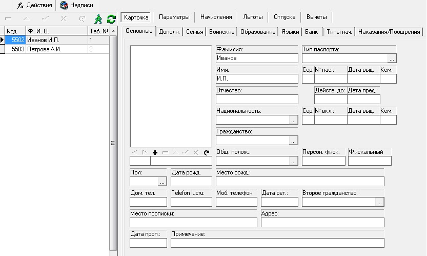

# FSal1p02

Вся информация, касающаяся работников предприятия, сосредоточена в форме «Справочник сотрудников».  

Данная форма состоит из основных закладок: 

**Карточка** – собрана  относительно постоянная информация о работнике \(паспортные данные, адрес, телефон, данные об образовании, банковские реквизиты...\)

**Параметры** – информация, касающаяся положения работника на предприятии с ведением хронологии 

**Начисления** – какие персональные автоматические начисления и удержания будут обрабатываться

**Льготы** – освобождения по подоходному налогу.

**Вычеты** –какие персональные автоматические вычеты будут обрабатываться

В форме «Справочник сотрудников» также предусмотрена возможность фильтрации работников по определенным параметрам.

 `Основные свойства формы:`

| **Название свойства** | **Тип** | **Описание**  | **Значение для примера**  |
| --- | --- | --- | --- | --- |
| `Active` | `B` | Если значение `False`, объект игнорируется | `true` |
| `Caption` | `S` | Наименование формы | Справочник\(Картотека\) сотрудников |
| `DLL FormName` | `S` | Идентификатор формы в `DLL` | `FSal1p02` |
| `DLL ID` | `I` | Идентификационный номер `DLL` | `8101` |

Внешний вид формы определяют значения параметров DLL FormName и DLL ID.

**`Свойства формы:`**

| **Название свойства** | **Тип** | **Описание**  | **Значение для примера**  |
| --- | --- | --- | --- | --- | --- | --- | --- | --- | --- | --- | --- | --- | --- | --- |
| `FamilyShowPanel` | `B` | отображение настраиваемой панели на `ts02p1p11` | `true` |
| `FamilyPanHeight` | `S` | изменение высоты настраиваемой панели на `ts02p1p11` | `300` |
| `AuxVisibleTabs` | `S` | отображение настраиваемых вкладок | `ts02p1p11, ts02p1p12, ts02p1p13,                                                                                                ts02p1p14, ts02p1p15, ts02p1p16, ts02p8, ts02p9` |
| `GenTabNavProp` | `S` |  изменение позиций и размеров навигатора в `ts02p1p15`  | `Top:Left:Height:Width ex: 10:10:50:200` |
| `GenPanPProp` | `S` | изменение позиций и размеров настраиваемой панели в `ts02p1p15` | `Top:Left:Height:Width ex: 10:10:50:200` |
| `PlanPanVisible` | `B` | отображение настраиваемой панели на `ts02p9` | `false` |
| `FormMuncGridWidth` | `S` | изменение ширины левого грида  \(для изменения ширина грида со списком сотрудников\) | `300` |
| `Cst1Caption` | `S` |  | Дополнительно |
| `SetupCaptions` | `M` |  |  |
| `SetupInvisible` | `M` | Свойство определяет невидимость вкладок, под вкладок и различных полей в карточке | `ts02p4,ts02p6` |
| `SetupVisible` | `M` | Свойство определяет видимость вкладок, под вкладок и различных полей в карточке | `ts02p1,ts02p2,ts02p5,                           ts02p9, ts02p1p11ts02p1p12, ts02p1p13,ts02p1p14ts02p1p15, ts02p1p16` |
| `UseRestoreGridPos` |  | позволяет сохранять  фокус на том же месте после `REFRESH` |  |
| `UseClickFormRefresh` | `B` |  обновляет уже открытую форму при переходе на нее форму |  |
| `FormPrmGridWidth` | `S` | Для изменения ширины грида. Изначально считывается для каждого `user-a из Uesrs->...->FormPrmGridWidth` если свойство у пользователя отсутствует, то считывается из `Settings->Salariu->FormPrmGridWidth` | `500` |

**Типы вкладок карточки:**

`ts02p1` - карточка

`ts02p2` - параметры

`ts02p3` - начисления

`ts02p4` - льготы \(исп. в Молдове\)

`ts02p5` - отпуска

`ts02p6` - вычеты \(станд.\)

`ts02p7` - KVINT

**Настраиваемые вкладки:**

`ts02p8` - параметры

`ts02p9` - настраиваемая план \(вычеты\)

`ts02p1p11` - Comp Familiei

`ts02p1p12` - семья \(Familia\)

`ts02p1p13` - послужной список \(Carnet de munca\)

`ts02p1p14` - документ, удостоверяющий личность \(Document identitate\)

`ts02p1p15` - общий \(Generale\)

`ts02p1p16` - военный \(Militare\)

**Чтобы определить название активной вкладки, нужно:**

- Выбрать вкладку или под вкладку в форме карточка сотрудников

- Нажать кнопку надписи

- в появившемся окне нажать кнопку `V`

- в появившемся окне 2 раза нажать `Find`

**Чтобы изменить заголовок вкладки или поля, нужно:**

- нажать кнопку надписи

- в появившемся окне в списке `Component list` найти имя вкладки или поля \(если нет, то загрузить все кнопкой `Load`\)

- если в полях `object list` и `label list` пусто, то нажать кнопку + для каждого поля

- поменять значения свойства `Caption` 

- нажать `save` и `OK`

