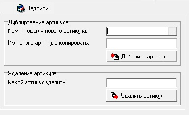

# FSal1p06

 Форма Дублирование/удаление артикула \(FSal1p06\).

 Отличие от других форм, свойства: 

| **Название свойства** | **Тип** | **Описание** | **Значение для примера** |
| --- | --- | --- |
| ProcInsert | S |  | YCOVR\_DORS.InsertUnivArticols |
| ProcRemove | S |  | YCOVR\_DORS.DeleteUnivArticols |

