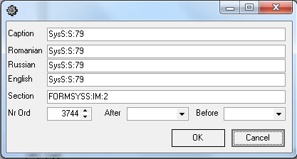

# SysS

 Главные \(идентификационные\) параметры формы Syss:

| **Название свойства** | **Тип** | **Описание**  | **Значение для примера**  |
| :------------- |:-------------:| :-----| :-----|
| Active | Boolean | действующий объект | true |
| Caption | Boolean | подпись формы | 12. Маршруты |
| DLL FormName | String | тип формы | SysS |
| DLL ID | Integer | идентификационный номер DLL | 0 |
| TIP | String | тип справочника SysS | S |
| TIP.COD | Integer | код справочника SysS | 79 |

 Название справочника в конфигураторе: 

