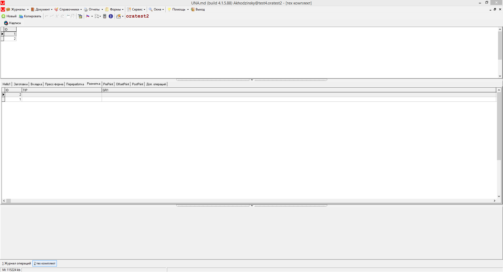

# TehComplect

 Один грид сверху и 10 вкладок с 10-ю гридами под ним.

| **Название свойства** | **Тип** | **Описание**  | **Значение для примера**  |
| :------------- |:-------------:| :-----| :-----|
| Active | B | Если значение False, объект игнорируется | true |
| Caption | S | Наименование формы | Техническая комплектация |
| DLL FormName | S | Идентификатор формы в DLL | TehComplect |
| DLL ID | I | Идентификационный номер DLL | 8000 |
|  ControlParams |  M | Заголовки вкладок | tehcomplectTS1:Hello1 tehcomplectTS3:Вкладка |

 Запросы и дизайн гридов можно изменять, однако связи  Master Detail пока не обнаружено.

