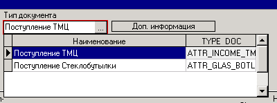

# Cartela

| **Имя свойства**   | **Тип**  |  **Описание** | **Значение для примера**   |
| :------------- |:-------------:| :-----| :-----|
|   |  |  **Свойства справочника:** |   |
| MainAttr | String | Секция карточки, которая открывается вместо основной \(имя секции "ATTR\_MPT" дано в качестве примера\) | ATTR\_MPT |
| MainAttrActive | Boolean | Карточка открывается сразу при открытии справочника | true |
| MenuAttr | String | Список секций карточек, образующих меню справа от кнопки "А"  \(имена секций "ATTR\_TVR,ATTR\_SLD,ATTR\_PRC" даны в качестве примера\) | ATTR\_TVR,ATTR\_SLD, ATTR\_PRC |
|   |   |  **Общие свойства карточки:** |   |
| Caption | String | Текст пункта меню, по которому открывается карточка \(подпись "Cartela" дана в качестве примера\) | Cartela |
| SQL\_Init | Memo | Действие, которое надо выполнить при открытии карточки \(скрипт "BEGIN NULL; END;" дан в качестве примера\) | `BEGIN NULL; END;` |
| UseTimer | Boolean | Полусекундная задержка между остановкой на позиции справочника и обновлением карточки \(для долго открывающихся карточек\) | true |
| Internal | Boolean | Использовать внутренний механизм карточек \(РЕКОМЕНДУЕТСЯ!\) | true |
| Splitter | Boolean | Отображение сплиттера между карточкой и справочником | true |
| Height | Integer | Высота карточки \(при наличии сплиттера ее можно будет изменить\)  \(значение "300" дано в качестве примера\) | 300 |
| FormHeight | Integer | Высота карточки | 350 |
| FormWidth | Integer | Ширина карточки | 700 |
| HideTopPanel | Boolean | При открытии карточки в модальном режиме скрыть верхнюю панель с двумя рядами полей ввода \(КОД АЛЬТ, НАЗВАНИЕ и т.п.\) |  true |
| FocusOnGrid | Boolean | При открытии карточки в модальном режиме установить фокус на нижнюю часть окна \(как при включенном HideTopPanel=true\) | true |
|   |  |  **Стандартная карточка:** |   |
| ShowStd | Boolean | Отображение стандартной карточки вместе с настраиваемой \(на вкладках\) | true |
| StdCaption | String | Заголовок вкладки, на которой отображается стандартная карточка \(подпись "Stardard Page" дана в качестве примера\) | Stardard Page |
| ShowStdActive | Boolean | При открытии карточки сделать активной вкладку со стандартной карточкой | true |
|   |  |  **Настраиваемая карточка:** |   |
| Tab0Caption | String | Заголовок вкладки, на которой отображается настраиваемая карточка  \(подпись "Custom Page" дана в качестве примера\) | Custom Page |
| ShowPanel | Boolean | Использовать панель вместо грида для настраиваемой карточки | true |
| Tab0Splitter | Boolean | Отображение сплиттера между областями master и detail | true |
| DetailHeight | Integer | Высота области detail \(на которой расположен 1 грид, сама область detail включается ненулевым значением этого свойства, отрицательное значение  задает высоту области master, при наличии сплиттера ее можно будет изменить, значение "-100" дано в качестве примера\) | -100 |
|   |   |  **Динамические вкладки \(до 9\):** |   |
| TabCount | Integer | Количество динамических \(то есть дополнительных\) вкладок \(значение "1" дано в качестве примера\) | 1 |
| Tab1Caption | String | Аналогично свойству Tab0Caption \(префикс от Tab1 до Tab9\) | Dynamic Page |
| Tab1Panel | Boolean | Аналогично свойству ShowPanel \(префикс от Tab1 до Tab9\) | true |
| Tab1DetailHeight | Integer | Аналогично свойству DetailHeight \(префикс от Tab1 до Tab9\) | -100 |
| Tab1Splitter | Boolean | Аналогично свойству Tab0Splitter \(префикс от Tab1 до Tab9\) | true |
|   |  |  **Свойства Params:** |   |
|   |  | Вызов карточки из документа, в дизайне шапки документа добавляется кнопка, в свойстве [Params ](https://bsoft.gitbook.io/wiki/razrabotka/obekty-una/panel/knopka)прописываем: |   |
| TargetType | String | Карточка | cartela |
| TargetSection | String | Имя карточки  \(так же имя карточки может быть поле, см. пример №1\) | ATTR\_COMMIS |
| nrdoc | String | В карточку передается поле nrdoc  | \_nrdoc |
| MainTA | Integer |   | 1 |
|   |   |   | Пример №1 В шапке                            документа есть поле                                     "Тип документа", в это                                  поле выбирается     информация                                 из справочника \(наименование ,               type\_doc - название                    карточки \)                                     По кнопке "Дополнительная     информация" вызывается              выбранная карточка TargetType= cartelaTargetSection= \_TYPE\_DOC  - поле с  названием карточкиnrdoc= \_nrdocMainTA=1 |

 [Cartela PHOTO \(карточка с фото\)](cartela-photo.md)

