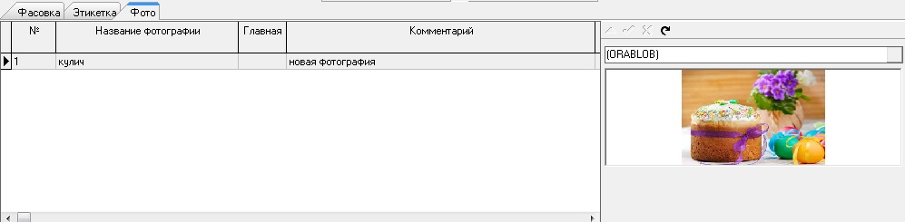

# Cartela PHOTO

Пример карточки ФОТО \(только отображение\) .

Настройки в конфигураторе: 

| **Имя свойства**   | **Тип**  |  **Описание** | **Значение для примера**  |
| --- | --- | --- | --- | --- | --- | --- |
| Caption | String | Текст пункта меню, по которому открывается карточка | Фото |
| Height | Integer | Высота карточки | 400 |
| Internal | Boolean | Использовать внутренний механизм карточек | true |
| NodeType | String |  | CM |
| PanelWidth | Integer |  | 350 |
| UseTimer | Boolean | Полусекундная задержка между остановкой на позиции справочника и обновлением карточки \(для долго открывающихся карточек\) | false |

 Карточка

