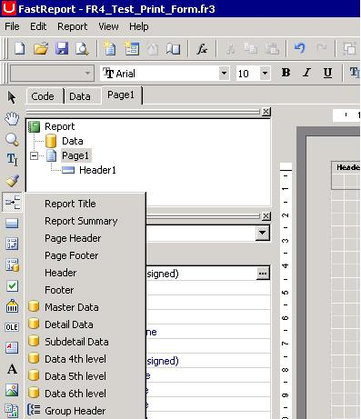
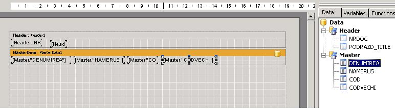

# Создание шаблона Fast Report

1. Создаем в папке Templates файл с расширением ".fr3" или копируем уже существующий и переименовываем его, далее изменим его дизайн.

2. Создаем ПФ для документа в конфигураторе с набором свойств:

| **Название свойства** | **Тип** | **Описание** | **Значение для примера** |
| --- | --- | --- | --- | --- | --- | --- |
| `DLL ID` | `I` |  | `5002` |
| `Report ID` | `S` |  | `2` |
| `ReportType` | `S` |  | `2` |
| `SQLAllinOne` | `M` |  | `BEGIN YKVINT_TEST_1.FR4_Print_Form (:nrdoc,:SqlHeader,:SqlMaster); END;` |
| `Template` | `S` |  | Test\_Print\_Form.fr3 |
| `VersionFR` | `I` |  | `4` |

[Множественная \(потоковая\) печать](https://bsoft.gitbook.io/wiki/razrabotka/konfigurator/otchety/sozdanie-shablona-fast-report/mnozhestvennaya-potokovaya-pechat)

3. В клиенте открываем документ, нажимаем кнопку печать, выбираем созданную ПФ и нажимаем кнопку "Шаблон". \(если появится ошибка - "ОК"\)

4. В открывшемся редакторе FR выбираем пункт меню: File - New Page.

5. Выбираем в Меню Report-Data- ставим галочки на датасетах \(header,master\)

6. На объект Page1 скидываем необходимые элементы отчета, например Header и Master Data \(выбрать их можно, нажав в левой вертикальной панели 6-ю кнопку. См. пример на рисунке\)

7. При перетягивании элементов на страницу отчета необходимо обязательно указывать привязку к Датасетам. Изменить привязку можно дважды кликнув по элементу отчета.

8. С правой панели, вкладка Data перетягиваем поля отчета \(См. пример на рисунке\).

Подробное руководство по использованию компонентов FastReport можно просмотреть по ссылке [FastReport 4.6 Руководство пользователя](http://www.fast-report.com/documentation/UserMan-ru/index.html?78.htm)

[Fast Report \(документация\)](http://www.fast-report.com/documentation/UserManFrNET-ru/index.html?printemptybands.htm) \(еще одна хорошая инструкция [fast report 3](http://www.melbis.com/download/FRManual.pdf), [бэнды в отчете](http://www.fast-report.com/ru/documentation/frhelp/bend_in_fr.htm) \)

9. Сохраняем шаблон и тестируем ПФ.

Чтобы разработать шаблон для отчета, его нужно создать как печатную форму любого документа, там же настроить, после в отчетах добавить новый отчет и указать в Template имя отчета \(ПФ из документа\).

Минимальный набор свойств отчета FR:

TipMaster=1

.type.TipMaster=String

TipDetail=0

.type.TipDetail=String

Tip=1

.type.Tip=String

.Hint.Tip=мастер  - детайл или мастер

Template=kadr\_propusk.fr3

.type.Template=String

.Hint.Template=Шаблон

SingleDate=true

.type.SingleDate=Boolean

SQLAllinOne=.MEMO.ZZZ.SQLAllinOne

.type.SQLAllinOne=Memo

ReportType=2

.type.ReportType=String

ReportKernel=1

.type.ReportKernel=String

Report ID=univ

.type.Report ID=String

DLL ID=9002

.type.DLL ID=Integer

Admin=false

.type.Admin=String

\[.MEMO.ZZZ.SQLAllinOne\]

begin

:SqlHeader := '

  select un$xparamsintrepr.getparameter\(''NAME''\) company 

    ,nvl\(b.familia, decode\(instr\(u.denumirea,'' ''\),0,u.denumirea 

    ,substr\(u.denumirea,1,instr\(u.denumirea,'' ''\)\)\) \)familia, b.numele, b.prenumele 

    ,a.clckadr\_doljn\_r\_502t doljn 

    ,un$to\_number\(u.codvechi\) tabnum 

    ,photo 

    ,cartela\_turnichet cart 

   from vslrprm\_calcd a, vms\_munc b, vms\_univers u, tms\_munc\_photo p 

  --  where u.cod=a.sc\_munc and u.cod=b.cod \(+\)  and u.tip=''o'' and u.gr1=''r'' and u.cod=p.cod \(+\) and p.nrord\(+\)=1 

   where u.cod=a.sc\_munc and u.cod=b.cod \(+\)  and u.tip=''O'' and u.gr1=''R'' and u.cod=p.cod and p.nrord=1 

    and to\_date\('''\|\|'01.01.2013'\|\|'''\) between trunc\(to\_date\(datastart\),''MM''\) and last\_day\(dataend\) 

    and shtat\_id=0 

    and dep\_sectia is not null and dep\_sectia&lt;&gt;0 --to\_number\(sys\_context \(''envun4'', ''sl\_cod\_uvolen''\)\) 

    --and u.cod in \(nvl\(:pdep,u.cod\)\)

    order by u.denumirea

';

end;

**Пример передачи фильтров в отчет:**

BEGIN

  YKVINT\_TEST\_1.FR4\_Print\_Workers\(:datebegin,:datefinal,:filt1,:SqlHeader,:SqlMaster\);

END;

/\*

filt1=edit\_fmAGRO\_filt1

\*/

Даты начала и конца передаются, как :datebegin,:datefinal

Имена остальных фильтров, которые вынесены на панель отчета можно посмотреть по нажатию Alt+D \(на фильтре\), вкладка Other field properties, поле Parameter name.

Максимальное количество датасетов три, например:

В конфигураторе печатной формы выбираем свойстве SQLAllinOne и передаем параметры, которые возвращают 3 sql-запроса.   
begin  
 pkg\_raw\_docs.inc\_pf\(:nrdoc, :SqlHeader, :SqlMaster, :SqlDetail\);  
end;

Если в отчете нужно выводить данные из нескольких таблиц, это случай, когда не хватает датасетов, можно в одном запросе объединять таблицы.  
  
Например:   
  
Сначала нужно выводить значения из первой таблицы, потом объединить со второй, только при объединении не должно быть пересекающихся полей, это нужно для того, чтобы при выводе в отчете, можно было поставить условие, для этой таблицы, не выводить пустые строки.  
  
select поле\_табл1, NULL поле\_табл2 

from табл1

union all   
select NULL поле\_табл1, поле\_табл2   
from табл2  
  
Когда мы отображаем данные в шаблоне отчета, нужно прописать условие отображения в событии onBeforePrint.  
Два раза щелнуть по выбраному событию и прописать код \(в примере испол. язык программирования Pascal Script \)  
  
procedure MasterData5OnBeforePrint\(Sender: TfrxComponent\);  
begin   
if &lt;SubDtl."PR"&gt; = NULL then   
MasterData5.Visible := false   
else  
 MasterData5.Visible := true;   
end;  
  
Т.е. необходимо задать условие отображения, можно данные разделять по какому либо признаку, т.е. для табл1 поле pr=1, тогда можно прописать такое условие :   
  
if &lt;SubDtl."PR"&gt; = 0 then   
MasterData9.Visible := true  
else  
 MasterData9.Visible := false;  
  
Так же можно задавать условия отображения для любого объекта отчета.   
  
procedure HeaderПоле1OnBeforePrint\(Sender: TfrxComponent\);  
begin  
 if HeaderПоле1.Text = '' then   
HeaderПоле1. Visible := false  
else  
 HeaderПоле1.Visible := true;   
end;

Для получения значения поля, надо писать &lt;Master."PAGECOUNT"&gt;

например изменять кол-во страниц в событии OnBeforePrint

procedure Page1OnBeforePrint\(Sender: TfrxComponent\);

begin

 Page1.PageCount := &lt;Master."PAGECOUNT"&gt;;

end;

**Важная заметка:** чтобы скопировать группу элементов шаблона и вставить ее на ту же страницу или на другую страницу шаблона - необходимо делать вставку не в masterData, а в свободное место шаблона, где нет других объектов. В этом случае сохраняется расстояние между элементами. \(используется для шаблонов, которые печатаются в нескольких экземплярах на одной странице - платежное поручение, расчетные листы\)

[Вывести пустые строки до конца страницы в таблице:](https://bsoft.gitbook.io/wiki/razrabotka/konfigurator/otchety/sozdanie-shablona-fast-report/vyvod-pustykh-strok-do-konca-stranicy)

