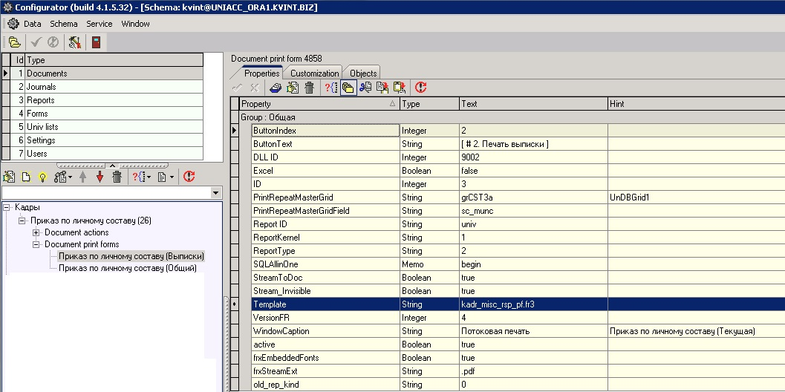
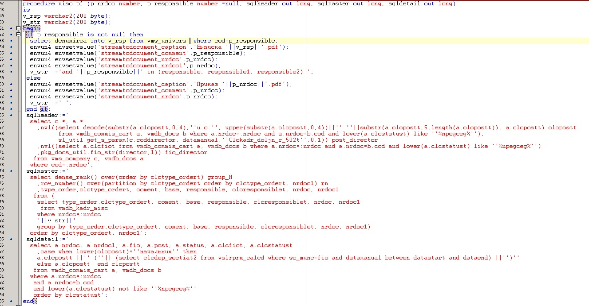

# Множественная \(потоковая\) печать

 Основные свойства для реализации потоковой печати:

| **Название свойства** | **Тип** | **Описание**  | **Значение для примера**  |
| :------------- |:-------------:| :-----| :-----|
| PrintRepeatMasterGridField | String | в этом свойстве указывается поле грида по которому будет идти группировка | sc\_munc |
| PrintRepeatMasterGrid | String | тип грида  | grCST3a или UnDBGrid1 |
| StreamToDoc | Boolean |  | true |
| Stream\_Invisible | Boolean | логическое свойство, которое устанавливается на уровне печатной формы. Значение true делает построение формы невидимым. | true |
| frxEmbeddedFonts | Boolean |  Сво-во frxEmbeddedFonts = true , добавляет Fonts в pdf \(только для FastReport\) | true |
| frxStreamExt | String | Сво-во frxStreamExt = '.pdf' определяет формат выгружаемого потока \(только для FastReport\) | .pdf |
| SaveToDoc | Boolean | устанавливается на уровне печатной формы и создает поток, данных который может быть сохранен в blob поле tmdb\_docs\_ole.  Для вставки строки с blob полем необходимо перед формированием печатной формы добавить инициализацию сисконтекстов \(streamtodocument\_caption, streamtodocument\_comment  ,streamtodocument\_nrdoc\) | true |

Потовая печать работает в отчетах типа Fast Report.

Пример потоковой печати можно посмотреть на схеме BOX формы - Документооборот по кадрам - 00.Документы - Печатные формы -  Лист согласования или 

Например:



 При вызове процедуры обязательно передаем значение поля 

```sql
begin
pkg_kadr_docs.misc_pf(:nrdoc, :responsible, :SqlHeader, :SqlMaster, :SqlDetail);
end;
/*
responsible=field_fRegistru_sqCST3a_SC_MUNC
*/
```

Пример процедуры для печати:

-- печать приказа по личному составу




