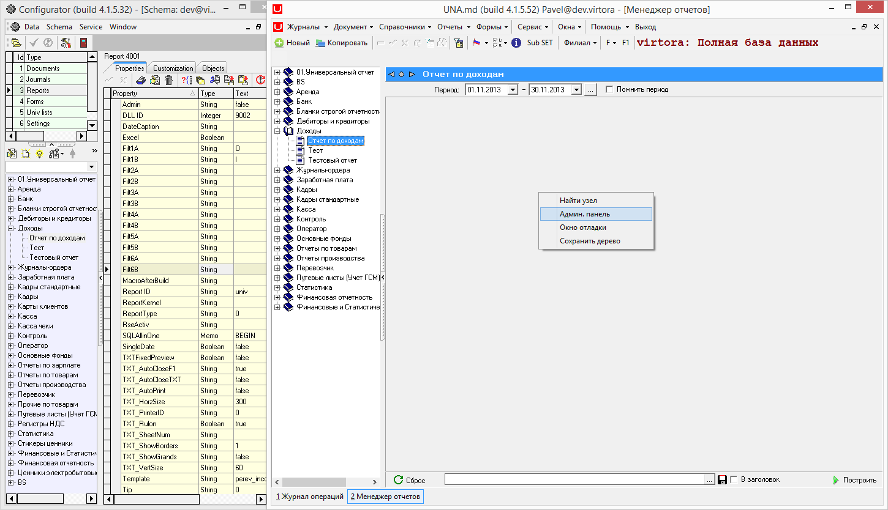
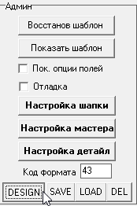
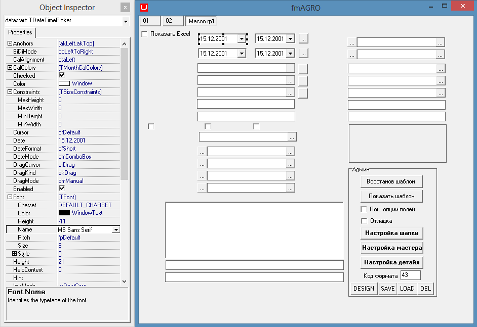

# Свойства отчета с произвольными параметрами

**Отчет с произвольными параметрами.**

Отчет \(DLL ID = 9002, ReportID = univ \) поддерживает возможности настройки окна параметров отчета и указания наборов данных, выводящихся в отчете.

| **Имя свойства** | **Тип** | **Описание** | **Значение для примера** |
| :------------- |:-------------:| :-----| :-----|
|  |  | **Группа Filters:** |  |
| Filt1A, Filt2A, …, Filt6A | String | Установка фильтра по полю ‘Тип’ для записей универсального справочника, выводящихся в спискахFilt1, Filt2, …, Filt6 | Flit1A=O Организации\) Filt2A = P \(Продукция\) |
|  |   |  **Группа Видимость:** |   |
| Filt1Visible, Filt2Visible, …,  Filt6Visible, Parameter1Visible, …, Parameter4Visible | String | Отображение / скрытие элементов управления в окне параметров отчета |   |
|   |  |  **Группа Заголовки:** |  |
| Filt1Caption, Filt2caption, …,Filt6Caption, Parameter1Caption,…,Parameter4Caption | String | Создание подписей для элементов управления окна параметров |   |
|   |   | **Группа Значения:** |   |
| Filt1Text, Filt2Text, …,  Filt6Text, Parameter1Text, …,  Parameter4Text | String | Установка значений по умолчанию для элементов управления окна параметров |   |
|   |   | **Группа Общая:** |   |
| ExtRep | String | Тип расширения файла шаблона \(0-xls,1-vts\) | 1 |
| MacroAfterBuild | String | Макрос Visual Basic для xls-отчетов |  |
| PeriodGlobal | Boolean | Указывает, выводится ли период в окне параметров | true |
| Tip | String | Тип отчета: Только Master / Master–Detail |  |

_Пример:_

 В программе открываем  нажимаем правой кнопкой мыши и в открывшейся вкладке выбираем 

  После открытия  выбираем 

 В результате откроется дизайн данного отчета.

