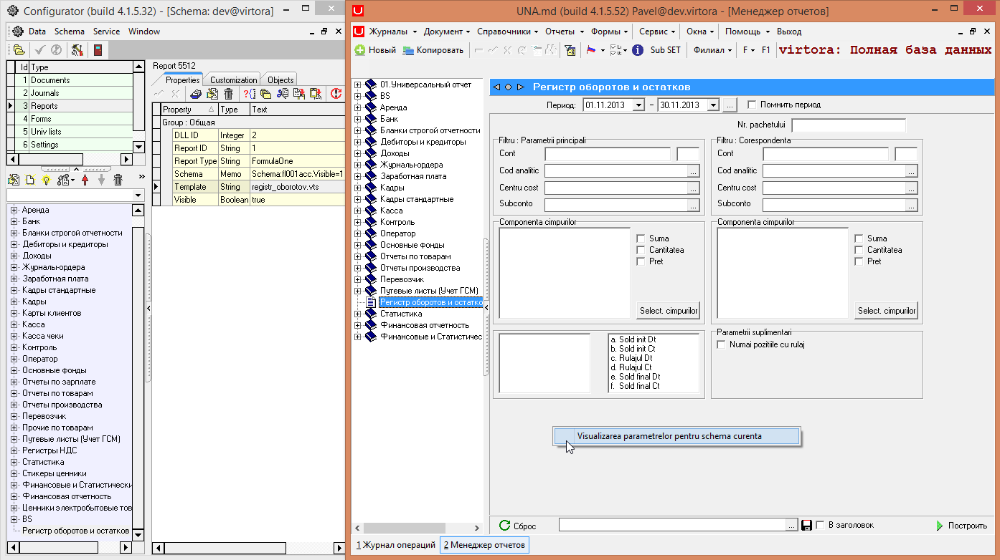

# Свойства Универсального отчета

 **`Универсальный отчет (Регистр оборотов и остатков (DLL ID = 2, Report ID = 1)).`**

| **Имя свойства** | **Тип** | **Описание** | **Значение для примера** |
| --- | --- | --- | --- |
| `FieldsListA` | `Memo` | Список полей, доступных в разделе `[Parametrii principali]`Формат списка:Имя поля \(под которым оно появляется в списке\) в кавычках,Имя поля \(имя поля в результирующем наборе записей и в шаблоне отчета\) |  |
| `FieldsListB` | `Memo` | Список полей, доступных в разделе `[Corespondenta]` |  |
| Schema | Memo | Текст, содержащий настройки окна параметров отчета: отображение / скрытие элементов управления, установка значений по умолчанию, список выбранных полей, включение / выключение флажковФормат:\[Имя элемента управления\].`Visible=0,1`\(0 – скрытие элемента управления, 1 –отображение элемента управления\)\[Имя элемента управления\].Text= \(Значение по умолчанию для элемента управления\)Список полей, выбранных в разделе \[Parametrii principali\] \(`[Corespondenta]`\)`FieldListA – start`      \(`FieldListB – start`\)Имя поля \(под которым оно появляется в списке\) в кавычках,Имя поля \(имя поля в результирующем наборе записей и в шаблоне отчета\)`FieldListA – end`    \(`FieldListB – end`\)                                                                                                                                         | Пример значения свойства                                        `Schema:fl001acc.Visible=1                                                                            fl001acc. Tag=0                                                                              fl001acc.Text=211 213 921 217                                                    fl001dep.Visible=1                                                                         fl001dep.Tag=1098                                                                 fl001dep.Text=1098,Depozit de materiale chimice, fire si deseuri                                                                                                  FieldListA-start                                                                                           a.Cont,CONT                                                                                          b.Cont.sc.,CONT1                                                                                                "d.Cont analitic - cifru",SCCODE                                                                        "f.Cont analitic - denumirea 2                                                         ",SCNAME2"e.Cont analitic-denumirea",                                          SCNAME"g.Cont analitic - unitatea de masura", SCUM                                           "c.Cont analitic - cod",SC                                                                         ListC.Text="a. Sold init Dt","c. Rulajul Dt","d. Rulajul Ct","e. Sold final Dt"`                      Замечание                                                                                                            Схему окна параметров отчета из приложения Universal Accounting можно позволяет получить  контекстное меню `[Vizualizarea parametrelor pentru Schema curenta]` окна параметров отчета. |

 _Пример:_

 В программе открываем 

 \(есть такой отчет есть\), нажимаем правой кнопкой мыши и затем левой нажимаем на

 В результате откроется текстовый документ

