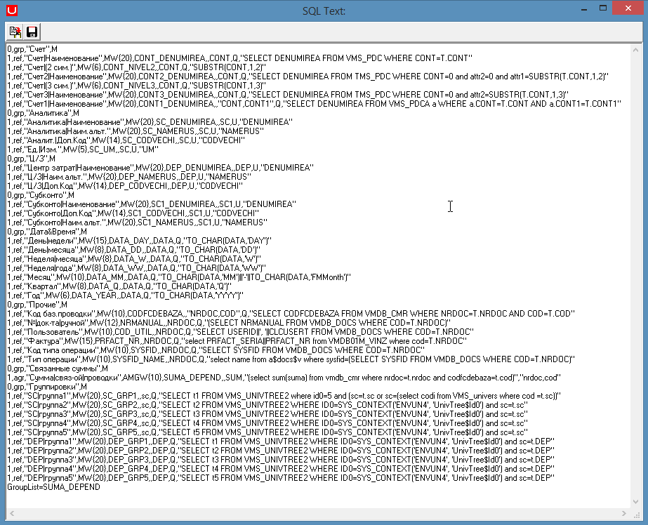

# Свойства нового универсального отчета

 **Новый универсальный отчет \(DLL ID = 4201, Report ID = 12\).**

| **Имя свойства** | **Тип** | **Описание** | **Значение для примера** |
| :------------- |:-------------:| :-----| :-----|
| OraFunction | Memo | Процедура PL/SQL генерации результирующего набора записей |  |
| RseFiledsBaza | Memo | Список доступных и выбранных полей раздела Filtru de baza |  |
|  | Memo | Список доступных и выбранных полей раздела Filtru Corespondent |  |
| RseSoldRulajTmplOrder | Memo | Указывает, какие из категорий Sold Initial Dt, Ct, Rulaj Dt, Ct, Sold Final Dt, Ct используются в отчете и порядок появления их в шаблоне |  |
| RseSumaCantTmplOrder | Memo | Указывает, какие из категорий Cant, Suma, SumaVal используются в отчете и порядок появления их в шаблоне |  |
| RepWindow | Memo | Текст, содержащий настройки окна параметров отчета: отображение / скрытие элементов управления, установка значений по умолчанию, включение / выключение флажков |  |

_Примечание:_

Для справки по Новому Универсальному отчету см. [RSE.DOC](http://wiki.bsoft.biz/xwiki/bin/view/%D0%A0%D0%B0%D0%B7%D1%80%D0%B0%D0%B1%D0%BE%D1%82%D0%BA%D0%B0/%D0%A3%D0%BD%D0%B8%D0%B2%D0%B5%D1%80%D1%81%D0%B0%D0%BB%D1%8C%D0%BD%D1%8B%D0%B9+%D0%BE%D1%82%D1%87%D0%B5%D1%82+%28RSE%29)

_Пример:_

 В программе открываем 

  нажимаем правой кнопкой мыши и в открывшейся вкладке выбираем 

 В результате этого в отчете появится панель 

 Для редактирования Master’a нажимаем на кнопку  в результате чего выйдет окно: 

  Для редактирования Detail’a нажимаем на кнопку  в результате чего выйдет окно:

 При нажатии на кнопку  выйдет окно:

  При нажатии на кнопку  выйдет окно:

