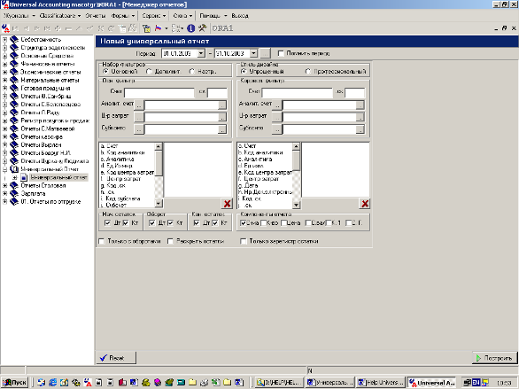

# Универсальный отчет \(УО\)

Универсальный отчет \(УО\)

1. Назначение
2. Концепция

11. определение

1. 1. структура счетов
   2. план счетов
   3. сквозной справочник аналитики
   4. журнал документов
   5. регистр проводок
2. Интерфейс

11. Общее описание

1. 1. Фильтрация данных
   2. Структура аналитики \(группировок\)
   3. Структура агрегатных атрибутов

**Общее описание**

УО характеризуется очень удобным в использовании интерфейсом все существующие параметры для определения формы отчета выбираются пользователем индивидуально но также их можно сохранить для того чтобы не затруднять себя каждый раз в выборе.

Интерфейс УО делится на две части левая сторона характеризует основной счет и все определяющие его параметры, правая часть определяет, корреспондирую

1. Формат вывода
2. Дополнительные возможности
3. Примеры

Назначение УО

УО является основным инструментом обработки и получения информации в информационной системе Universal Accounting \(ИС-UNIACC\). С помощью УО можно сформировать отчет по любому множеству данных из бухгалтерского ядра системы в наиболее удобном и универсальном формате.

Концепция УО

УО является набором правил отображения данных, систематизированных в соответствии со структурой бухгалтерской части базы данных ИС-UNIACC. Опорными элементами этой структуры являются:

1. план счетов
2. сквозной справочник аналитики
3. журнал документов
4. регистр проводок

**структура счетов**

Ключом к пониманию концепции УО является структура счета ИС-UNIACC:

\[_СЧЕТ_\] – \[_Субсчет_\] - \[_АНАЛИТИКА_\] – \[_Дополнительная АНАЛИТИКА_\] - \[_Агрегатные атрибуты_\], где

| **Элемент** | **Характеристика** | **Обозначение** | **Пример** |
| --- | --- | --- | --- | --- | --- |
| _СЧЕТ_ | обычный бухгалтерский счет, строго фиксированной стандартной длины | `Cont` | 2111.0 |
| _Субсчет_ | Дополнительный цифровой код, расширяющий диапазон значений основного счета | `.sc` |   |
| _АНАЛИТИКА_ | до трех параллельных раздельных аналитических кодов учета | `1 – Cont analitic 2 – Centru de cost 3 – Subconto` | \(1,20\) |
| _Дополнительная АНАЛИТИКА_ | дополнительные раздельные аналитические атрибуты | `Nrdoc- номер документа Data - дата NrSet - номер пакета STRSC – несистематизи-рованный алфавинто-цифровой код` |   |
| _Агрегатные атрибуты_ | Количественные, суммовые атрибуты. | `Suma - Общая сумма Cant - Общее количество SumaVal- Сумма в валюте Cant1 – раздельное к-во` | 200 лей 10 штук 50 USD 1 кг |

Отметим, что \[_СЧЕТ_\] является определяющим элементом по отношению ко всем остальным атрибутам. Это значит, что без знания конкретного значения счета смысл аналитики остается неопределенным.

План счетов выполняет следующие функции:

1. Определяет допустимые значения \[_СЧЕТ_-а\]
2. Определяет структуру \[_АНАЛИТИКи_\] \[_СЧЕТ_\]-а
3. Определяет свойства счета – баланс/забаланс, актив и/или пассив, класс, подкласс
4. Отражает учетную политику предприятия-пользователя ИС-UNIACC

**сквозной справочник аналитики**

Атомарным аналитическим элементом учета в ИС-UNIACC является структура:

\[_ключ_\] – \[_наименование_\] – \[_тип_\] – \[_подтип_\] –

– \[_доп. универсальные характеристики_\] – \[_доп. специфические характеристики_\], где

| **Элемент** | **Характеристика** | **Обозначение** | **Пример** |
| --- | --- | --- | --- | --- | --- | --- |
| _ключ_ | Сквозной уникальный номер, однозначно идентифицирующий аналитику в любом месте ИС-UNIACC. Генерируется программно. | `Cod` | 101 |
| _наименование_ | Текстовое описание аналитики. Определяется пользователем. | `Denumirea` | “Склад№1” |
| _тип_ | Определяет принадлежность к одному из следующих объектов аналитики: P - продукция, материалы, товары O – склады, организации, персонал F – основные средства T – прочая аналитика | `Tip` | “M” “O” |
| _подтип_ | Дополнительная группировка к \[_тип_\]-у. Обязательна для объектов с Tip=”O” | `Gr1` | “2111” “E” |
| _доп. универсальные характеристики_ | Общие атрибуты для любых типов аналитики: Единица измерения Альтернативный идентификационный код Альтернативное наименование Признак НДС Рекурсивный «родительский» код |  `UM CodVechi NameRus Gr2 CodI` |   |
| _доп. специфические характеристики_ | Раздельные наборы атрибутов для каждого типа аналитики: {ORG} {MPT} {AFX} {MUNC}  |  |  |

**журнал документов**

В период эксплуатации ИС-UNIACC ввод данных осуществляется путем регистрации первичных документов. Кроме того, практически все вторичные данные \(например, закрытия счетов\) также вводятся через интерфейс документооборота. Таким образом, главным объектом ввода информации в ИС-UNIACC является документ. Доступ к любому документу программы осуществляется через журнал документов, следующей структуры:

