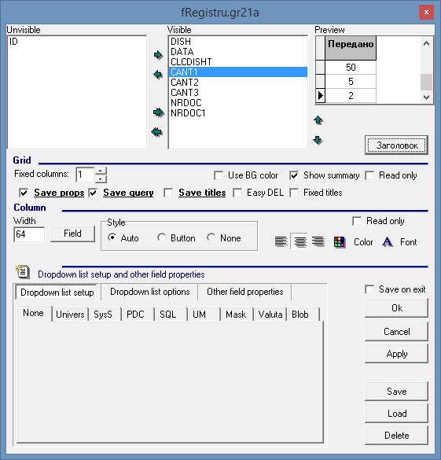
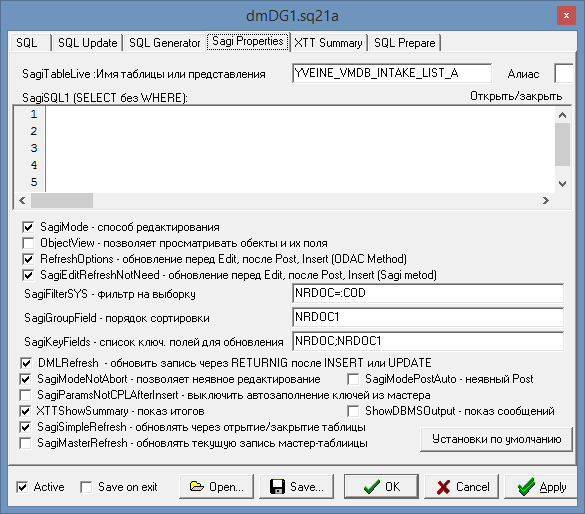

# Вычисление итогов для грида

| **Имя свойства** | **Тип** | **Описание** | **Значение для примера** |
| :------------- |:-------------:| :-----| :-----|
| XCST | Boolean | Использование вкладки. Включает отображение и использование дополнительной  вкладки Дополнительная вкладка появляется в нижней части окна документа справа от вкладки спецрегистров. | true |
| XCST GridCount | Integer | Количество гридов \(1..3\). Указывает количество гридов для отображения.  Максимальное значение - 3. При меньших значениях лишние гриды скрываются. | 3 |
| XCST GridHeight1  | Integer | Высота 1 грида \(35..500\). Указывает высоту первого грида.  Работает только при GridCount=2 или GridCount=3. | 81  |
| XCST GridHeight2  | Integer | Высота 2 грида \(35..500\). Указывает высоту второго грида.  Работает только при  GridCount=3. | 81 |
| XCST Summary1 | Memo | Строка итогов 1-го грида. Позволяет включить и настроить строку  итогов 1-го грида \(см. XCST SummaryHelp\). |   |
| XCST Summary2 | Memo | Строка итогов 2-го грида. Позволяет включить и настроить строку  итогов 2-го грида \(см. XCST SummaryHelp\). |   |
| XCST Summary3  | Memo  | Строка итогов 3-го грида. Позволяет включить и настроить строку  итогов 3-го грида \(см. XCST SummaryHelp\). |   |
| XCST SummaryHelp | Memo | Справка по строке итогов. Содержит краткую подсказку по настройке свойств XCST Summary1, XCST Summary2 и XCST Summary3. Каждое из этих свойств представляет собой параметр типа MEMO,  содержащий список полей грида, под которыми нужно показывать агрегатное значение.  Каждое поле указывается на отдельной строке. Можно указать количество знаков после запятой либо  строку формата, дописав их к имени поля через знак равенства. | `.MEMO.ZZZ.XCST SummaryHelp XCST Summary-properties format:               fieldname[=[prec[,func]]]where prec={number|string}and func={0|1|2|3|4}                       default prec is 2default func is 0                      functions: 0-Sum,1-Min,2-Max,                                       3-Count,4- Avg           Пример:SUMACANT=0PRET=,4  CLCCTSCT="Total rows: %.0f",3` |

 Для отображения суммы в клиенте необходимо в дизайне \(ALT+D\) в настройках грида

 В Редакторе запросов \(ALT+Q\)  вкладка 

 В редакторе запросов \(ALT+Q\) на вкладке

 Пример:

На примере видно, что в строке итогов для поля CANT1\(Передано\) выводится 3 знака после запятой, для поля CANT2\(Возвращено\) выводится 4 знака после запятой, для поля CANT3\(Итого кол-во\) выводится 1 знак после запятой, для поля CLCDISHT \(Наименование блюд\) ведется подсчёт строк.

