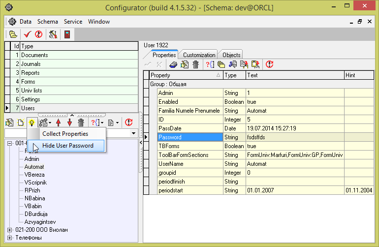

# Как скрыть пароль

Для скрытия пароля надо после ввода свойства Password, выбрать в контекстном меню узла Execute SQL \| Hide User Password

Или нажать на кнопку с изображением желтой лампочки на тулбаре над деревом и в появившемся меню выбрать Hide User Password

Эта команда заменит свойство Password на свойство Encoded, чтобы никто не смог прочитать пароль"

