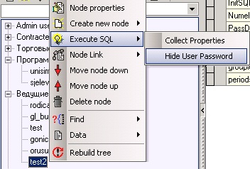

# Смена пароля

**Смена пароля**

1.На узле пользователя существует свойство Encoded \(закодированное значение пароля\). Для смены пароля необходимо данное свойство удалить нажатием на кнопку Удалить на панели управления свойствами.

2.Далее следует создать свойство Password и в поле Value указать новый пароль.

3.Для того, чтобы пароль данной учетной записи пользователя не был доступен к просмотру необходимо его скрыть. Установите курсор на только что созданной учетной записи пользователя и щелкните правой кнопкой мыши. В появившемся меню выберите Execute SQL  Hide User Password.

 либо нажмите на кнопку с изображением лампочки  Hide User Password.

Данная команда заменит свойство Password на свойство Encoded. 

4.Нажмите на кнопку с изображением красной галочки на панели инструментов. Данным действием вы подтвердите сохранение всех сделанных изменений.

