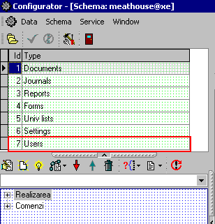
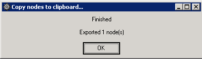

# Создание учетной записи пользователя

## Создание учетной записи пользователя в конфигураторе UniConf путем копирования

1. Запустите конфигуратор UniConf путем нажатия двойным щелчком мыши на ярлык UniConf на рабочем столе. Если ярлык отсутствует, то откройте конфигуратор, используя данный путь _Мой компьютер_  -&gt; _Диск D_  -&gt; _Shares_  -&gt; _Good_  -&gt; _UniConf_.

2. Установите курсор на категории Users.

 3. В нижнем блоке появится список групп пользователей. Выберите необходимую группу пользователей.

 4. В меню выберите Options, используя данный путь _Service_  -&gt; _Options…_

 либо нажмите кнопку _Настройки_ на панели инструментов.

 5. Поставьте галочку напротив _Don't check property changes_ и нажмите кнопку ОК.

 6. Установите курсор на одной из учетной записи пользователя и щелкните правой кнопкой мыши. Из появившегося меню выберите _Data_ -&gt; _Export_ -&gt;_Node_

 либо нажмите на _кнопку с изображением листа_  -&gt;  _Export_  -&gt; _Node_.

 7. Сообщение _Copy nodes to clipboard…_ должно появиться на экране. Нажмите кнопку ОК.

 8. Установите курсор на группе Ведущие специалисты.


 **Примечание.** Каждой учетной записи пользователя должен быть присвоен уникальный код. В таблице Свойства в строке UserGroupList указаны идентификационные номера, которые могут быть присвоены пользователям в данной группе.

Если все номера уже присвоены учетным записям пользователей в группе и есть необходимость в новой учетной записи пользователя, то есть возможность добавления идентификационных номеров путем двойного щелчка на  UserGroupList и в появившемся окне указать порядковый номер для новой учетной записи пользователя.


 9. Откройте буфер, выбрав пункт меню _Data_ -&gt; _Buffer_, либо нажав комбинацию кнопок Ctrl+B.

10. Окно буфера открылось. Установите курсор на созданной учетной записи пользователя. Правой кнопкой мыши нажмите на него и выберите опцию _Node properties_.

11. В поле Caption укажите имя новой учетной записи пользователя.


 **Примечание.**

Обычно используется данный  формат:

Первая буква имени + фамилия.

Остальные поля автоматически поменяются после смены первого значения.


Нажмите кнопку ОК.

12.  В таблице Свойства дважды щелкните по строке ID. В появившемся окне в поле Value поменяйте ID на следующий порядковый номер и нажмите кнопку ОК.

 13. Установите курсор на строке Encoded и удалите ее путем нажатия на кнопку с изображением корзины.

14. Установите курсор на строке UserName, дважды щелкните по ней и в появившемся окне, укажите имя пользователя.

15. Нажмите на кнопку Новое свойство.

 16. В появившемся окне в поле Name указать Password и в поле Value пароль новой учетной записи пользователя. Нажмите кнопку ОК.

 17. Закройте окно буфера. Щелкните правой кнопкой мыши по той учетной записи пользователя, свойства которой экспортировали в буфер. Из появившегося меню выберите _Dataà ImportàNew node_

 либо нажмите на _кнопку с изображением листа_  -&gt; _Import_  -&gt; _New node_.

 18. Дождитесь, пока в сообщении _Paste nodes from clipboard…_ кнопка Cancel заменится на кнопку ОК.

 19. Для того, чтобы пароль данной учетной записи пользователя не был доступен к просмотру необходимо его скрыть. Установите курсор на только что созданной учетной записи пользователя и щелкните правой кнопкой мыши. В появившемся меню выберите _Execute SQL_  -&gt; _Hide User Password_.

 либо нажмите на кнопку _с изображением лампочки_  -&gt; _Hide User Password._

Данная команда заменит свойство Password на свойство Encoded.

20. Нажмите на кнопку с изображением красной галочки на панели инструментов. Данным действием вы подтвердите сохранение всех сделанных изменений.

