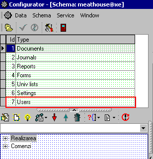

# Удаление учетной записи пользователя

**Удаление учетной записи пользователя из конфигуратора.**

1. Войдите в конфигуратор UniConf путем нажатия двойным щелчком мыши на ярлык UniConf на рабочем столе. Если ярлык отсутствует, то откройте конфигуратор, используя данный путь Мой компьютер -&gt;Диск D -&gt; Shares -&gt; Good -&gt; UniConf.  

2. Установите курсор на категории Users. 

3. В нижнем блоке появится список групп пользователей. Выберите необходимую группу пользователей.

4. Выберите учетную запись пользователя, которую необходимо удалить и щелкните по ней правой кнопкой мыши. В появившемся меню нажмите на Delete Node.

5. Убедитесь, что учетная запись пользователя была удалена.

