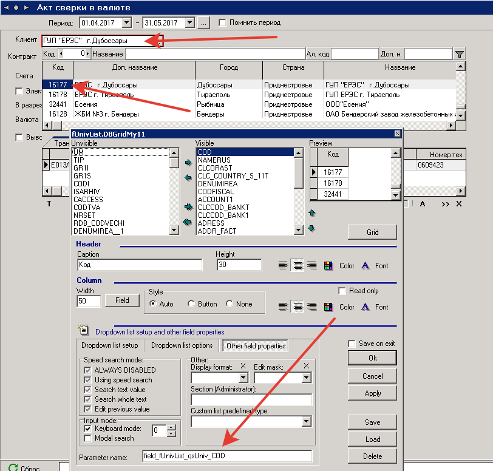

# CustomList

Инструкция по настройке общего справочника произвольного типа

Создаем секцию в Администраторе в разделе "Настройки"

\(можно в любом месте дерева, но желательно в разделе CustomList,

находящемся на одном уровне с узлом "System settings"\)

Вот пример корневого узла CustomList:

\[CustomList\]

.Type=Univ group

.Parent=NULL

.IsGroup=1

.Caption=CustomList

Вот пример узла произвольного справочника:

\[cl\_contract\]

.Type=Univ group

.Parent=CustomList

.IsGroup=1

.Caption=cl\_contract

Для настройки выпадающего справочника на этот узел

надо в окне настройки дизайна на вкладке "Dropdown list setup"

выбрать тип справочника \(например, "SQL"\),

а на вкладке "Other field properties" в поле "Section \(Administrator\)"

ввести имя секции узла произвольного справочника

\(в нашем примере это cl\_contract\)

В текстовом просмотре свойств должно получиться так:

TIP=Q

TIPNODE=cl\_contract

Несмотря на то, что тип справочника можно выбрать любой,

наибольший практический интерес представляет именно тип Q

Свойства справочника могут быть заданы несколькими способами

Можно задать их прямо в окне редактирования дизайна,

а можно задать их в Администраторе в секции узла.

Во втором случае они могут быть заданы один раз

для всех случаев использования справочника.

Зато задавая их прямо в окне дизайна, можно заменить

общие для всех свойства конкретными отличающимися значениями

Имена свойств для задания в Администраторе можно узнать,

задавая их визуально и затем просматривая в текстовом режиме.

Для справочника с произвольным запросом можно задать

текст основного запроса как свойство "SQL" узла Администратора,

а текст предварительного SQL \(Prepare SQL\) как свойство "PSQL".

Свойства SQL и PSQL могут быть как типа "String", так и "Memo".

Для этого типа справочника тут можно задать также такие свойства,

как ListFields, ResultFields, Captions и Widths \(соответственно

текстовым полям на вкладке "List setup"\).

Кроме этого, целый ряд свойств справочника можно задать

одним свойством "List" Администратора \(типа "Memo"\),

если скопировать туда эти свойства из текстового режима

окна настройки справочника. Так удобнее быстро создать

общий справочник, но так не очень удобно исправлять

отдельные свойства.

Наивысший приоритет будут иметь свойства, заданные

в окне настройки свойств справочника, самый низший

приоритет у свойств, заданных "всем скопом" в свойстве "List"

Пример:

\[ZZZ\]

List=.MEMO.ZZZ.List

.type.List=Memo

\[.MEMO.ZZZ.List\]

TIP=Q

SQL1=select \* from vms\_order\_inf\_supliment

SQL2=order by id

LISTFIELDS=id,inf\_supliment

RESULTFIELDS=inf1,clc\_inf1\_t

CAPTIONS=Cod,"Inf.supliment"

WIDTHS=0,20

Для справочника с произвольным запросом можно задать

основной или предварительный запрос с параметрами,

расшифровку которых указать в конце текста соответствующего

запроса в блоке комментария, располагая каждую расшифровку

на отдельной строке, например:

SELECT CONTRACTID,INFO

FROM VCN0M\_CONTRACTS\_SHORT

WHERE \(CLIENTID = :CLIENT\)

/\*

client=field\_dmDG1\_sq04tDEP\_SECTIA

\*/

Вот как это выглядит в качестве свойства узла Администратора:

\[ZZZ\]

SQL=.MEMO.ZZZ.SQL

.type.SQL=Memo

\[.MEMO.ZZZ.SQL\]

SELECT CONTRACTID,INFO

FROM VCN0M\_CONTRACTS\_SHORT

WHERE \(CLIENTID = :CLIENT\)

/\*

client=field\_dmDG1\_sq04tDEP\_SECTIA

\*/

Но задание расшифровки на уровне узла Администратора

далеко не всегда удобно, удобнее размещать там только

запрос, а расшифровку указывать в каждом конкретном

случае использования справочника в его настройках.

Тогда в качестве свойства "SQL" узла Администратора

надо задать запрос без расшифровки или с частичной

расшифровкой \(только некоторых параметров\),

а в тексте запроса в окне настройки справочника

ввести только расшифровку остальных параметров

как блок комментария, начинающийся со строки /\*params

Например: свойство SQL Администратора содержит запрос

SELECT CONTRACTID,INFO

FROM VCN0M\_CONTRACTS\_SHORT

WHERE \(CLIENTID = :CLIENT\)

А в поле "SQL" в окне настроек справочника мы вводим

/\*params

client=field\_dmDG1\_sq04tDEP\_SECTIA

\*/

В текстовом режиме просмотра это должно выглядеть так:

SQL1=/\*params

SQL2=client=field\_dmDG1\_sq04tDEP\_SECTIA

SQL3=\*/

Если на уровне узла Администратора задано свойство "PSQL",

но в конкретном случае использования справочника нужно

отказаться от его использования, нужно в окне настроек

в поле "Prepare SQL" ввести символ восклицательного знака.

В текстовом режиме просмотра это должно выглядеть так:

PSQL=!

**Для задания свойств произвольного запроса через XGRIDPROP**

**\(и в том числе для задания SQLInsert, SQLUpdate и т.п.\)**

**надо на уровне узла Администратора или на уровне окна**

**задать свойство "SagiEditQuery" значением "true" или "1".**

При первом выпадении справочника просто исправить запрос

и сохранить, как обычно в таких случаях.

**Фильтр в отчетах для выпадающих справочников customList**:

Пример: в справочнике контрактов\(customList\) нужно сделать фильтр по контрагенту из поля выше.

Для этого необходимо взять имя параметра из поля код в выпадающем справочнике контрагентов.



 И далее подставляем имя параметра в фильтр кастом-листа:

```sql
/*params
p_client=field_fUnivList_qsUniv_COD
*/
```


